# Calibrating a hierarchical response model for a benchmark-level cold start

Technical report for the Predictive AI Evaluation Competition (PAIEC), NeurIPS 2026 [PAIEC organisers 2026].

Author: Nikita L. Polomoshnov

Affiliation: Moscow State University

Email: nikitapol@fbb.msu.ru

Code: https://github.com/doctawho42/PAIEC (MIT License)

Keywords: predictive evaluation, item response theory, Brier score, cold start, PAIEC

Every number traces to `docs/findings.md` (cited as F§ and a section title), `docs/protocol.md` (P§) or a committed `results/` file, through the script that produced it. Appendix H gives the convention and maps each number to its code.

---

## Abstract

PAIEC asks for the probability that an AI system answers a benchmark item correctly, given visible attributes and 0 to 31 revealed labels, scored by Brier ALC on benchmarks absent from training. We rebuilt the organisers' streaming evaluator. An earlier replica had made pooling across subjects the apparent main lever; under the verified protocol pooling is still worth 0.009 to 0.030 ALC on dense runs, but 0.0004 to 0.001 at the platform's composition of one or two pairs per benchmark: run size, not the information set, removed it. Our predictor, a hierarchical Bayesian item-response model refitted from the revealed labels at every checkpoint, gains mainly through its prior on a new benchmark's level: three global hyperparameters set on test-like runs built from public data to resemble the first formative feedback. On held-out test-like runs it beats our first submission by 0.042 ALC, but the gain is regime-conditional: 0.014 without the synthetic date shift, 0.025 to 0.031 in regimes set to the feedback's level readings, and within noise on public runs. A smoothed mean with a calibrated prior matches it in the tuned regime; the model adds 0.004 to 0.011 over it elsewhere, public runs included. Two formative runs of the shipped model lie within 1.02 single-run sds of every regime's mean. Except a blind rating that tracks difficulty on mathematics only, every item-side signal we completed, from text-based difficulty maps to a 14B model's reasoning entropy, fails to transfer or stays below an acceptance gate of 0.002 ALC.

---

## 1 Introduction

### 1.1 The task

For each subject and item, the program returns P(correct) from two dictionaries: the subject (eight string fields, such as normalized_name, provider, release_date, harness and reasoning_effort) and the item (item_content, item_features, interactors and an anonymous benchmark_id). It also receives `labeled`, the outcomes revealed so far [P§ Interfaces]. The items of each pair (subject, benchmark) with at least 80 distinct items are split 50/50 into acquisition and evaluation pools. Labels are revealed from the acquisition pool, and the Brier score, a strictly proper scoring rule [Brier 1950; Gneiting and Raftery 2007], is measured on the evaluation pool at budgets 0, 1, 3, 7, 15 and 31, then averaged equally over pairs:

    ALC = 0.1 B0 + 0.2 B1 + 0.2 B3 + 0.2 B7 + 0.2 B15 + 0.1 B31

The k-th acquired label counts toward every budget it survives into, so the first label is worth 0.9 of a budget's weight and labels 16 to 31 are worth 0.1 each [P§ Scoring]. B0 and B1 alone carry 0.3 of the weight. The platform's run score is the unweighted mean of the per-pair ALCs (App D.1).

### 1.2 What makes it hard

**The level of a new benchmark is not in the training data.** The five public benchmarks' levels average -0.56 on the pair-accuracy logit scale, with sd 0.90, and a leave-one-out level misses by 0.86 logit on average (F§ "The step-2 analyses behind the model", `experiments/hier_design/levels.py`). Read through the lower roots of p(1-p) = B31, the first formative run sat about 0.9 logit below the public centre; read per pair against replica pairs it is spread both ways, and later readings are more central (§5.1, §5.4).

**Per-item structure is most of the headroom and does not transfer.** On all 221 public pairs, Brier falls from 0.25 (constant 0.5) to 0.176 when the pair's true accuracy is known, and to 0.0433 when each item's true probability is known (F§ "How much there is to win", `experiments/ceilings.py`). But item difficulty predicted from text does not transfer: leave one benchmark out, a TF-IDF map correlates -0.16 to 0.14 with Rasch difficulty, every 95% interval below 0.3 (§6.3).

**Runs are small.** A formative run holds at most 1,000 (subject, item) entries across both pools, so at most 12 pairs of at least 80 items [P§ Runs]. Our three scored runs held 9, 8 and 9 pairs over the same 7 benchmarks, and 5, 6 and 5 of them were alone on their benchmark (App D.1). Pooling across subjects therefore has little to pool: at that composition it is worth 0.0004 to 0.001 ALC to our model (§2.4).

**No state survives between budgets.** Evaluation workers are recreated at every checkpoint, so `predict` has to be a pure function of `(input, labeled)` [P§ Flow].

### 1.3 Contributions

1. **A verified replica of the official evaluator, and what the first one got wrong** (`paiec/official.py`). It reproduces the organisers' client decision for decision; an earlier replica had made cross-subject pooling look like the main lever, which run size, not the information set, removes (§2.3, §2.4).
2. **A hierarchical item-response predictor fitted from `labeled` alone** (`paiec/hier.py`). It integrates every item residual exactly and reads the target on the exact log posterior along a line, reducing the Gaussian approximation's under-reaction to a pair's first labels (exact for one pair whose labelled items share the target item's group effects; §3).
3. **A calibration of the new-benchmark level, and an account of what it buys** (`paiec/testlike.py`). It sets global hyperparameters only, on test-like runs built from public data, under a guard against losses on public runs. hier-ship, the shipped configuration, is confirmed on held-out runs, tested at the feedback's level readings under a rule fixed in advance, and split into calibration and modelling (§3.4, §5).
4. **An acceptance harness and a catalogue of negative results** (`experiments/harness.py`). It maps a covariate's correlation with an item difficulty fitted on other subjects (its honest r) to its chance of passing one gate. Every item-side idea we completed does not transfer to a held-out benchmark, stays below the gate, or (a blind rating) holds on mathematics only; each has its script, and every text map, judge, probe and encoder has 95% intervals (§6).

### 1.4 Related work

**Item response models.** Our model, hier (§3), is an item-response model in the Rasch tradition [Rasch 1960], with item-feature effects as in explanatory IRT [Fischer 1973; De Boeck and Wilson 2004], fitted hierarchically [Patz and Junker 1999; Fox 2010]. IRT has been used to build and compare ML and NLP test sets [Lalor et al. 2016; Martínez-Plumed et al. 2019; Rodriguez et al. 2021], and small informative item sets are chosen with IRT [Maia Polo et al. 2024], anchor points [Vivek et al. 2024] or a learned acquisition policy [Li et al. 2025]; here the evaluation items are fixed, and a new benchmark's level dominates the error.

**Predicting performance.** Performance has been predicted from other evaluation records [Ye et al. 2023; Zhang et al. 2024], shared capability dimensions [Ruan et al. 2024], instance-level assessors, which lose their edge out of distribution [Pacchiardi et al. 2024], and rubric-based demand levels [Zhou et al. 2026]. Setting a new benchmark's level resembles re-estimating class priors under label shift [Saerens et al. 2002; Lipton et al. 2018].

**Difficulty of unseen items.** Difficulty is estimated from question text [Benedetto et al. 2023] or embedded question content [Truong et al. 2025]; for agentic coding, success is predicted from issue text with repository state, tests and solutions [Ge et al. 2026] or from task length in human time [Kwa et al. 2025]. Model internals carry difficulty [Lugoloobi and Russell 2025] and predict a model's own success [Lugoloobi et al. 2026; Moreno Cencerrado et al. 2026], and token entropy transfers weakly between agentic benchmarks [Krsteski and Meyer 2026]. §6 tests such signals on benchmarks held out entirely.

### 1.5 Headline numbers

hier-ship is our submission and LegacyP our first submission's predictor. Δ = hier-ship − comparator in ALC, negative favours hier-ship, with the pair-cluster bootstrap SE in parentheses (§4.3). Test-like (TL) runs are built from public data to resemble the first formative feedback; public runs (R1-bf, R1-pu) redraw public pairs at formative size (§4.1; names: §2.1).

| what | value | where |
|---|---|---|
| formative runs, single draws: run 1 LegacyP; run 2 hier-ship; run 3 hier-ship's rebuilt archive (recomputed from its table) | ALC 0.2113; 0.1926; 0.1817 | §5.1 |
| Δ LegacyP, held-out TL runs 200-299 (seed 2); mean ± SE over the four multi-subject benchmarks (parent-level) | -0.0419 (0.0037); -0.038 ± 0.008 | §5.4 |
| Δ LegacyP, TL with item groups merged at random (TL-mix, runs 0-99, seed 3) | -0.0436 (0.0039) | §5.4 |
| Δ LegacyP, TL without the synthetic date shift (TL-noshift, runs 0-99, seed 3) | -0.0144 (0.0024) | §5.4 |
| Δ LegacyP, test-like runs set to two later readings of the feedback's level (READING / AUDIT, seed 11; realised level -0.63 / -0.93) | -0.0248 (0.0037) / -0.0313 (0.0049) | §5.4 |
| Δ LegacyP, public runs (R1-bf runs 0-149 / R1-pu runs 0-99, seed 0) | -0.0017 (0.0021) / -0.0018 (0.0017) | §5.4 |
| Δ a smoothed label mean with a calibrated prior (Smooth-cal): TL redrawn (TUNED) / R1-bf / R1-pu, seed 11 | +0.0015 (0.0019) / -0.0108 (0.0014) / -0.0100 (0.0018) | §5.4, §5.5 |
| Δ a plain Rasch model at hier-ship's level (1PL-ship), same runs | +0.0017 (0.0013) / -0.0048 (0.0007) / -0.0050 (0.0007) | §5.5 |
| Δ the Beta(2,2)-smoothed label mean (Smooth), TL runs 0-199 (seed 2) / R1-bf runs 0-149 (seed 0) | -0.0169 (0.0020) / -0.0086 (0.0030) | §5.4 |
| Δ the organisers' empirical-mean baseline (EmpMean), TUNED / R1-bf / R1-pu (seed 11) | -0.0339 (0.0030) / -0.0464 (0.0027) / -0.0449 (0.0030) | §5.5 |
| ten alternative configurations at the two later readings (READING, AUDIT) | none gains the 0.002 that a rule fixed in advance required | §5.4 |
| Δ LegacyP, the single-subject public benchmark (swe_rebench) | +0.0101 ± 0.0012 (130 R1-bf appearances, run-2 library, seed 0); +0.0094 ± 0.0016 (51, current library, seed 11); SE over appearances | §5.6 |

Sources: `experiments/<name>.py`, which writes `results/<name>.json`, for formative_feedback, formative_run3, ship_confirm, regime_sensitivity, baselines_p1 and gate_and_ci (`single`); full SE triples in §5.4 and the appendices.

---

## 2 Data, protocol and our replica

### 2.1 Names and notation

One name per model (Table 1) and per term or run set (Table 2) is used throughout; figure legends still use older names, which each caption gives. Internal labels are glossed in App H.1.

*Table 1: models.*

| name | what it is |
|---|---|
| **LegacyP** | Our first submission's predictor (`paiec/predict.py`): a per-pair logistic model with a multiple-choice floor, subject ability around a relative attribute prior, and item difficulty from a joint IRT once a benchmark has 64 labelled items. Formative run 1. |
| **hier** | The hierarchical item-response model of §3 (`paiec/hier.py`). |
| **hier-fit** | hier with every hyperparameter from the empirical-Bayes fit, its level prior included (no LEVEL). |
| **hier-ship** | hier with the level prior LEVEL: mu0 -2.5, sigma_mu 2.5, attr_scale 0.5 (`LEVEL` in `submission/model.py`). Our submission; formative runs 2 and 3. |
| **hier-rec** | hier with mu0 -3.0, sigma_mu 2.5, attr_scale 0.25: the level calibration's recommendation, replaced by an audit before shipping (§5.4). Its numbers never stand for hier-ship's. |
| **hier-argmax** | hier with mu0 -3.5, sigma_mu 2.5, attr_scale 0.25: the selection rule's choice. |
| **hier-ship σ3.5, σ5** | hier-ship with sigma_mu 3.5 or 5.0. |
| **hier-EB** | hier whose new-benchmark level centre is re-estimated by empirical Bayes at every checkpoint, on a stated base prior: hier-EB on hier-ship, or on mu0 -3.0 / attr_scale 0.5 (App E.3). |
| **hier-nosubj** | hier-ship without its subject prior (attribute prior and identity link off). |
| **1PL-ship, 1PL-fit** | A plain 1PL (one pooled level per benchmark, one ability per pair, one difficulty per item, refitted from `labeled`) at hier-ship's level, or at its own leave-one-parent-out public level. |
| **Smooth** | The Beta(2,2)-smoothed mean of the pair's labels. |
| **Smooth-cal** | A smoothed mean whose Beta prior (mean 0.25, strength 2) was chosen by LEVEL's selection rule on the tuned regime, regardless of the guard. |
| **EmpMean** | The organisers' empirical-mean baseline. |
| **BLE** | The organisers' language-model predictor (not run, §5.5). |
| **LegacyP+fix** | LegacyP with a level fix (offset, scale, variance; values in the tables). |
| **oracles** | Base-rate oracle: every pair at its true rate, so E[p(1-p)]. Pair-rate oracle: every response at its pair's rate. Item oracle: in-sample Rasch probability per item. |

*Table 2: terms and run sets.*

| term | meaning |
|---|---|
| subject, item, pair | an evaluated AI system (eight visible string fields); a benchmark item; a (subject, benchmark). ALC averages pairs equally. |
| appearance | one pair in one run. Replica runs redraw pairs, so a pair has many appearances. |
| budget Bk | the checkpoint after k labels per pair, k in {0, 1, 3, 7, 15, 31}. ALC = 0.1 B0 + 0.2 (B1 + B3 + B7 + B15) + 0.1 B31. |
| level; LEVEL | a benchmark's mean pair-accuracy logit; hier-ship's prior on a new one. |
| R1 (R1-bf, R1-pu); R2 | public formative-like runs, with benchmark-first or pair-uniform weighting; dense runs, every eligible pair of one benchmark. |
| parent; pseudo-benchmark | a public benchmark (four multi-subject parents carry every test-like number); a group of one parent's items given its own anonymous id in a test-like run. |
| TL; TL-mix; TL-noshift; TL-1.2, TL-2.0 | test-like runs at the defaults; with item groups merged at random and whole parents; without the date shift; with level_mean -1.2 or -2.0. |
| LA-0.8, LA-flat | the level audit's two extra regimes: level_mean -0.8, and no level tilt. |
| RS regimes | TUNED, READING, AUDIT, MIXTURE, FLAT: the regime-sensitivity (RS) study's test-like regimes (§4.1, App C.1). TUNED is TL redrawn at seed 11. |
| selection, confirmation, held-out runs | TL runs 0-99, 100-199 and 200-299; the last were never used to choose the level. |
| date shift; level tilt | test-like runs shift visible release and access dates 1.25 years later; they tilt the draw of pairs toward a target level distribution. |
| split scope | whether the 50/50 acquisition / evaluation split is drawn per pair ('pair') or per benchmark item ('benchmark'). |
| LOPO; strict run-LOBO; nested LOPO | fitted without the target's parent; without every benchmark of the run; selection redone inside each held-out parent and bootstrap resample. |
| guard; gate; rule | the guard: lose at most 0.003 ALC to LegacyP on both R1 weightings. The gate: the four acceptance conditions of §4.4. The rule: the RS study's decision rule (App C.2). |
| honest r; within-pair r | correlation with item difficulty fitted on other subject folds; the same correlation within a test-like pair, the gate's scale. |
| single-run sd | the spread of one run's ALC over a regime's runs: the noise of one formative run. |
| run-2 library; current library | hier as in formative run 2's archive (old multiple-choice floor, solver before the floored-fit fix); hier with both fixes, as in archive-3 (`4d2cc4f`). |
| lower-root reading; pooled reading | run 1's pair rates read from p(1-p) = B31 at the lower root; the reading of runs 1 and 2's 17 pairs against matched replica pairs (§5.4). |

### 2.2 Data

We use only measurement-db, the organisers' public training release [Truong et al. 2026] (gated, CC-BY-SA-4.0; revision `bc8204d8…`, App G.2): 571,921 responses over 287 subjects and six benchmarks [P§ Data]. mmdocrag is fraction-valued (only 4.8% of its responses are 0 or 1) and is excluded, as the test excludes non-binary benchmarks; matharena's 0.1% non-binary tail is dropped. Keeping pairs with at least 80 distinct items leaves 221 pairs and 225,843 responses:

| benchmark | pairs | distinct items | mean accuracy | item_features key (levels, share of item variance) |
|---|---|---|---|---|
| multi_swebench | 82 | 2,126 | 0.219 | lang (8, 0.05) |
| matharena | 81 | 1,633 | 0.607 | competition (25, 0.50) |
| researchcodebench | 31 | 212 | 0.354 | paper (20, 0.43) |
| real_webagents | 26 | 233 | 0.330 | website (12, 0.24) |
| swe_rebench | 1 | 6,306 | 0.479 | none |

Sources and the count script: App A.1.

Properties that shaped the method:

- **Few subject ids cross benchmarks; more model names do.** Only 22 of 287 subjects appear on more than one benchmark [P§ Data], but hier keys a subject's standing theta_s on the coarser canonical name (`normalized_name`, else the source model name), which links 117 of the 220 pairs of the four multi-subject benchmarks (F§ "The step-2 analyses behind the model"). On current evidence that link adds almost nothing on top of the attributes, a provisional reading (§3.3). `interactors` is empty everywhere.
- **Repeats are uneven.** 99.8% of matharena items have repeated responses, 99.6% of swe_rebench's, 0.4% of multi_swebench's [P§ Data].
- **Some subject attributes live on one benchmark.** Harness strings appear only on multi_swebench (81 of 82 pairs, 12 strings), reasoning_effort only on matharena (23 of 81 pairs) (F§ "Subject side at budgets 0 and 1").
- **matharena items are partly textless.** A third have no task text, and its 336 Kangaroo items are five-option multiple choice with the options in an image (App A.1).
- **Raw solve rates confound difficulty,** because items attempted only by recent subjects look easy, so difficulty targets are Rasch estimates (`paiec/rasch.py`).

The hidden benchmarks come from the organisers' inventory of 161 candidates, assigned at random to the two pools. Keyword rules on the titles class 67% of them as AI evaluations: 39% text QA, 30% images, 15% agents, 6.5% code, 4.6% video, 2.8% math and 2.8% audio (App A.1), so the public benchmarks are not a representative sample of the hidden task types.

### 2.3 The protocol, as verified

We read the organisers' streaming client (`tools/streaming_ingestion.py` in the baseline repository [PAIEC baseline repository 2026], commit `82d330dd`, App G.2) alongside the competition page [P§]. Six properties matter here:

- **Scoring is budget-major.** Every pair of a run is evaluated at budget 0 with `labeled` empty; acquisition then continues until every pair holds up to one label, every pair is evaluated at budget 1, and so on.
- **`labeled` is one shared list per checkpoint.** It holds the first B labels of *every* pair in the run, other subjects' and other benchmarks' included.
- **Workers are recreated** (up to 16) from the submission at every checkpoint; identical inputs are predicted once per checkpoint.
- **The default acquisition policy is a hash rule:** the candidate is taken iff `u < min(1, labels_remaining / items_remaining)`, u a sha256 digest of the candidate and its context.
- **Only binary data is used,** from pairs with at least 80 distinct items, and each pair's 50/50 split is fixed across submissions and budgets.
- **The runtime rejects bad outputs** (non-finite or out of range) and signals failures by exit code (40, 41, 42).

Our replica (`paiec/official.py`) matches the client decision for decision and agrees with the analytic ALC of the empirical mean (App A.4).

### 2.4 What our first replica got wrong, and why it mattered

Our first replica (`paiec/evaluator.py`, kept as the *legacy* replica so its numbers stay reproducible) was built before the client was public. It scored all 221 pairs pair-major in one session, showed each target only its own labels, and leaked identifiers to `predict` (the five differences: App A.2).

- **It pointed the research at pooling.** Evaluation order alone moved the assembled predictor from 0.1898 to 0.1725, and the predictor ladder made pooled item difficulty look worth about 0.020 ALC (legacy; F§ "Evaluation order is worth 0.017", "The predictor ladder").
- **At formative size the lever nearly vanishes.** Over 600 official R1 runs (seed 0; §5.2), pooled difficulty adds about 0.0007 to LegacyP, which needs 64 distinct labelled items on a benchmark, against about two pairs per benchmark in a formative run (F§ "Under the official protocol").
- **Run size, not the information set, removed it.** We switched pooling on and off on the official replica, under both split scopes, on dense and formative-size runs, and reweighted to the platform's composition: of the 26 appearances in formative runs 1 to 3, 16 were alone on their benchmark and 10 had one companion (method: App A.2).

| pooling on − off, ALC | dense, 'pair' | dense, 'benchmark' | formative, 'pair' | formative, 'benchmark' | platform mix, 'pair' / 'benchmark' |
|---|---|---|---|---|---|
| hier-ship, everything from other subjects | -0.0300 (0.0099) | -0.0142 (0.0059) | -0.0033 (0.0006) | -0.0020 (0.0005) | -0.0010 / -0.0004 (0.0003) |
| of which the pooled level | -0.0043 (0.0014) | -0.0029 (0.0009) | -0.0015 | -0.0012 | -0.0007 / -0.0003 |
| of which pooled item difficulty | -0.0258 (0.0088) | -0.0114 (0.0055) | -0.0018 | -0.0008 | -0.0004 / -0.0002 |
| LegacyP, pooled difficulty | -0.0237 (0.0065) | -0.0086 (0.0038) | -0.0010 (0.0002) | -0.0004 (0.0001) | 0 / 0 |

Dense: the four multi-subject benchmarks, mean (SE across them). Formative: 100 runs (seed 11, R1-bf), cluster SE. Full table: App A.2. Source: `experiments/pooling_decomposition.py`, `results/pooling_decomposition.json`; F§ "Pooling under the verified protocol".

On dense runs pooling is still worth 0.009 to 0.030 ALC, bracketing the legacy ladder's 0.020, mostly through item difficulty, and per-benchmark splits halve it (ratios 0.47 for hier, 0.36 for LegacyP). At formative size it is worth 0.002 to 0.003 to hier and 0.0004 to 0.001 to LegacyP, and at the platform's composition 0.0004 to 0.001 and exactly 0. The first replica did not invent the lever; the platform's runs are too small to use it. Nothing in this report is quoted from the legacy replica except where marked "legacy".

### 2.5 Unknowns kept as parameters

The replica treats what the client leaves open as parameters [P§ Still unknown], chiefly `split_scope`: whether the 50/50 split is drawn per pair or per benchmark item. On dense runs, per-pair splits let other subjects' labels land on 83% to 99.5% of a target's evaluation items at B31, per-benchmark splits on 0% to 5%. Both scopes are reported in three places only: the dense R2 baselines (App A.3), hier-fit against LegacyP on public runs (App E.1), and the pooling decomposition (§2.4). Everything else ran split scope 'pair' only: the R1 baselines, the level calibration and its guard, hier-ship's confirmation, the RS and baseline studies, the harness, and every official-protocol study of §6. Other open points: App A.3.

---

## 3 Method

### 3.1 Model

`paiec/hier.py` models the log-odds that subject s answers item i of benchmark b correctly:

    eta = mu_b + theta_s + delta_sb - g_i - e_i
    p   = c_i + (1 - c_i - slip) * E[ sigmoid(eta) ]

| term | meaning | prior |
|---|---|---|
| mu_b | the benchmark's level, shared by every subject's labels on it | N(mu0, sigma_mu^2), Gaussian; Student-t optional |
| theta_s | the subject's standing, keyed on its canonical name | attribute ridge mean (times attr_scale), sd sigma_attr; identity term capped |
| delta_sb | the pair's own deviation | N(0, sigma_delta^2) |
| g_i | item_features group effects, one per key whose visible values are neither all numeric nor constant | N(0, sigma_g^2) divided evenly over a benchmark's keys; the group share of item variance is capped at 0.25 |
| e_i | the item's own residual | N(0, sigma_d^2), integrated exactly per item; sigma_d^2 + sigma_g^2 is the median public item variance |
| c_i | guessing floor: `guess` times the multiple-choice floor read from the item text (`paiec/mcq.py`) | fixed, guess 0.5 |

The floor and the slip are the lower and upper asymptotes of a four-parameter logistic model [Barton and Lord 1981], and the g_i are item covariates as in explanatory item-response models [Fischer 1973; De Boeck and Wilson 2004]. A component that no label touched (a new benchmark, subject, pair, group or item) stays at its prior, and the predictive integrates over it. At budget 0 the prediction is therefore the level prior plus the attribute prior, integrated. That is where the hidden test's headroom turned out to be (§5.1).

Everything is on the scale of an item-level (Rasch) model [Rasch 1960], where the public variance components were measured, and is fitted from `labeled` alone.

### 3.2 Inference

**Item residuals are integrated, not maximised.** A joint mode over all effects is penalised quasi-likelihood [Breslow and Clayton 1993], whose bias with binary responses and large random effects is well documented [Rodríguez and Goldman 1995; Breslow and Lin 1995]. With an item variance near 9.5 (the shipped sigma_d² + sigma_g² = 2.671² + 1.542²) and one label per item, the item effects absorb each label: in a pinned test with item variance 8.7, a pair with 160 of 200 successes is predicted at 0.70 on a new item that way, and at 0.79 once the item residual is integrated (`tests/test_hier.py`). The vector x therefore holds every component except the e_i, each item's likelihood is integrated over e_i by adaptive Gauss-Hermite with 20 nodes [Liu and Pierce 1994; Pinheiro and Bates 1995], and Newton finds the mode of the joint log posterior of x (details: App B.1).

**The target is read along its line.** The Laplace (Gaussian) posterior [Tierney and Kadane 1986] of the target's linear predictor a'x under-reacts to a pair's first labels, by 0.013 to 0.02 in probability after one to seven labels, because the mode of a skewed posterior sits nearer the prior than its mean. So a'x is read on a grid along the Gaussian conditional mean, with the exact log posterior at each point. This is INLA's Laplace strategy with its conditional-mean simplification, the conditional mode replaced by the Gaussian conditional mean [Rue, Martino and Chopin 2009, §3.2.2], without the conditional Gaussian's normalising term. It is the exact marginal only when every label loads on x through a'x alone, as for one pair whose labelled items share the target item's group effects. Otherwise components off the line move along their Gaussian conditional mean, skew ignored, and the read is an approximation whose error, on cases drawn from the model, moves Brier by about 0.001 at B1 and by at most 1e-4 from B7 on (App B.1).

### 3.3 Offline prior and empirical-Bayes hyperparameters

`paiec/prior.py` fits one item-level model per public benchmark, `logit p = mu_b + t_s - g_i - e_i`, on each subject's first recorded response per item (the one acquisition reveals), with variances by Laplace-EM. It supplies the subject standings t_s, which an attribute ridge predicts from provider, release date (linear in days since 2023), model size parsed from the name, reasoning-effort dummies and a harness-present flag (`paiec/subjects.py`), and the levels, item variance and group share, which `fit_hyper` pools across benchmarks (fallbacks: App B.1).

Every experiment refits the prior and the hyperparameters *without the target's parent benchmark* (§4.2). The shipped bundle, fitted on all five public benchmarks with the level prior from `LEVEL`, is `submission/prior.json` (F§ "Verdict: ship hier with the level moved down"):

| mu0 | sigma_mu | attr_scale | sigma_theta | sigma_delta | sigma_attr | sigma_d | sigma_g | slip | guess |
|---|---|---|---|---|---|---|---|---|---|
| **-2.5** | **2.5** | **0.5** | 0.1 | 2.382 | 1.018 | 2.671 | 1.542 | 0.01 | 0.5 |

The three bold fields are the level prior set for the hidden test (§3.4). The rest are the empirical-Bayes fit [Morris 1983].

On current evidence, the subject's cross-benchmark identity carries almost nothing beyond its attributes: the shared part of a named model's attribute residual across benchmarks, tau2_res, is estimated at -0.002 and clipped to [0.01, 0.2], which puts sigma_theta at its floor of 0.1 and the link weight across benchmarks at 0.0018 (`paiec/hier.py` docstring). The estimator is biased downward, because the ridge that predicts a name's standing on one benchmark saw the same name's standings on the others. Until it is corrected and re-measured, the identity conclusion and the small link weight are provisional (F§ "The step-2 analyses behind the model").

### 3.4 Calibrating the level prior for the hidden test

**The signal.** The first formative feedback showed LegacyP confidently optimistic at budget 0, predicting near 0.75 on pairs whose rates were low (§5.1). Two readings pointed the same way when the level was chosen: through the lower roots of p(1-p) = B31 its pairs sit about 0.9 logit below the public centre, and *if* the organisers' leaderboard entry is the empirical-mean baseline, inverting its ALC puts E[p(1-p)] near 0.128, against 0.181 on public runs (F§ "Against the live leaderboard"). Later readings are more central (§5.4).

**The regime.** One run of nine pairs identifies little, so we built test-like runs from public data that resemble the feedback (§4.1) and chose the level prior on them.

**The candidates.** Grids over (mu0, sigma_mu, attr_scale) for hier, with Gaussian and Student-t levels; an empirical-Bayes re-estimate of the level at every checkpoint; a level fix for LegacyP (F§ "Calibrating for the hidden test").

**The selection.** The best mean ALC on the selection half (TL runs 0 to 99), among configurations that lose at most 0.003 ALC against LegacyP on *both* public weightings (the guard), confirmed on runs 100 to 199.

**The rule we kept.** The feedback may set *global* hyperparameters of the level distribution, here three numbers: mu0, sigma_mu and attr_scale. It never sets anything keyed on an anonymous benchmark or subject id, and no prediction was shaped to probe hidden labels, following the competition's conduct rule against extracting test data and identifying anonymous ids. The level grid's selection used nothing from the feedback beyond the regime's defaults; two later uses read it per pair, still for global hyperparameters only (§5.4; every use: App G.6).

Which configuration shipped, and why, is told once, in §5.4 (chosen, audited, confirmed, tested).

### 3.5 Run-time engineering

`predict` is a pure function of `(input, labeled)`, fits are cached under a content fingerprint of `labeled`, and nothing raises: a failed fit falls back to the prediction without labels, then to 0.5. The build writes the numpy-only archive only if every check passes, including the organisers' validator and a bit-for-bit match with the in-repository predictor (App B.2).

---

## 4 Evaluation methodology

### 4.1 Runs

| regime | what it is | used for |
|---|---|---|
| **R1** (R1-bf, R1-pu) | public formative-like runs, `official.sample_run`: 5 to 12 pairs, cut to the 1,000-item cap; seed 0. Benchmark-first weighting (a run holds 8.6 pairs over 4.4 benchmarks) and pair-uniform weighting (3.4 benchmarks) | baselines; the public guard |
| **R2** | dense runs, `official.dense_run`: every eligible pair of one benchmark, whole | the most cross-subject evidence a run can carry |
| **TL** | test-like runs, `testlike.Regime()` at its defaults, seed 2; see below | primary regime for hidden-test choices |
| TL-1.2, TL-2.0, TL-mix, TL-noshift | sensitivities, seed 3: level_mean -1.2 and -2.0 instead of -1.6; groups merged at random with no strata, and whole parents; no date shift | robustness of every hidden-test choice |
| LA-0.8, LA-flat | the level audit's extra regimes, seed 5: level_mean -0.8, and no level tilt | the audit (§5.4, App E.2) |
| RS regimes | seed 11, 80 runs each: TUNED (the defaults); READING (level_mean -0.85, level_sd 1.75); AUDIT (-1.8, 2.1); MIXTURE (a two-component level target, `Regime.level_mix`); FLAT (no level tilt). R1 at seed 11, 60 runs a weighting. Knobs set on seed 10 from run composition alone | hier-ship at the feedback's readings, under a rule fixed in advance (§5.4); the baseline study (§5.5) |

Sources: F§ "Under the official protocol", "Hierarchical model", "Calibrating for the hidden test", "What actually shipped, after the audit", "Regime sensitivity at the feedback's reading". Realised levels and later run sets: App C.1.

**How test-like runs are built** (`paiec/testlike.py`).

- *Pseudo-benchmarks.* Each public benchmark is cut into pseudo-benchmarks (merged item_features groups, cross-fitted difficulty strata, whole parents, random chunks of the single-subject benchmark), each with its own anonymous benchmark_id. Every label is a real recorded response.
- *Run shape.* A run draws 5 to 12 pairs, about one pair per pseudo-benchmark, like the feedback.
- *Level tilt.* The draw is tilted toward a target distribution of pair accuracy logits (mean -1.6, sd 1.5). The 300 check runs realise a mean pair logit of -1.29, with sd 1.70 (cluster SE 0.16; `results/testlike_check.json`).
- *Date shift.* Visible release and access dates are shifted 1.25 years later, which reproduces the feedback's budget-0 optimism for the legacy prior's linear date term.

**How well the regime matches.** The defaults are the grid point closest to the feedback's B0 and B1, so that agreement is in sample; the budgets not used in tuning (B3 to B31) sit at z +0.09 to +0.50 of the replica's single-run sd, while on public R1 the feedback's B0 is at z +8.5. ALC alone does not separate the regimes: LegacyP scores 0.2073 on TL runs, 0.2075 on R1 and 0.2113 in the feedback (`results/testlike_check.json`; construction details: App C.1).

**How the regime is thin.** Pseudo-benchmarks carry less item structure: an item-level oracle gains 46% of the pair-rate oracle's Brier on TL runs against 55% on public runs (F§ "Item signal from the pair's own labels"), so item-aware comparisons must also hold on TL-mix and R1. Base ALCs differ between tables because run sets and libraries differ (hier-ship's on each: App H.2), so every table names its runs and seed.

### 4.2 Leave-one-parent-out

For every target, the subject prior and every empirical-Bayes hyperparameter are fitted without the target's *parent* benchmark (`prior.build(pairs, (parent,))`), dispatched on the anonymous benchmark_id, so `predict` never sees a name; on public runs the parent is the benchmark itself. A stricter line fits without every benchmark of the run (strict run-LOBO; App E.1).

Hyperparameters chosen by a study (a covariate's slope, a layer's configuration) are selected by **nested** leave-one-parent-out:

1. For each held-out parent, choose the configuration (or "off") on the other parents' appearances.
2. Score that choice on the held-out parent.
3. Redo the selection inside every bootstrap resample.

### 4.3 Statistics

All comparisons are paired on the same runs, checkpoints and acquisitions; a run's ALC is the mean over its pairs. A difference Δ = A − B is negative when A is better, written in full as "Δ ± a / b / c (run / cluster / stratified SE)":

- The **run SE** is over runs; it overstates precision, because runs redraw the same pairs.
- The **cluster SE** is a pair-cluster bootstrap (2,000 resamples, ratio estimator) over (benchmark, subject) clusters on public runs and (parent, subject) clusters on test-like runs.
- The **stratified SE** is the same bootstrap, resampled within each parent.

**In the main text, "±" and an SE in parentheses after a difference mean the cluster SE, unless marked otherwise.** The full triple appears only in the confirmation table of §5.4 and in the appendices. None covers variation between benchmarks, so we also report per-parent and leave-one-parent-out ranges and the **parent-level** mean ± SE over the four multi-subject parents. Other spreads are named where they occur. A **single-run sd** is the spread of one run, not an SE; [a, b] is a 95% interval; many options against one default face a Bonferroni bar (2.95 SEs two-sided for sixteen comparisons; F§ "Ablations and sensitivities").

### 4.4 Selection discipline

- **Selection, confirmation and held-out runs.** Candidates are chosen on TL runs 0 to 99 and confirmed on runs 100 to 199 (§3.4); the halves redraw from one catalogue of pairs, so they measure redrawing, not new parents. Runs 200 to 299 were never used to choose the level.
- **Guards.** Every hidden-test choice must hold on both public weightings.
- **Gates fixed in the studies' plans.** A component ships only if all four hold (F§ "Subject side at budgets 0 and 1"):
  1. nested selection switches it on in at least 3 of 4 folds;
  2. the nested test-like difference is at most -0.002;
  3. no held-out parent is above +0.002;
  4. neither public weighting loses more than 0.001.

  We call these gates fixed in the studies' plans, not pre-registered; App C.3 records, study by study, when each rule was fixed.

---

## 5 Results

### 5.1 Formative feedback

Three formative runs have been scored, each one noisy draw of its own pairs. The platform also reports expected calibration error (ECE) [Naeini et al. 2015].

| run | model; archive (sha256) | pairs (benchmarks, subjects) | B0 | B1 | B3 | B7 | B15 | B31 | ALC | mean ECE-ALC |
|---|---|---|---|---|---|---|---|---|---|---|
| 1 | LegacyP, commit b68492c; archive-1 `8e28d930…` | 9 (7, 9) | 0.3589 | 0.2539 | 0.2043 | 0.1712 | 0.1693 | 0.1568 | 0.2113 | 0.170 |
| 2 | hier-ship, commit ee5085a (run-2 library: old multiple-choice floor, solver before the floored-fit fix); archive-2 `2c64eaad…` | 8 (7, 8) | 0.2368 | 0.1947 | 0.1963 | 0.1836 | 0.1785 | 0.1833 | 0.1926 | 0.100 |
| 3 | hier-ship, commit 4d2cc4f (current library: corrected floor, floored-fit fix); archive-3 `4a882cc7…` | 9 (7, 9) | 0.2351 | 0.1868 | 0.1885 | 0.1664 | 0.1667 | 0.1644 | 0.1817 (recomputed) | 0.118 |

Sources: F§ "Formative feedback, runs 1 and 2", "Formative run 3"; the organisers' tables, byte for byte, in `results/formative/`; per pair: App D.1.

Run 3, the rebuilt archive, was uploaded as a regression and latency check only, a purpose stated before it was scored; its ALC is recomputed from its table (App D.1). The difference of two independent runs' ALC has an sd of about 0.04 (0.037 to 0.047 for hier-ship), against the observed 0.019 and 0.011, so formative runs on different draws do not measure an improvement.

**Run 1 lost its score at budget 0.** It scored 0.3589 where a constant 0.5 scores 0.25, with ECE up to 0.75; answering 0.5 at B0 and B1 alone would have given about 0.1996. Its attribute prior placed strong 2025-26 subjects near p = 0.75, but read through the lower roots of p(1-p) = B31 the pairs' rates were 0.006 to 0.45, averaging -1.6 (sd 1.5) on the plain logit, where the public R1 appearances average -0.74 (sd 1.50; `experiments/hier_design/levels.json`). It motivated the level calibration (§3.4, §5.4).

**Runs 2 and 3, with hier-ship's level prior, lost far less at budget 0, on different pairs:** B0 0.237 and 0.235, against run 1's 0.359 (by budget: App D.2). Placed in hier-ship's single-run distributions:

| regime (runs) | mean ALC | single-run sd | run 2's z | run 3's z |
|---|---|---|---|---|
| TL (300) | 0.1658 | 0.0318 | +0.84 | +0.50 |
| TL-mix (200) | 0.1711 | 0.0329 | +0.65 | +0.32 |
| TL-noshift (100) | 0.1585 | 0.0335 | +1.02 | +0.69 |
| R1-bf (150) | 0.2051 | 0.0285 | -0.44 | -0.82 |
| R1-pu (100) | 0.2020 | 0.0261 | -0.36 | -0.78 |

Source: `results/ship_confirm.json` (`run2_placement`); run 3 from `results/formative_run3.json` (`placement`). Run-2 library; seeds TL 2, TL-mix and TL-noshift 3, R1 0.

Neither run discriminates the regimes. Run 2's profile is at least as close to plain public runs as to the tuned regime (every budget within 0.8 sd of public R1, its B31 1.4 sd above the TL mean), and both runs lie within 1.02 single-run sds (0.026 to 0.034 ALC) of every regime's mean (Figure 1).

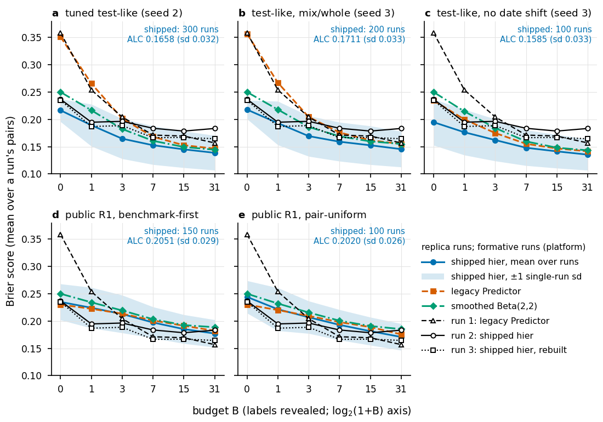

*Figure 1.* Brier by budget for hier-ship ("shipped hier" in the legend; band: ±1 single-run sd), LegacyP ("legacy Predictor") and Smooth in five replica regimes: (a) TL, (b) TL-mix, (c) TL-noshift, (d) R1-bf, (e) R1-pu. The three formative runs' pair means are overlaid in every panel; they are three draws with different subjects, so the gaps between them are not measured effects. The hier-ship rows are the run-2 library.

**The leaderboard.** On 2026-09-24 the organisers' entry scored 0.1801 and the best entry 0.1172, both single draws (F§ "Against the live leaderboard").

### 5.2 Public formative-like runs: baselines

R1-bf, 600 runs, seed 0, split scope 'pair' (F§ "Under the official protocol", `experiments/official_baselines.py`):

| predictor | B0 | B1 | B3 | B7 | B15 | B31 | ALC ± run SE |
|---|---|---|---|---|---|---|---|
| constant 0.5 | 0.2500 | 0.2500 | 0.2500 | 0.2500 | 0.2500 | 0.2500 | 0.2500 |
| EmpMean | 0.2500 | 0.3746 | 0.2572 | 0.2131 | 0.1974 | 0.1913 | 0.2526 ± 0.0014 |
| Smooth | 0.2500 | 0.2349 | 0.2220 | 0.2059 | 0.1957 | 0.1908 | 0.2158 ± 0.0008 |
| LegacyP, LOPO prior | 0.2313 | 0.2238 | 0.2162 | 0.2034 | 0.1944 | 0.1832 | 0.2090 ± 0.0009 |
| base-rate oracle E[p(1-p)] | 0.1809 | 0.1809 | 0.1809 | 0.1809 | 0.1809 | 0.1809 | 0.1809 ± 0.0010 |

EmpMean is no better than answering 0.5, because one label sends it to 0 or 1 (0.3746 at B1). LegacyP beats Smooth by only 0.0026 ± 0.0009 with a strict prior, or 0.0069 ± 0.0016 with a LOPO prior. hier-fit beats LegacyP by 0.0024 (0.0013), mostly by pooling a benchmark's level across the subjects a run holds on it, not for a target alone on its benchmark (App E.1); its attribute prior, feature groups and pooled level each pull their weight (App B.3). On that evidence the first verdict was to keep LegacyP (F§ "Verdict: keep the Predictor"); §5.3 reversed it.

### 5.3 Test-like runs: moving the level

**What moving the level buys, unconstrained** (selection half, TL runs 0 to 99, seed 2; F§ "What moving the level buys, unconstrained"):

| family | best configuration | ALC | Δ = family − LegacyP (cluster SE) | public cost, R1-bf / R1-pu (SE not shown) |
|---|---|---|---|---|
| LegacyP (first submission) | | 0.2039 | | |
| hier-fit | | 0.1906 | -0.0134 (0.0017) | -0.0019 / -0.0017 |
| Smooth | | 0.1788 | -0.0252 (0.0021) | +0.0070 / +0.0075 |
| hier, Gaussian level | mu0 -4, sigma_mu 2.5, attr_scale 0.5 | 0.1572 | -0.0467 (0.0042) | +0.0036 / +0.0032 |
| hier, Student-t level | mu0 -4, scale 1.8, attr_scale 0.5 | 0.1570 | -0.0469 (0.0042) | not scored |
| hier-EB | on the Gaussian above | 0.1567 | -0.0473 (0.0042) | +0.0034 / +0.0033 |
| LegacyP+fix | off -2.5, sc 1, va 2 | 0.1562 | -0.0477 (0.0045) | +0.0329 / +0.0329 |
| Smooth-cal | n0 2, m0 0.25 | 0.1588 | -0.0451 (derived, no SE) | +0.0077 / +0.0096 |

Source: `experiments/level_calibration.py`; run and stratified SEs: the same F§ section. The Smooth-cal row was added by the RS study on the same runs (App E.4).

- **Every family reaches the same plateau once its level is moved:** about 0.156 to 0.157, and flat, with 14 of 108 Gaussian configurations within 0.001 of the best. LegacyP loses to answering from Beta(2,2) here, and what it loses is its prior: a smoothed mean with a calibrated prior, which has no model at all, reaches 0.159. How much of the gain to call calibration is §5.5.
- **The widest level prior always won.** At every shift, sigma_mu 2.5 beat 1.8, 1.3 and 0.9 in every cell of both grids (Figure 2; wider priors: §5.4).
- **The public guard decides.** Moving the level costs LegacyP far more on public runs than it costs hier, which gives back most of its B0 and B1 losses from B7 on.

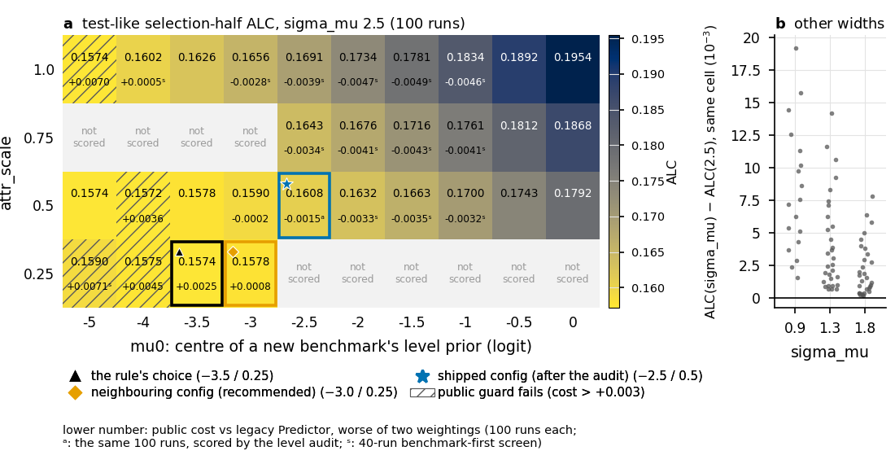

*Figure 2.* (a) Selection-half ALC of hier over mu0 and attr_scale at sigma_mu 2.5, with each cell's public guard cost (100 runs a weighting where scored, hier-ship's cell from the level audit on the same runs; otherwise the 40-run screen); hatched cells fail the guard. Marked: hier-argmax (mu0 -3.5, attr_scale 0.25; 0.1574), hier-rec (-3.0 / 0.25; 0.1578; "neighbouring config" in the legend) and hier-ship (-2.5 / 0.5; 0.1608). (b) In every scored cell, sigma_mu 0.9, 1.3 and 1.8 lose to 2.5, the edge of the grid; the wider priors are in Figure 4.

### 5.4 hier-ship: chosen, audited, confirmed, tested

**(a) Chosen.** The selection rule picked hier-argmax (mu0 -3.5, attr_scale 0.25); the level calibration recommended hier-rec (mu0 -3.0) on a tie-break by the guard's margin, 0.0004 behind on selection and level on confirmation (F§ "The public guard decides"):

| configuration | selection half, ALC | confirmation half, ALC ± run SE | Δ LegacyP, confirmation (cluster SE) | R1-bf runs 0-99, Δ LegacyP (SE not shown) | R1-pu runs 0-99, Δ LegacyP (SE not shown) |
|---|---|---|---|---|---|
| **hier-ship** (mu0 -2.5, sigma_mu 2.5, attr_scale 0.5) | 0.1608 | 0.1677 ± 0.0028 | -0.0396 (0.0037) | -0.0015 | -0.0018 |
| hier-rec (-3.0, 2.5, 0.25; recommended, not shipped) | 0.1578 | 0.1655 ± 0.0031 | -0.0418 (0.0047) | +0.0008 | +0.0007 |
| hier-argmax (-3.5, 2.5, 0.25) | 0.1574 | 0.1655 ± 0.0033 | -0.0418 (0.0051) | +0.0025 | +0.0023 |
| hier-EB (EB-cs, tau 2) on mu0 -3.0, attr_scale 0.5 | 0.1580 | 0.1658 ± 0.0031 | -0.0416 (0.0043) | +0.0005 | +0.0006 |
| LegacyP+fix (off -1.5, sc 1, va 3) | 0.1630 | 0.1696 ± 0.0027 | -0.0377 (0.0032) | +0.0026 | +0.0028 |
| hier-fit | 0.1906 | 0.1949 ± 0.0024 | -0.0124 (0.0019) | -0.0019 | -0.0017 |
| LegacyP | 0.2039 | 0.2073 ± 0.0022 | | ¹ | ¹ |

¹ LegacyP's own ALCs: 0.2068 and 0.2038. Paired, hier-ship − hier-rec is +0.0030 (0.0009) and +0.0022 (0.0011) on the two TL halves, and -0.0023 (0.0005) and -0.0024 (0.0004) on R1-bf and R1-pu runs 0-99 (other SEs: App E.2). Sources: `experiments/level_calibration.py`; hier-ship's row from `results/level_audit.json` (`mild`) and `results/ship_confirm.json`.

**(b) Audited.** An audit then moved the choice to hier-ship, the milder guarded configuration (F§ "What actually shipped, after the audit"; `results/level_audit.json`), for three reasons:

1. Matched against replica pairs, two of run 1's nine pairs, on one benchmark, are more plausibly high-rate, with 70% and 80% of their nearest replica pairs above a rate of 0.5, and a third is ambiguous. So the hidden levels look spread both ways: read that way, the nine pairs average -0.98 (sd 2.05) on the plain logit, not -1.6. And against LegacyP, hier-rec loses 0.014 on TL pairs at rates 0.5 to 0.7, 0.070 at 0.7 and above, and 0.015 to 0.017 on public matharena.
2. The two sit on a flat plateau (the table's note), and hier-ship has no worse measured worst case.
3. The confirmation half repeats 82.2% of the selection half's pairs and 99.5% of its clusters, so it measures redrawing, not unseen parents.

**(c) Confirmed.** hier-ship was then scored against LegacyP and Smooth on identical runs, including TL runs 200 to 299, which no choice of the level used (F§ "Shipped configuration, confirmed"; `experiments/ship_confirm.py`, `results/ship_confirm.json`; full SE triple):

| regime, runs | hier-ship ALC | Δ LegacyP (run / cluster / stratified SE) | parent-level | parents (range) | Δ Smooth (run / cluster / stratified SE) |
|---|---|---|---|---|---|
| TL, 0-99 (selection half) | 0.1608 | -0.0431 ± 0.0019 / 0.0032 / 0.0028 | -0.038 ± 0.009 | -0.059 to -0.014 | -0.0180 ± 0.0010 / 0.0021 / 0.0020 |
| TL, 100-199 (confirmation half) | 0.1677 | -0.0396 ± 0.0019 / 0.0037 / 0.0034 | -0.035 ± 0.011 | -0.058 to -0.007 | -0.0159 ± 0.0009 / 0.0021 / 0.0020 |
| TL, 200-299 (never used to choose the level) | 0.1687 | -0.0419 ± 0.0017 / 0.0037 / 0.0034 | -0.038 ± 0.008 | -0.057 to -0.021 | not stored |
| TL, 0-299 | 0.1658 | -0.0415 ± 0.0011 / 0.0034 / 0.0031 | -0.037 ± 0.009 | -0.058 to -0.014 | -0.0169 ± 0.0007 / 0.0020 / 0.0019 (0-199) |
| TL-mix, 0-99 | 0.1694 | -0.0436 ± 0.0014 / 0.0039 / 0.0031 | -0.029 ± 0.012 | -0.065 to -0.010 | -0.0176 ± 0.0008 / 0.0022 / 0.0019 |
| TL-noshift, 0-99 | 0.1585 | -0.0144 ± 0.0012 / 0.0024 / 0.0022 | -0.012 ± 0.005 | -0.024 to -0.000 | -0.0220 ± 0.0014 / 0.0030 / 0.0028 |
| R1-bf, 0-149 | 0.2051 | -0.0017 ± 0.0008 / 0.0021 / 0.0018 | -0.003 ± 0.005 | -0.013 to +0.010 | -0.0086 ± 0.0010 / 0.0030 / 0.0021 |
| R1-pu, 0-99 | 0.2020 | -0.0018 ± 0.0010 / 0.0017 / 0.0016 | -0.002 ± 0.005 | -0.015 to +0.009 | -0.0093 ± 0.0011 / 0.0021 / 0.0019 |

Seeds: TL 2, TL-mix and TL-noshift 3, R1 0; run-2 library (App H.2).

Held out, the gain is 0.040 to 0.042: hier-ship beats LegacyP on 296 of 300 TL runs, and leaving one parent out of all 300 gives -0.047 to -0.032. Between benchmarks it is less certain: the parent-level SE (0.009) is about 2.7 times the cluster SE, and matharena gains least (-0.014 ± 0.009, per-parent cluster SEs), multi_swebench most (-0.058 ± 0.004). B0 and B1 carry 0.029 of the 0.042 (0.135 and 0.076 of Brier there; Figure 3). On public runs hier-ship is level with LegacyP, 0.0015 to 0.0018 better (0.81 and 1.02 cluster SEs), losing at B0 and on public matharena (+0.010, +0.009) and gaining from B7 on. Against Smooth, which has no level to tune, it gains 0.016 to 0.018 in the tuned regime, 0.022 without the date shift, and 0.009 on public runs.

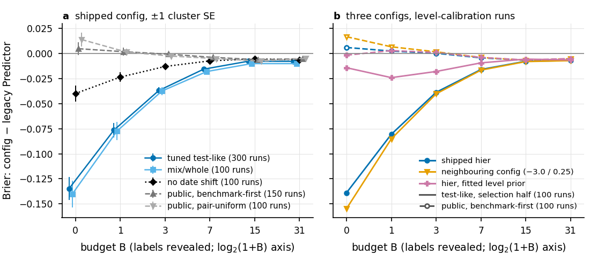

*Figure 3.* Paired Brier difference against LegacyP ("legacy Predictor") by budget. (a) hier-ship ("shipped hier") in five regimes, ±1 cluster SE: on TL runs it gains 0.135 at B0 and 0.076 at B1 (0.040 and 0.023 on TL-noshift); on public runs it costs 0.005 and 0.014 at B0 (cluster SEs about 0.007), is level at B1 and B3, and gains 0.004 to 0.008 a budget from B7 on. (b) hier-ship, hier-rec ("neighbouring config") and hier-fit on the level calibration's runs, without SEs (none is stored per budget for the last two).

**(d) After run 2: the pooled reading.** Runs 1 and 2 were then read per pair, pooled, under a decision rule hash-locked before the reading was computed but after both runs' tables had been seen (App C.3). It could change mu0 and sigma_mu only, at a bar of 2 SEs that resample the 7 benchmarks. The 17 pairs' level is -0.65 (K = 15 neighbours) and -0.78 (K = 40), SE 0.51, which is 1.24 and 1.00 SEs above the tuned regime's realised -1.29: no candidate, and LEVEL stays. The hidden level looks near the public centre, more central than the regime of the headline gain, but within the noise of 7 benchmarks. Run 3 is not read (rule, table and checks: App D.4).

**(e) Tested at the feedback's readings.** The regime-sensitivity (RS) study scored ten alternatives against hier-ship on identical runs of the five RS regimes (§4.1) and both public weightings (F§ "Regime sensitivity at the feedback's reading"; `results/regime_sensitivity.json`). Seed 11 is fresh, but its runs redraw the catalogue and public pairs that chose the level, so TUNED and the public guard are not an independent replication. A replacement had to gain at least 0.002 in READING and AUDIT with the upper end of its 95% interval below zero, lose at most 0.002 in the other test-like regimes and at most 0.001 on public runs (all five conditions: App C.2).

| alternative − hier-ship, ALC (cluster SE) | TUNED (-1.28) | READING (-0.63) | AUDIT (-0.93) | MIXTURE (-0.64) | FLAT (-0.28) | R1-bf | R1-pu |
|---|---|---|---|---|---|---|---|
| hier-ship, ALC | 0.1690 | 0.1881 | 0.1650 | 0.1830 | 0.1739 | 0.2114 | 0.1948 |
| hier-rec | -0.0034 (0.0010) | +0.0015 (0.0011) | +0.0005 (0.0014) | +0.0017 (0.0012) | +0.0033 (0.0014) | +0.0025 (0.0004) | +0.0020 (0.0005) |
| hier-ship σ3.5 | +0.0009 (0.0003) | +0.0006 (0.0003) | -0.0003 (0.0004) | +0.0005 (0.0004) | -0.0010 (0.0005) | +0.0007 (0.0003) | +0.0008 (0.0003) |
| hier-ship σ5 | +0.0031 (0.0007) | +0.0023 (0.0007) | +0.0006 (0.0008) | +0.0022 (0.0008) | -0.0007 (0.0009) | +0.0026 (0.0007) | +0.0025 (0.0007) |
| hier-EB on hier-ship | -0.0014 (0.0004) | +0.0003 (0.0003) | -0.0002 (0.0004) | -0.0001 (0.0003) | -0.0001 (0.0004) | +0.0006 (0.0003) | +0.0014 (0.0003) |
| hier-EB on mu0 -3.0 / attr_scale 0.5 | -0.0027 (0.0006) | +0.0003 (0.0004) | -0.0005 (0.0007) | -0.0001 (0.0004) | +0.0003 (0.0004) | +0.0017 (0.0002) | +0.0020 (0.0002) |
| hier-fit | +0.0309 (0.0035) | +0.0173 (0.0032) | +0.0233 (0.0042) | +0.0164 (0.0028) | +0.0140 (0.0038) | -0.0010 (0.0010) | +0.0009 (0.0011) |
| hier-nosubj | -0.0030 (0.0012) | +0.0026 (0.0014) | +0.0016 (0.0017) | +0.0031 (0.0014) | +0.0049 (0.0017) | +0.0025 (0.0005) | +0.0027 (0.0004) |
| Smooth-cal | -0.0015 (0.0019) | +0.0078 (0.0021) | +0.0043 (0.0024) | +0.0071 (0.0021) | +0.0103 (0.0024) | +0.0108 (0.0014) | +0.0100 (0.0018) |
| Smooth | +0.0170 (0.0022) | +0.0096 (0.0018) | +0.0142 (0.0024) | +0.0110 (0.0020) | +0.0103 (0.0018) | +0.0075 (0.0029) | +0.0127 (0.0021) |
| LegacyP | +0.0434 (0.0037) | +0.0248 (0.0037) | +0.0313 (0.0049) | +0.0263 (0.0037) | +0.0200 (0.0044) | +0.0002 (0.0020) | +0.0039 (0.0019) |

Source: `experiments/regime_sensitivity.py`. Realised mean pair logit in brackets; 80 runs a test-like regime and 60 a public weighting, seed 11, library of `4d2cc4f`. Positive: hier-ship is better. Run and stratified SEs, U95, per-parent and per-budget differences: F§ "Regime sensitivity at the feedback's reading"; results in full: App E.2.

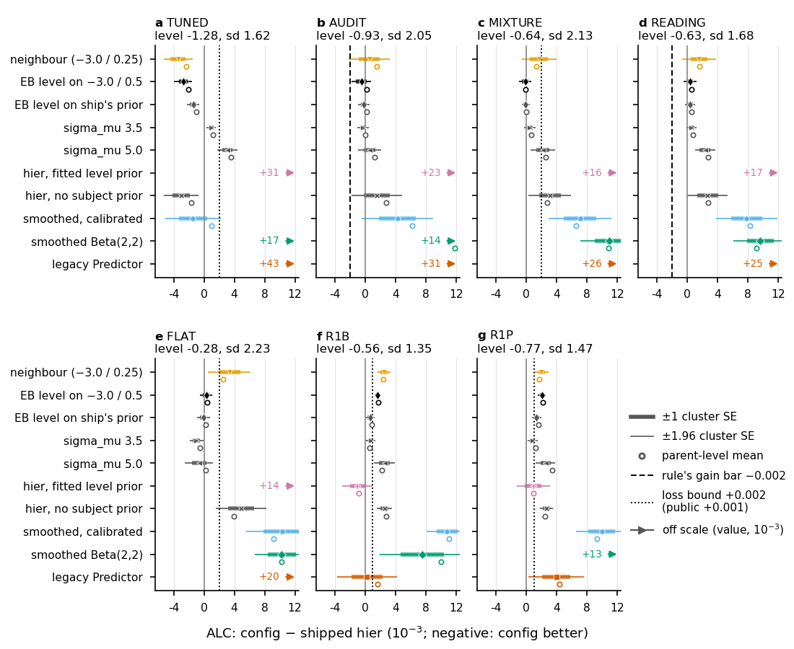

*Figure 4.* Each alternative minus hier-ship ("shipped hier") in the seven RS regimes, test-like ones ordered by realised level, with ±1 and ±1.96 cluster-SE bars (the right end of the thin bar is the rule's U95) and the parent-level mean as a hollow marker. Dashed: the gain the rule required in READING and AUDIT (-0.002); dotted: its loss bounds. "hier, no subject prior" in the legend is hier-nosubj, not the plain 1PL of §5.5. No alternative crosses -0.002 in READING or AUDIT.

No configuration passes, so LEVEL stays (Figure 4). One reproduction check was compared at stored rather than planned precision, a deviation the team accepted (App C.3); with or without it, no alternative is a candidate. The closest alternatives, hier-ship σ3.5 and both hier-EB, sit within 0.0006 of hier-ship in READING and AUDIT (cluster SEs 0.0003 to 0.0007). hier-rec wins only where it was chosen, in TUNED (-0.0034 (0.0010)), and loses elsewhere by +0.0005 to +0.0033, the more the higher the level. Against LegacyP, hier-ship gains 0.043 in TUNED, 0.031 in AUDIT, 0.026 in MIXTURE, 0.025 in READING and 0.020 in FLAT: the gain shrinks as the hidden level rises, as in the level audit's LA-0.8 and LA-flat (App E.2).

Four parents carry these numbers: every alternative with a lower centre than hier-ship gains on multi_swebench, the lowest-level parent, and loses on matharena, the highest. The parent-level SE is two to four times the cluster SE; the rule detects gains of about 0.003 or more and is a coin flip at 0.002.

### 5.5 Calibration against modelling

On the RS study's TUNED and public runs, the baseline study scored a plain 1PL (hier with attributes, identity link, groups, floor and slip off) at hier-ship's level (1PL-ship) and at its own leave-one-parent-out public level (1PL-fit), and EmpMean (F§ "Baselines: a plain 1PL, the organisers' empirical mean and BLE"; `results/baselines_p1.json`; App E.4).

| ALC; TUNED and R1, seed 11 (the RS runs) | TUNED | R1-bf | R1-pu |
|---|---|---|---|
| hier-ship | 0.1690 | 0.2114 | 0.1948 |
| 1PL-ship | 0.1673 | 0.2162 | 0.1998 |
| Smooth-cal | 0.1675 | 0.2222 | 0.2048 |
| 1PL-fit | 0.1743 | 0.2173 | 0.2027 |
| hier-fit | 0.1999 | 0.2104 | 0.1957 |
| EmpMean | 0.2029 | 0.2578 | 0.2397 |
| LegacyP | 0.2124 | 0.2116 | 0.1988 |

hier-ship's TUNED gain over LegacyP, -0.0434 (0.0037), split by the order of the steps (shares with 95% bootstrap intervals):

| order of the steps | the level calibration's share | the model's share |
|---|---|---|
| calibrate first: LegacyP → Smooth-cal → hier-ship | 1.03 [0.94, 1.10] | -0.03 [-0.10, 0.06] |
| model first: LegacyP → hier-fit → hier-ship | 0.71 [0.61, 0.81] | 0.29 [0.19, 0.39] |
| through the 1PL: LegacyP → 1PL-fit → 1PL-ship → hier-ship | 0.16 [0.12, 0.20] | 0.88 [0.84, 0.91] for 1PL-fit; -0.04 [-0.08, 0.02] for hier's extras |

- **"Calibration is worth far more than the modelling" is not an order-free statement, and we no longer make it.** Calibrating first gives the calibration the whole gain, modelling first 0.71, and on the 1PL path 1PL-fit takes 0.88 before any calibration.
- **What holds in every order: at a calibrated level the model adds nothing in the tuned regime.** hier-ship − Smooth-cal is +0.0015 (0.0019), and hier-ship − 1PL-ship +0.0017 (0.0013). Smooth-cal, with no item model and no subject prior, beats LegacyP by 0.045 there, but trails hier-ship by 0.004 to 0.010 in the four other test-like regimes and by 0.010 to 0.011 on public runs, where it also fails the guard (App E.4).
- **Most of LegacyP's tuned-regime deficit is its own prior.** 1PL-fit, with no calibration at all, beats it there by 0.038 (cluster SE 0.004), hier-fit by 0.012, and even EmpMean by 0.0095 (1.9 cluster SEs). LegacyP's mean B0 prediction in TUNED is 0.68, against 0.42 for hier-ship: its attribute prior turns the synthetic date shift into optimism, which sets much of the tuned headline.
- **On public runs, where the calibration costs, the model pays for it.** hier-ship − LegacyP is within noise there (-0.0002 and -0.0039). At the same level hier adds 0.010 over Smooth-cal and 0.005 over 1PL-ship (-0.0048 (0.0007) and -0.0050 (0.0007)), about half of it the subject prior (hier-ship − hier-nosubj) and half the groups, floor, slip and name-keyed ability (hier-nosubj − 1PL); at B0 the attribute prior pays once the centre is held level (App E.4).

BLE could not be run: each prediction is an agent run against a paid API, 569,838 of them on these runs alone (App E.5), and the best leaderboard entry (0.1172) stays unexplained. 1PL-ship borrows hier's calibrated mu0, and TUNED redraws the catalogue that chose LEVEL and Smooth-cal, so it favours those configurations.

### 5.6 Where it loses, and what it costs

**The single-subject benchmark.** swe_rebench has one subject, whose appearances each see a different subset of its 6,306 items; nothing measures variation between subjects or between single-subject benchmarks (F§ "A single-subject benchmark"; `results/gate_and_ci.json`, `single`). There hier-ship loses to LegacyP: +0.0101 ± 0.0012 over 130 R1-bf appearances (run-2 library, seed 0) and +0.0094 ± 0.0016 over 51 (current library, seed 11), SEs over appearances; against Smooth, +0.0130 ± 0.0014 and +0.0117 ± 0.0018. The loss sits at B0 to B3. Test-like runs exclude such benchmarks, and swe_rebench's rate (about 0.49) sits near the public centre (App E.6).

**The platform's composition.** Reweighted to the platform's composition, public runs put hier-ship level with LegacyP under per-pair splits (+0.0024 ± 0.0023) and behind it under per-benchmark splits (+0.0045 ± 0.0024). 87 of the replica's 193 pairs alone on their benchmark are swe_rebench; without it these become +0.0004 ± 0.0026 and +0.0017 ± 0.0022, so the cost is mostly the single-subject benchmark's (F§ "Pooling under the verified protocol"; App A.2).

**Cost.** hier-ship takes 0.80 to 1.04 ms an evaluation call in the subject-side study (run-2 library) and 1.34 ms in the RS study (current library; slowest call 0.56 s), separate measurements: the floored-fit fix itself changes the time per call by -0.2% to +0.2%. On dense matharena it takes 7.5 to 9.4 ms; a formative run is about 3,000 calls, a few seconds against the 8-hour limit (App B.5).

---

## 6 What does not transfer

Every item-side idea reduces to a covariate, one number per item. §6.1 gives the harness and gate that score it, §6.2 and §6.3 what was tried (detail: App F), §6.4 why it fails.

### 6.1 The acceptance harness and its gate

`experiments/harness.py` scores a covariate x against hier-ship, fitted leave-one-parent-out, by adding a centred logit offset (F§ "Acceptance harness"):

    q_i = sigmoid( logit p_i + cap(beta (x_i - mean of x over labeled items)) ),  cap(o) = 4 tanh(o/4)

Here p_i is hier-ship's prediction; centring keeps its level, so x only orders items, and does nothing at B0. The slope beta is either **transferred**, one coefficient per budget fitted on the other parents, or **per-pair**, a MAP from the target pair's own labels under a zero-mean prior of s per standard deviation of x. The **gate table** scores degraded oracles, x = r z + sqrt(1 - r^2) noise, where z is an *honest* difficulty fitted on other subject folds only, over 8 noise draws per r. A real covariate is one draw, so its chance of passing is read from the draws, not from the averaged line:

| honest r (within-pair r) | transferred slope: nested TL Δ (cluster SE, draw sd) | draws passing (Jeffreys 95%) | P(one draw clears -0.002), normal / t | P(full gate), modelled | per-pair slope: nested TL Δ | draws passing |
|---|---|---|---|---|---|---|
| 0 (0.00) | -0.00002 (0.00001, 0.00006) | 0/8 | | | -0.00000 | 0/8 |
| 0.1 (0.08) | -0.00010 (0.00005, 0.00043) | 0/8 | | | -0.00000 | 0/8 |
| 0.2 (0.16) | -0.00083 (0.00015, 0.00086) | 1/8 [0.01, 0.45] | 0.09 / 0.12 | 0.09 | -0.00010 | 0/8 |
| 0.3 (0.25) | **-0.00255** (0.00032, 0.00068) | **6/8** [0.41, 0.94] | 0.79 / 0.76 | 0.68 | -0.00032 | 0/8 |
| 0.4 (0.33) | -0.00462 (0.00052, 0.00081) | 7/8 [0.55, 0.99] | 1.00 / 0.99 | 0.87 | -0.00136 | 0/8 |
| 0.5 (0.42) | -0.00738 (0.00077, 0.00090) | 8/8 [0.74, 1.00] | 1.00 / 1.00 | 1.00 | **-0.00255** | **8/8** |
| 0.7 (0.61) | -0.01528 (0.00143, 0.00091) | 8/8 | | | -0.00768 | 8/8 |
| honest oracle | -0.0360 (0.0030) | passes | | | -0.0223 | passes |

Source: `results/harness_thresholds.json`, 300 TL runs, current library; pass probabilities from `results/gate_and_ci.json` (F§ "The gate, tightened"). TL-mix and public columns: App C.4.

- **A transferred slope needs an honest r of about 0.3 to 0.35;** at 0.3 it passes about two times in three (Figure 5).
- **A per-pair slope needs about 0.46** (0.455 to 0.475), because it must be learned from at most 31 labels.
- **The gate uses the thinnest regime, so it leans toward false negatives.** At r = 0.2 the transferred line gains 0.0016 on TL-mix and 0.0019 to 0.0025 on public runs, but 0.0008 on TL runs (the gate read on TL-mix: App C.4).

**One correlation scale.** The honest difficulty is reliable (0.84 to 0.95), so a correlation against full-sample difficulty is only 0.5% to 1.6% higher than against it. What differs is the unit: the gate reads a covariate within a test-like pair, where its bar is r = 0.25, while most correlations in §6.3 are taken over a benchmark's whole range, within groups, or over text-bearing subsets. A degraded oracle keeps 0.82 of its r within a pair, the 14B's main covariates 0.57 to 0.65 (App F.1).

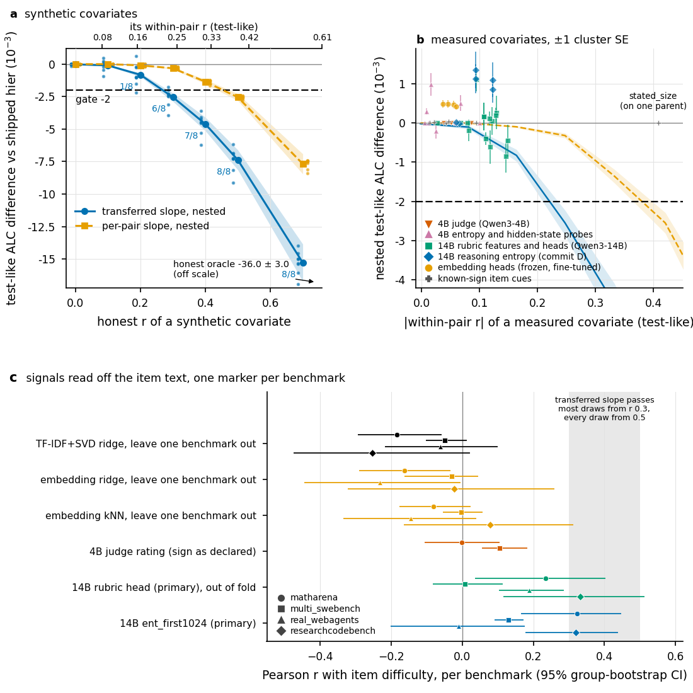

*Figure 5.* (a) The nested TL ALC difference against hier-ship ("shipped hier") for a synthetic covariate at honest correlation r (top axis: within-pair r), for the transferred and the per-pair slope, with the 8 noise draws and the number that pass; the gate is -0.002. (b) The 44 measured covariates at their within-pair |r| and nested lines (translucent, because several overlap): none reaches the gate. (c) Per-benchmark correlations with difficulty and 95% group-bootstrap intervals for the text maps, the 4B judge, the 14B's rubric head and its reasoning entropy.

### 6.2 What was tried

Each idea is recorded as negative with its script (Figure 6). Rows marked "harness" were scored against hier-ship leave-one-parent-out; the text maps and blind ratings are data-level correlations with difficulty; the last three rows come from the legacy replica.

| idea | footing | key number | within-pair r | verdict |
|---|---|---|---|---|
| item difficulty from TF-IDF text | data-level, LOBO | Pearson with Rasch difficulty -0.16 to 0.14, every 95% interval below 0.3 | 0.07 | does not transfer |
| item difficulty from Qwen3-Embedding-0.6B | data-level, LOBO | ridge -0.23 to -0.02 | -0.11 (ridge); -0.04 (kNN) | does not transfer |
| blind LLM difficulty rating | data-level | 0.482 [0.25, 0.64] on matharena; -0.13 to 0.21 elsewhere | | mathematics only; inconclusive on two benchmarks, below 0.3 on swe_rebench |
| Qwen3-4B zero-shot judge | harness | no TL difference ≤ -0.001, parents weighted equally | 0.04 to 0.09 | closed |
| a 4B model's own attempts | correlation rule | graded accuracy 2.3% and 7.8%, below the 10% floor | | cannot be read |
| entropy and hidden-state heads | LOBO r | -0.05 [-0.24, 0.14] and +0.12 [-0.004, 0.24] | | replicated null |
| in-context learning over the pair's labels | correlation rule | r 0.206 ± 0.040, below 0.3 | | closed |
| pairwise (anchored) comparisons | correlation rule | pooled q 0.540, below 0.60 | | dropped |
| text-similarity residual layer (itemsig) | harness, nested | -0.00002 (0.00008) | | no gain |
| meta-learned heads on frozen embeddings | harness, nested | 0 (every head off in every fold); forced +0.0002 to +0.0006 | | no gain |
| fine-tuned encoder | LOBO r; harness | 0 of 4 parents at r ≥ 0.3; transferred line +0.00048 | | closed |
| Qwen3-14B demand rubric | harness, nested | best line -0.00084 (0.00043) | 0.11 (head); 0.15 (best scales) | null for ALC |
| Qwen3-14B reasoning attempts (matharena) | correlation rule; forced per-pair | rho 0.372 [0.209, 0.516] | 0.32 (one parent) | GO for correlation; null for ALC |
| Qwen3-14B reasoning entropy, four parents | harness, nested; rule fixed before the data | transferred +0.00110 (0.00045) | 0.12 [0.09, 0.15] | null |
| known-sign item cues | harness, nested | 0 to +0.00003; text length +0.28 / +0.36 / -0.43 within paper; stated size +0.50 on one benchmark | +0.41 (stated size, one benchmark) | none passes |
| subject side (harness identity, effort, date forms, t level) | harness, nested | best -0.00097 (0.00033) | | none passes |
| acquisition policies | legacy replica | coverage-first -0.0000 ± 0.0013 | | none beats random |
| post-hoc temperature and slip | legacy replica | loses 0.0007 ± 0.0011 | | does not transfer |
| offline bank of per-item results | feasibility | 1 of 161 inventory benchmarks judged usable | | closed |

Brackets: 95% intervals; parentheses after a nested line: its cluster SE; other ± as each study records them. Scripts and intervals: App F.1.

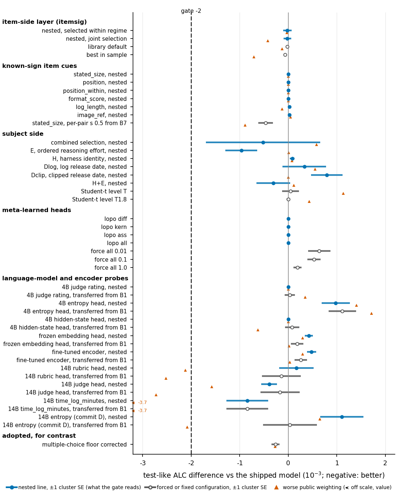

*Figure 6.* Each idea's TL ALC difference against hier-ship, ±1 pair-cluster SE: filled, the nested line the gate reads; hollow, a forced or fixed configuration; triangle, the same line's worse public weighting (at the edge with its value when off scale, as for the 14B's estimate of an expert's time, -0.0037). Dashed: the gate, -0.002. No nested line reaches it; the best are the subject side's ordered reasoning effort (-0.0010 ± 0.0003) and the 14B's estimate of an expert's time (-0.0008 ± 0.0004). The corrected multiple-choice floor, adopted as a bug fix, is drawn for contrast. Footings differ by idea (§6.2's table).

### 6.3 Study by study

**Text maps.** Leave one benchmark out, TF-IDF correlates -0.16 to 0.14 with Rasch difficulty and embedding ridge -0.23 to -0.02. Within a benchmark embeddings reach 0.27 to 0.66, but mostly by identifying the item_features group, which hier already learns from labels: with whole groups held out they fall to -0.09 to 0.40 (App F.2).

**Language-model judges.** A blind rater with an undocumented prompt (180 items) correlates 0.482 [0.25, 0.64] with Rasch difficulty on matharena and -0.13 to 0.21 elsewhere; with 45 items a benchmark, the intervals on multi_swebench and real_webagents still include 0.3 (inconclusive rather than negative), while swe_rebench's [-0.41, 0.17] excludes it. A fully specified 4B judge was closed through the harness, and the 14B below rated every item (App F.3).

**A label-conditional layer.** `paiec/itemsig.py` carries hier's residuals on a pair's labelled items to unlabelled items with similar text. With nested selection over 480 configurations it gains -0.00002 on TL runs; it cannot act at B0 or B1, and at B31 it takes 0.5% of the 0.063 Brier gap between the pair-rate and item oracles (Figure 7; App F.4).

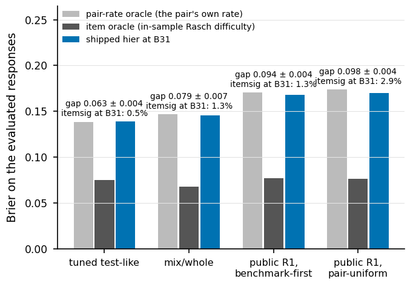

*Figure 7.* Brier on the evaluated responses per regime: the pair-rate oracle, the item oracle (in-sample Rasch difficulty) and hier-ship ("shipped hier") at B31. The gap between the two oracles (± cluster SE) is what an item-difficulty model could add; the itemsig layer's nested line recovers 0.5% of it at B31 on TL runs and 1.3% to 2.9% elsewhere. Run sets: TL 0-299, TL-mix 0-199, R1-bf 0-199, R1-pu 0-99.

**Probes, heads and encoders.** Meta-learned heads on frozen embeddings are off in every fold under nested selection and cost +0.0002 to +0.0006 when forced on. A 4B model's own attempts fell below their accuracy floor, entropy and hidden-state heads are a replicated null, in-context learning and pairwise comparisons stay below their bars, and a fine-tuned encoder reaches r 0.3 on 0 of 4 parents (App F.5, F.9).

**Known-sign cues.** Benchmark-agnostic cues with signs declared in advance (`paiec/itemcov.py`) mostly vary on one benchmark only; text length, the one universal cue, changes sign; researchcodebench's stated size has a within-pair r of +0.41 but exists on one benchmark. Nested TL differences are 0 to +0.00003 (App F.6).

**The subject side.** Of four prior changes that act at B0 and B1, ordered reasoning effort is switched on in all four folds but gains -0.00097, half the bar, all through a lower date slope under the synthetic shift; harness identity cannot be measured leave-one-parent-out, the date form is decided by the shift, and a Student-t level ties or loses (App F.7).

**A 14B on a free GPU.** Qwen3-14B on two Kaggle T4s rated all 4,326 items of the four parents on a demand rubric, attempted 270 matharena texts, and reasoned once over every item. Its attempts' token entropy reaches a within-competition Spearman of 0.372 [0.209, 0.516] with difficulty on mathematics, the one signal past its correlation bar. Its reasoning entropy, under a rule committed before the data existed, orders difficulty on mathematics and research code (+0.29, +0.33 within group) but weakly or not on the agentic two (+0.12, -0.03), reaches 0.12 within a test-like pair, and fails the gate (App F.9).

**Legacy replica.** No acquisition policy beat the platform's random one, so the submission ships no `labeling.py`; post-hoc temperature and slip do not transfer; an offline bank of per-item results was closed on feasibility and on the rules' public-pool restriction (App F.8).

### 6.4 Why these fail, in two numbers

1. **Item-side terms barely reach the budgets that matter most.** B0 and B1 carry 0.3 of ALC's weight. On the second formative run B0 was the largest error (0.237), and B1 and B3 were level (0.195 and 0.196); on the third, 0.235, then 0.187 and 0.189. A centred covariate is zero at B0, where only the level and subject priors act (the harness's uncentred B0 term never passes the gate: -0.0027 even for the honest oracle), and a per-pair slope is zero at B1 too. A transferred slope does act at B1: at the gate's r = 0.3 it gains 0.0026 of Brier there, against 0.0027 to 0.0030 at B3 to B31 (`results/gate_and_ci.json`, `gate.b1`).
2. **Item-level headroom is large but needs a signal no public cue has.** On TL runs it is 0.063 of Brier, but a transferred slope needs an honest correlation of about 0.3 to 0.35, 0.25 within a test-like pair, and within a pair every covariate that can be carried to a new benchmark reaches at most 0.15 (§6.1, §6.2). The larger correlations of §6.3 (0.48 and 0.37 on mathematics, 0.29 and 0.33 within group) are taken over a benchmark's whole range, within groups, or on one parent: the unit, not the target, flatters them.

---

## 7 Limitations

- **Five public benchmarks.** Four parents carry every test-like number: the headline's parent-level SE (0.009) is about 2.7 times its cluster SE, and per-parent gains range from 0.014 (matharena) to 0.058 (multi_swebench) (§5.4).
- **A self-built regime.** The test-like regime is tuned in sample to one feedback run, realises a pair logit of -1.29, not its target of -1.6, and takes the size of its gain from a synthetic date shift that matches the feedback for the legacy prior only: without it the gain is 0.014 (§5.4), and most of the tuned headline is LegacyP's own optimism under that shift (§5.5). Regimes set to the pooled reading (-0.65 to -0.78) and to the audit's give 0.025 to 0.031, but share the tuned regime's catalogue and shift and realised milder levels than targeted (§5.4, App C.1).
- **What hier adds.** Over a calibrated level, hier-ship's measured value is robustness to where the hidden level sits (§5.5).
- **Baselines missing.** BLE was not run, and 1PL-ship borrows hier's calibrated mu0 (§5.5, App E.5).
- **Selection optimism.** The selection and confirmation halves, and the RS runs, redraw one catalogue of pairs and the public pairs that chose the level, and several hyperparameters were set with all five public benchmarks in view (App C.2). hier-ship was never scored at level_mean -2.0.
- **Single-subject benchmarks.** hier-ship loses about 0.010 to LegacyP on the one public single-subject benchmark, and nothing measures variation between such benchmarks, which the hidden test may hold (§5.6).
- **Unexplained.** Two costs at B1 on dense runs were not investigated: hier's pooling on real_webagents (+0.015 ± 0.010 of Brier) and LegacyP's pooled difficulty on multi_swebench (+0.004 to +0.009); a cost at B1 is the signature our notes say to check first for a mishandled second-order (posterior-curvature) term. The full gate under TL-mix was not run (App C.4, App I).
- **Library defects.** LegacyP's fit can diverge when its prior sits far from the labels, and the test-like item oracle oscillates on some strata, both reported, not fixed; a floored hier fit that could stop unconverged is fixed in archive-3 (App B.6).
- **Provenance gaps.** Some design inputs are recorded only as outputs, the blind rater's prompt and the inventory judgement are unrecorded, run 3's headline was not pasted, and the RS study's lock rests on local file times and the accepted precision deviation (App H.3, C.3).
- **Formative feedback is noisy.** A single run's ALC has sd 0.02 to 0.04, and the three runs are different draws (one pair recurs, in runs 1 and 3, under different models). We read feedback only for global hyperparameters, and run 3 for nothing beyond its regression check.

---

## Code, data and conduct

- *Data and code.* measurement-db, at a pinned revision, is our only training data, and the organisers' client is used at a pinned commit (App G.2). App G gives every command to rebuild the submission and rerun each experiment, with wall times. Every number traces to a committed script and results file (App H), and the per-row files behind the tables are packaged for release, except the itemsig rows (App G.4).
- *Formative feedback.* It set global quantities only: the test-like regimes' settings (level targets, date shift, run shape) and LEVEL's three hyperparameters. Run 1 set the test-like regime's defaults and was read per pair by the audit. Run 2's pooled reading, under a rule written before it was computed but after both runs' tables had been seen, changed nothing. Run 3 was a regression check only (§5.4, App G.6). No input, prior or selection is keyed on an anonymous id.
- *The inventory scan.* It cloned the organisers' inventory repositories, which may include hidden-test benchmarks, to list and match file paths. Whether some files were opened is unrecorded; nothing from the scan, its outputs or the inventory enters `paiec/`, `submission/` or `tools/`, and no per-item data from it was kept or used (App G.6).
- *Pretrained and language models.* Qwen3-Embedding-0.6B, Qwen3-4B-Instruct-2507 and Qwen3-14B-AWQ were used for research features only; the submission uses no pretrained model (App G.6). The blind difficulty rater of §6.3 was the Claude model of our coding session, and its prompt is undocumented. The code, the experiments and this report were developed with Claude Code.

---

## References

Author-year; the venue's year where a venue exists, with the arXiv id of every arXiv-first work. Checked on 2026-10-02 against arXiv, Crossref, Semantic Scholar, the venues and the dataset card (`docs/report/references_check.md`); the one preprint without a venue is marked.

- Barton, M. A. and Lord, F. M. (1981). An upper asymptote for the three-parameter logistic item-response model. *ETS Research Report Series* 1981(1). doi:10.1002/j.2333-8504.1981.tb01255.x
- Benedetto, L., Cremonesi, P., Caines, A., Buttery, P., Cappelli, A., Giussani, A. and Turrin, R. (2023). A survey on recent approaches to question difficulty estimation from text. *ACM Computing Surveys* 55(9): 1–37. doi:10.1145/3556538
- Breslow, N. E. and Clayton, D. G. (1993). Approximate inference in generalized linear mixed models. *Journal of the American Statistical Association* 88(421): 9–25. doi:10.1080/01621459.1993.10594284
- Breslow, N. E. and Lin, X. (1995). Bias correction in generalised linear mixed models with a single component of dispersion. *Biometrika* 82(1): 81–91. doi:10.1093/biomet/82.1.81
- Brier, G. W. (1950). Verification of forecasts expressed in terms of probability. *Monthly Weather Review* 78(1): 1–3. doi:10.1175/1520-0493(1950)078<0001:VOFEIT>2.0.CO;2
- De Boeck, P. and Wilson, M. (eds.) (2004). *Explanatory item response models: a generalized linear and nonlinear approach.* New York: Springer. doi:10.1007/978-1-4757-3990-9
- Fischer, G. H. (1973). The linear logistic test model as an instrument in educational research. *Acta Psychologica* 37(6): 359–374. doi:10.1016/0001-6918(73)90003-6
- Fox, J.-P. (2010). *Bayesian item response modeling: theory and applications.* New York: Springer. doi:10.1007/978-1-4419-0742-4
- Ge, C., Kryvosheieva, D., Fried, D., Girit, U. and Hariharan, K. (2026). Agent psychometrics: task-level performance prediction in agentic coding benchmarks. In *Conference on Language Modeling (COLM 2026)*. arXiv:2604.00594
- Gneiting, T. and Raftery, A. E. (2007). Strictly proper scoring rules, prediction, and estimation. *Journal of the American Statistical Association* 102(477): 359–378. doi:10.1198/016214506000001437
- Krsteski, S. and Meyer, C. (2026). Predicting task difficulty without rollouts. *COLM 2026 Workshop on Agent Behavior*. arXiv:2608.05797
- Kwa, T., West, B., Becker, J., et al. (2025). Measuring AI ability to complete long software tasks. In *Advances in Neural Information Processing Systems (NeurIPS 2025)*. arXiv:2503.14499
- Lalor, J. P., Wu, H. and Yu, H. (2016). Building an evaluation scale using item response theory. In *Proceedings of EMNLP 2016*, 648–657. doi:10.18653/v1/D16-1062. arXiv:1605.08889
- Li, Y., Ma, J., Ballesteros, M., Benajiba, Y. and Horwood, G. (2025). Active evaluation acquisition for efficient LLM benchmarking. In *Proceedings of the 42nd International Conference on Machine Learning*, PMLR 267: 35581–35602. arXiv:2410.05952
- Lipton, Z. C., Wang, Y.-X. and Smola, A. (2018). Detecting and correcting for label shift with black box predictors. In *Proceedings of the 35th International Conference on Machine Learning (ICML 2018)*, PMLR 80: 3122–3130. arXiv:1802.03916
- Liu, Q. and Pierce, D. A. (1994). A note on Gauss–Hermite quadrature. *Biometrika* 81(3): 624–629. doi:10.1093/biomet/81.3.624
- Lugoloobi, W. and Russell, C. (2025). LLMs encode how difficult problems are. arXiv:2510.18147 (preprint; no venue found)
- Lugoloobi, W., Foster, T., Bankes, W. and Russell, C. (2026). LLMs encode their failures: predicting success from pre-generation activations. In *Conference on Language Modeling (COLM 2026)*. arXiv:2602.09924
- Maia Polo, F., Weber, L., Choshen, L., Sun, Y., Xu, G. and Yurochkin, M. (2024). tinyBenchmarks: evaluating LLMs with fewer examples. In *Proceedings of the 41st International Conference on Machine Learning*, PMLR 235: 34303–34326. arXiv:2402.14992
- Martínez-Plumed, F., Prudêncio, R. B. C., Martínez-Usó, A. and Hernández-Orallo, J. (2019). Item response theory in AI: analysing machine learning classifiers at the instance level. *Artificial Intelligence* 271: 18–42. doi:10.1016/j.artint.2018.09.004
- Moreno Cencerrado, I. V., Padrés Masdemont, A., Gonzalvez Hawthorne, A., Africa, D. D. and Pacchiardi, L. (2026). No answer needed: predicting LLM answer accuracy from question-only linear probes. *ICLR 2026 Workshop on Principled Design for Trustworthy AI*. arXiv:2509.10625
- Morris, C. N. (1983). Parametric empirical Bayes inference: theory and applications. *Journal of the American Statistical Association* 78(381): 47–55. doi:10.1080/01621459.1983.10477920
- Naeini, M. P., Cooper, G. F. and Hauskrecht, M. (2015). Obtaining well calibrated probabilities using Bayesian binning. In *Proceedings of the AAAI Conference on Artificial Intelligence* 29(1). doi:10.1609/aaai.v29i1.9602
- Pacchiardi, L., Cheke, L. G. and Hernández-Orallo, J. (2024). 100 instances is all you need: predicting the success of a new LLM on unseen data by testing on a few instances. *KDD 2024 Workshop on Evaluation and Trustworthiness of Generative AI Models*. arXiv:2409.03563
- PAIEC baseline repository (2026). https://github.com/aims-foundations/paiec_baseline, commit `82d330dd` (App G.2).
- PAIEC organisers (2026). Predictive AI Evaluation Competition at NeurIPS 2026. https://aimslab.stanford.edu/competition (read 2026-10-02).
- Patz, R. J. and Junker, B. W. (1999). A straightforward approach to Markov chain Monte Carlo methods for item response models. *Journal of Educational and Behavioral Statistics* 24(2): 146–178. doi:10.3102/10769986024002146
- Pinheiro, J. C. and Bates, D. M. (1995). Approximations to the log-likelihood function in the nonlinear mixed-effects model. *Journal of Computational and Graphical Statistics* 4(1): 12–35. doi:10.1080/10618600.1995.10474663
- Rasch, G. (1960). *Probabilistic models for some intelligence and attainment tests.* Copenhagen: Danish Institute for Educational Research. Expanded edition 1980, Chicago: University of Chicago Press.
- Rodriguez, P., Barrow, J., Hoyle, A. M., Lalor, J. P., Jia, R. and Boyd-Graber, J. (2021). Evaluation examples are not equally informative: how should that change NLP leaderboards? In *Proceedings of ACL-IJCNLP 2021 (Volume 1: Long Papers)*, 4486–4503. doi:10.18653/v1/2021.acl-long.346
- Rodríguez, G. and Goldman, N. (1995). An assessment of estimation procedures for multilevel models with binary responses. *Journal of the Royal Statistical Society, Series A* 158(1): 73–89. doi:10.2307/2983404
- Ruan, Y., Maddison, C. J. and Hashimoto, T. (2024). Observational scaling laws and the predictability of language model performance. In *Advances in Neural Information Processing Systems (NeurIPS 2024)*. arXiv:2405.10938
- Rue, H., Martino, S. and Chopin, N. (2009). Approximate Bayesian inference for latent Gaussian models by using integrated nested Laplace approximations. *Journal of the Royal Statistical Society, Series B* 71(2): 319–392. doi:10.1111/j.1467-9868.2008.00700.x
- Saerens, M., Latinne, P. and Decaestecker, C. (2002). Adjusting the outputs of a classifier to new a priori probabilities: a simple procedure. *Neural Computation* 14(1): 21–41. doi:10.1162/089976602753284446
- Tierney, L. and Kadane, J. B. (1986). Accurate approximations for posterior moments and marginal densities. *Journal of the American Statistical Association* 81(393): 82–86. doi:10.1080/01621459.1986.10478240
- Truong, N., Truong, S. T. and Koyejo, S. (2026). The AI Measurement Data Bank (measurement-db). AIMS Lab, Stanford University. https://aimslab.stanford.edu/measurement-db; Hugging Face dataset `aims-foundations/measurement-db`, revision `bc8204d811823da849c6686bf124d4ca9f82e4de`, CC-BY-SA-4.0.
- Truong, S. T., Tu, Y., Liang, P., Li, B. and Koyejo, S. (2025). Reliable and efficient amortized model-based evaluation. In *Proceedings of the 42nd International Conference on Machine Learning*, PMLR 267: 60238–60265. arXiv:2503.13335
- Vivek, R., Ethayarajh, K., Yang, D. and Kiela, D. (2024). Anchor points: benchmarking models with much fewer examples. In *Proceedings of EACL 2024 (Volume 1: Long Papers)*, 1576–1601. doi:10.18653/v1/2024.eacl-long.95. arXiv:2309.08638
- Ye, Q., Fu, H. Y., Ren, X. and Jia, R. (2023). How predictable are large language model capabilities? A case study on BIG-bench. In *Findings of EMNLP 2023*, 7493–7517. doi:10.18653/v1/2023.findings-emnlp.503. arXiv:2305.14947
- Zhang, Q., Lyu, F., Liu, X. and Ma, C. (2024). Collaborative performance prediction for large language models. In *Proceedings of EMNLP 2024*, 2576–2596. doi:10.18653/v1/2024.emnlp-main.150. arXiv:2407.01300
- Zhou, L., Pacchiardi, L., Martínez-Plumed, F., Collins, K. M., et al. (2026). General scales unlock AI evaluation with explanatory and predictive power. *Nature* 652(8108): 58–67. doi:10.1038/s41586-026-10303-2. arXiv:2503.06378

---

## Appendix A: data, protocol and the legacy replica

### A.1 Data sources and the inventory classification

Sources: pair counts [P§ Data]. Distinct items from `results/harness_thresholds.json` (`meta.oracle_info`) and, for swe_rebench, P§ Data. `experiments/data_counts.py` re-counts the pairs, responses and distinct items from `data/` and gets the same numbers (`results/data_counts.json`). Mean accuracy from the R2 table in F§ "Under the official protocol" and, for swe_rebench, F§ "How much there is to win". Variance shares from F§ "The step-2 analyses behind the model" (`experiments/hier_design/item_signal.py`, recorded output, not rerun). matharena's 1,633 items in eligible pairs span 25 competitions. The 0.50 share was estimated on all 1,751 items with a binary response, which span 27 (imc_2025 and miklos_2025 occur only on subjects below the 80-item floor; `results/data_counts.json`, `matharena`).

matharena's textless items read "See image", or fragments of a system prompt, and its 336 Kangaroo items are all in eligible pairs (`results/data_counts.json`); see F§ "What transfers between benchmarks" and F§ "The multiple-choice floor, corrected". That raw solve rates confound difficulty, and that Rasch targets fix it, is in F§ "What transfers between benchmarks".

The hidden benchmarks are drawn from the organisers' inventory of 161 candidate benchmarks, which were assigned at random to the training and test pools before curation. Keyword rules on the titles alone (no description, paper or item is read) class 108 of the 161 (67%) as evaluations of AI systems. Of those 108, 39% are text QA, 30% images, 15% agents, 6.5% code, 4.6% video, 2.8% math and 2.8% audio. On 80 labelled titles from the organisers' full sheet, the rules agree on which titles are evaluations for 82.5%, and on the category for 38 of the 40 that both call evaluations (95%). The 80 labels were assigned by an AI agent reading each title, not by a person (`experiments/inventory_classes.py`, `results/inventory_classes.json`; F§ "What this could do on the hidden test"). The public benchmarks are therefore not a representative sample of the hidden task types.

### A.2 The legacy replica, and the pooling decomposition in full

Our first replica (`paiec/evaluator.py`, kept as the *legacy* replica so its numbers stay reproducible) was built before the client was public. It differed from the protocol in five ways [P§ The legacy replica]:

1. **Pair-major scoring.** Each pair was scored at all six budgets before the next pair started, with one predictor instance throughout. A stateful predictor therefore held earlier pairs' full 31-label trajectories while it was being scored at budget 0.
2. **Own labels only.** `labeled` held only the target subject's own labels, never other subjects'.
3. **All pairs in one session.** It scored all 221 pairs in one session instead of 5 to 12.
4. **Leaked identifiers.** It passed private identifiers and raw benchmark names to `predict`.
5. **A process-salted split.** Its first version keyed the split on Python's `hash()`, which is salted per process, so the "fixed" split changed between runs. Both replicas now hash by digest.

The consequences were not cosmetic. On the legacy replica, evaluation order alone moved the assembled predictor from 0.1898 to 0.1725 (F§ "Evaluation order is worth 0.017", `experiments/order_sensitivity.py`). The ladder there made pooled item difficulty look worth about 0.020 ALC (F§ "The predictor ladder", `experiments/ladder.py`), which pointed the research at cross-subject pooling.

One more legacy result: on the legacy replica, mixing the training mean into LegacyP's level prior cost 0.004 (legacy). Under the official protocol the training mean is the better centre for hier: centring its level prior at 0 instead costs 0.0011 on public runs (App B.3).

Re-measured on the official replica, over 600 formative-sized runs (R1), the picture changes (F§ "Under the official protocol", `experiments/official_baselines.py`):

- **The organisers' empirical-mean baseline is no better than answering 0.5.** It scores 0.2526 ± 0.0014 against 0.2500, because one label sends it to 0 or 1 (0.3746 at B1).
- **LegacyP's margin is small.** It beats Smooth by only 0.0026 ± 0.0009 (pair-cluster SE) with a strict prior, or 0.0069 ± 0.0016 with a LOPO prior.
- **Pooled difficulty adds about 0.0007 at formative size** (600 runs, seed 0). It needs 64 distinct labeled items on a benchmark, and a formative run has about two pairs per benchmark.

**Why the lever vanished: run size, not the information set.** The legacy ladder and the official R1 runs differ in run size and in split scope as well as in the information set. So we switched pooling on and off on the official replica, under both split scopes, on dense runs and on formative-size runs, and reweighted the formative runs to the platform's own composition: of the 26 appearances in formative runs 1 to 3, 16 were alone on their benchmark and 10 had one companion. For hier-ship, pooling off restricts `labeled` to the target pair's own entries, and a level per pair separates the pooled level's share from the items'. For LegacyP it is the WARMUP switch behind the 0.0007 (F§ "Pooling under the verified protocol"; `experiments/pooling_decomposition.py`, `results/pooling_decomposition.json`).

| pooling on minus off, ALC | dense, scope 'pair' | dense, 'benchmark' | formative, 'pair' | formative, 'benchmark' | platform mix, 'pair' / 'benchmark' |
|---|---|---|---|---|---|
| hier-ship, everything from other subjects | -0.0300 ± 0.0099 | -0.0142 ± 0.0059 | -0.0033 ± 0.0004 / 0.0006 / 0.0005 | -0.0020 ± 0.0004 / 0.0005 / 0.0004 | -0.0010 / -0.0004 (cluster SE 0.0003) |
| of which the pooled level | -0.0043 ± 0.0014 | -0.0029 ± 0.0009 | -0.0015 | -0.0012 | -0.0007 / -0.0003 |
| of which pooled item difficulty | -0.0258 ± 0.0088 | -0.0114 ± 0.0055 | -0.0018 | -0.0008 | -0.0004 / -0.0002 |
| LegacyP, pooled difficulty | -0.0237 ± 0.0065 | -0.0086 ± 0.0038 | -0.0010 ± 0.0001 / 0.0002 / 0.0001 | -0.0004 ± 0.0001 / 0.0001 / 0.0001 | 0 / 0 |

Dense: the four multi-subject benchmarks, mean ± SE across them; three are scored on at most 32 evaluation items a pair, with the full dense `labeled` list. Formative: 100 runs (seed 11, R1-bf), ± run / cluster / stratified SE.

- **Under the verified protocol pooling is still a large lever on dense runs,** 0.009 to 0.030 ALC by scope and predictor, which brackets the legacy ladder's 0.020. Most of hier's dense value is pooled item difficulty.
- **At formative size it is worth 0.002 to 0.003 to hier and 0.0004 to 0.001 to LegacyP,** and at the platform's composition 0.0004 to 0.001 and exactly 0: two pairs never reach the 64 distinct items the legacy switch needs. Within the replica's runs it grows with company, from nothing for a pair alone on its benchmark to 0.0027 with one companion and 0.0053 with more.
- **Per-benchmark splits halve it on dense runs** (ratios 0.47 for hier, 0.36 for LegacyP).

So the first replica did not invent the lever. The platform's runs are too small to use it, and per-benchmark splits would halve what is left. The legacy numbers still ranked predictors under a different information set, and nothing in this report is quoted from the legacy replica except where marked "legacy".

**The platform's composition, by class.** On public runs reweighted to the platform's composition (most pairs alone on their benchmark), hier-ship is not distinguishable from LegacyP under per-pair splits, +0.0024 ± 0.0023 (z about 1.0), and behind it by +0.0045 ± 0.0024 under per-benchmark splits (cluster SEs). In the replica, 87 of the 193 pairs alone on their benchmark are swe_rebench, which is alone in every run; without it these become +0.0004 ± 0.0026 and +0.0017 ± 0.0022, and the 'alone' class's +0.0050 and +0.0075 become +0.0019 ± 0.0033 and +0.0030 ± 0.0028. So that cost is mostly the single-subject benchmark's, not that of pairs alone on a multi-subject benchmark (F§ "Pooling under the verified protocol", "Not explained"; `results/pooling_decomposition.json`, `single_subject_confound`). The pooling study's rows were scored by an earlier version of its script, whose summary code changed afterwards; five tasks re-scored by the current script are bit-identical.

### A.3 Split scope on dense runs, and other open points

The replica treats what the client leaves open as parameters, not assumptions [P§ Still unknown]. The main one is `split_scope`: whether the 50/50 split is drawn per pair or per benchmark item.

- Under per-pair splits, other subjects' acquired labels land on most of a target's evaluation items on dense runs (83% to 99.5% at B31).
- Under per-benchmark splits, that coverage falls to 0% to 5%.

On dense runs (every pair of one benchmark), LegacyP's gain over Smooth on matharena is -0.0354 under per-pair splits and -0.0159 under per-benchmark splits (F§ "One benchmark, every pair (R2)"). hier depends on the scope differently. hier-fit, on dense researchcodebench, beats LegacyP by 0.0042 under per-pair splits and loses by 0.0040 under per-benchmark splits (F§ "Hierarchical model", R2). The pooling study has since run hier-ship on all four dense multi-subject benchmarks under both scopes (§2.4; F§ "Pooling under the verified protocol", subsection "Dense runs per benchmark, and hier's cost there"). Against LegacyP it gains most on multi_swebench (0.021 and 0.017), is level on matharena (-0.0006 and -0.0007), and on researchcodebench again gains under per-pair splits (0.005) and loses under per-benchmark splits (+0.007); SEs are over pairs, 0.002 to 0.004. Which studies ran which scope is listed in §2.5.

Other open points are listed in `docs/protocol.md`:

- which recorded response is revealed for a repeated item;
- the per-call timeout;
- how a formative run picks and cuts its pairs.

The formative feedback's item counts suggest the platform splits after cutting, with a floor near 88 kept items (`paiec/testlike.py` docstring).

### A.4 How the replica was verified

- **The default policy matches.** `default_policy` is checked decision for decision against the organisers' `run_streaming` [P§ Interfaces].
- **Argument copies do not change results.** On one run, the platform-like argument copies with 16 simulated workers give per-pair Brier and ECE bit-identical to the fast path for all six predictors (F§ "Under the official protocol").
- **The replica agrees with the analytic formula.** The empirical mean's ALC follows from base rates: about 0.025 + 1.2118 E[p(1-p)]. Once the split and stream order are salted per run, the replica's residual against the exact expectation is -0.0005 ± 0.0006 (F§ "The empirical mean's ALC is a function of base rates"; Figure A1).
- **The invariants are pinned by tests.** `tests/test_official.py` (34 test functions) covers them. The test suite has 501 test functions over 23 files (699 collected tests) in this revision's working tree, to be recounted at the tag (App I); it runs on synthetic data and needs no download.

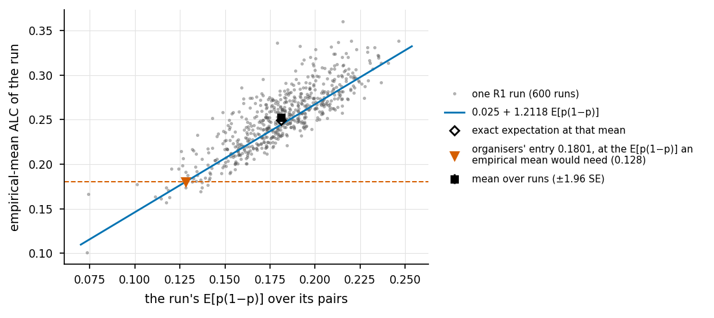

*Figure A1.* Each of the 600 public R1 runs: the empirical mean's ALC against the run's E[p(1-p)], with the analytic line 0.025 + 1.2118 E[p(1-p)], the mean over runs (0.2526) and the exact expectation there (0.2496). The organisers' leaderboard entry (0.1801) is drawn at the E[p(1-p)] an empirical mean would need to score it (0.128); 2.5% of the replica's runs lie below it.

---

## Appendix B: model, inference and run-time details

### B.1 Inference details, fallbacks and floored fits

Each item's likelihood is the one-dimensional integral over e_i: adaptive Gauss-Hermite with 20 nodes, or a fixed 201-node trapezoid on floored items, whose integrand can be bimodal. Newton with a line search finds the mode of the joint log posterior of x. After the target is read along its line (§3.2), E[sigmoid] is taken by a 171-node trapezoid, exact to 1e-9. The read is the exact marginal for one pair whose labelled items share the target item's group effects. Labelled items in other item_features groups, or other subjects on the benchmark, add components that the line moves along their Gaussian conditional mean, ignoring their skew, so the read is then an approximation. The pinned test, `test_laplace_error_at_low_budgets`, has no groups, floor or slip. The docstring of `paiec/hier.py` documents the remaining approximation error case by case, for other subjects on the benchmark and for floored benchmarks; a single pair whose labelled items lie in other groups is not measured separately. On cases drawn from the model it moves Brier by about 0.001 at B1 and by at most 1e-4 from B7 on.

**Cost.** Without floors the log posterior is concave and the mode unique. A floored item's success term is not concave, so Newton's matrix is shifted to positive definite when needed. Where Newton stops short on a posterior that holds a floored success, trust-region Newton from three starts settles the fit (`Problem._settle`, commit `4d2cc4f`; F§ "Floored fits"). Where Newton converges it changes nothing, bit for bit. Fits still unconverged after it are counted.

**Fallbacks of the offline prior.** Each hyperparameter the included benchmarks cannot identify falls back to a fixed `REFERENCE` value that no fit went into. For example, mu0 = 0 when fewer than three levels are available.

**The identity link, in full.** The shared part of a named model's attribute residual across benchmarks, tau2_res, is estimated at -0.002 on the public data and clipped to [0.01, 0.2]. That puts sigma_theta at its floor of 0.1 and the link weight across benchmarks at 0.0018 (`paiec/hier.py` docstring). The estimator is biased downward: the ridge that predicts a name's standing on one benchmark was fitted without that benchmark but saw the same name's standings on the others, which pulls its residuals on two benchmarks apart. Until the estimator is corrected and re-measured, the identity conclusion and the small link weight it sets are provisional (F§ "The step-2 analyses behind the model").

### B.2 Run-time engineering and the build checks

- **Purity and caching.** `predict` is a pure function of `(input, labeled)`. Fits are cached under a content fingerprint of `labeled`. Items and subjects are keyed on digests of all their visible fields, because the official input carries no ids and text prefixes collide.
- **Failure handling.** Nothing raises. A failed fit falls back to the prediction without labels, then to 0.5. An unusable `prior.json` falls back to the level prior without a subject prior.
- **Packaging.** The archive ships `model.py`, `prior.json` and the run-time modules renamed to `paiec_rt/`, so that no platform-side `paiec` can shadow them. Shipped code imports only the standard library and numpy at module level, and BLAS is held to one thread at run time.
- **The build either passes every check or produces no archive.** `tools/build_submission.py` fails unless all of the following hold:
  - a fresh interpreter loads `model.py` the way the validator does and predicts real items in the official format at every budget, with a fresh predictor per budget;
  - those predictions match the in-repository predictor bit for bit;
  - no fallback fires and no heavy library loads;
  - the organisers' validator prints OK.

### B.3 Ablations of hier-fit

These are ablations of hier-fit, before the level calibration: public R1, primary setting, each option alone against the default on the same runs (F§ "Ablations and sensitivities", `experiments/hier_eval.py`). The table holds all sixteen comparisons: twelve ablations and four width sensitivities.

| option | runs | minus default | where it acts |
|---|---|---|---|
| attribute prior off | 150 | +0.0039 ± 0.0003 / 0.0009 / 0.0008 | B0 to B3 |
| feature groups off | 150 | +0.0017 ± 0.0002 / 0.0003 / 0.0003 | B7 to B31 |
| level pooling off (a level per pair) | 150 | +0.0012 ± 0.0003 / 0.0004 / 0.0004 | B1, B3 |
| level centre 0 instead of the mean | 150 | +0.0011 ± 0.0003 / 0.0007 / 0.0006 | per benchmark ±0.004 |
| pair deviation off | 150 | +0.0001 ± 0.0001 / 0.0001 / 0.0001 | |
| linking off, relink 0.1 / 0.3 (three options) | 100 | 0.0000 to -0.0001 ± 0.0000 / 0.0000 / 0.0000 | |
| hard floor (guess 1; default 0.5) | 150 | +0.0001 ± 0.0000 / 0.0000 / 0.0000 | |
| text term on | 100 | +0.0002 ± 0.0001 / 0.0001 / 0.0001 | 5.3 ms a call |
| Student-t level (nu 3) | 100 | -0.0005 ± 0.0001 / 0.0002 / 0.0001 | 18.9 ms a call |
| Laplace fit without the line | 150 | -0.0007 ± 0.0001 / 0.0003 / 0.0001 | B1, B3 |
| sigma_mu x0.5 | 100 | -0.0021 ± 0.0003 / 0.0008 / 0.0004 | B1, B3; swe_rebench -0.0068 |
| sigma_mu x2 | 100 | +0.0049 ± 0.0004 / 0.0015 / 0.0005 | B1, B3 |
| sigma_delta x0.5 | 100 | -0.0004 ± 0.0003 / 0.0007 / 0.0006 | |
| sigma_delta x2 | 100 | +0.0060 ± 0.0004 / 0.0013 / 0.0008 | B1, B3 |

**Three components pull their weight on public runs:** the attribute prior, the feature groups and the pooled level.

**Three options beat the default by more than two cluster SEs:** a narrower level prior, the Student-t level and the Laplace fit. None clears a two-sided Bonferroni bar for sixteen comparisons on the pair-cluster SE; all three do on the stratified SE. All three make the model react less to a run's first labels. The deliberately widened level prior costs about 0.002 on public runs; why it was kept is in §5.4.

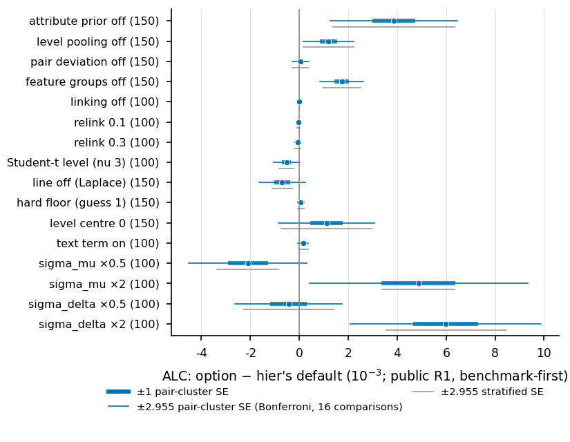

*Figure B1.* Each of hier-fit's sixteen options alone minus hier-fit, R1-bf runs, with ±1 pair-cluster SE and the two-sided Bonferroni bar for sixteen comparisons (±2.955 SEs) on the pair-cluster and the stratified SE. Three options beat hier-fit by more than two pair-cluster SEs; none clears the Bonferroni bar on the pair-cluster SE, and all three do on the stratified one.

### B.4 The corrected multiple-choice floor

It now reads "(A, B, C, D, or E)" lists and ignores TikZ point labels. It gains 0.00026 ± 0.00003 / 0.00008 on test-like runs and 0.00027 to 0.00045 on public runs, all on matharena at B0 and B1 (F§ "The multiple-choice floor, corrected", `experiments/mcq_floor.py`; measured on the legacy harness rows, with the solver before the floored-fit fix). It is adopted in the library. The archive was rebuilt with it and the floored-fit fix on 2026-09-27 (sha256 `4a882cc7…`; validator OK, run check bit-identical, `prior.json` byte-identical to the previous build). Formative run 2 used the earlier archive, and run 3 this one (§5.1).

### B.5 Cost in full

hier-ship takes 0.80 to 1.04 ms per evaluation call on the subject-side runs, with a slowest single call of 0.16 to 0.31 s, measured with two processes on a shared machine (F§ "Subject side at budgets 0 and 1", Latency). hier-rec, measured with six processes, took 0.75 ms on test-like runs and 0.88 ms on public runs, slowest call 0.45 s, and 2.0 to 2.4 ms per call on dense real_webagents and researchcodebench, at most 0.16 s (F§ "Calibrating for the hidden test", Latency). The floored-fit fix changes the time per call by -0.2% to +0.2% on public runs (F§ "Floored fits", Latency). In the RS study, at the library of the current archive, hier-ship averaged 1.34 ms a call over 520 runs, with a slowest call of 0.56 s. Both hier-EB, timed in the same tasks, took 1.18 to 1.19 times as long, and LegacyP's slowest call was 1.86 s. These times come from two processes on a shared machine, and no fallback fired (F§ "Regime sensitivity at the feedback's reading", Latency). A formative run is about 3,000 evaluation calls, a few seconds against the 8-hour limit. hier's worst case, dense multi_swebench and matharena (about 2,500 labeled entries at B31), was measured in the pooling study: hier-ship took 3.1 to 4.6 ms a call on multi_swebench and 7.5 to 9.4 ms on matharena, with a slowest single call of 0.39 s, on one process of a shared machine; LegacyP's slowest call there was 1.44 s (F§ "Pooling under the verified protocol"). The baseline study's plain 1PL takes 0.72 to 0.81 ms a call, with a slowest call of 0.13 to 0.18 s, on one process of a shared machine; hier-ship's 1.2 to 1.5 ms a call on the same runs was timed in the RS study's tasks, not in the 1PL's, so the ratio of about 1.7 to 1.9 is across tasks (derived; F§ "Baselines: a plain 1PL, the organisers' empirical mean and BLE", Cost; `results/baselines_p1.json`, `summary.regimes.<R>.configs`).

### B.6 Library defects

- `fitting.fit_ab`, LegacyP's fit, diverges when its prior sits far from the labels, a library bug reported in F§ "fit_ab diverges when the prior is far from the labels": 5 of 1,598 test-like appearances. Reported, not fixed.
- `testlike.item_oracle` oscillates on 35 of 2,425 test-like appearances, all of them on difficulty strata (689 appearances). That understated the item oracle on strata (32.7%, not 14.5%). Reported, not fixed.
- hier's floored Newton fit could stop unconverged: 11 of 3,030 floored fits on 400 public runs, one of them collapsed (pair-uniform run 108). This is fixed in `4d2cc4f` (`Problem._settle`). No fit is left unconverged, and run 108's pair goes from 0.217 to 0.770 at B31, against 0.669 observed (F§ "Floored fits", `results/hier_floor.json`). The archive was rebuilt on 2026-09-27 with the corrected floor and this fix (sha256 `4a882cc7…`), and formative run 3 ran it. Formative run 2 used the earlier archive, and hier-ship's numbers in §5.4 and App E.7 come from its code, except the regimes re-measured at `4d2cc4f` (App H.2).

---

## Appendix C: regimes, rules and when they were fixed

### C.1 Regime catalogue and realised levels

Every tilted regime realises a milder level than its target. Realised mean pair logit of the scored runs (sd):

| regime (seed) | knobs | target | realised mean (sd) |
|---|---|---|---|
| TL (300 check runs) | level_mean -1.6, level_sd 1.5, date shift | -1.6 (sd 1.5) | -1.29 (1.70), cluster SE 0.16 |
| TL-1.2 (3) | level_mean -1.2 | -1.2 | -1.10 |
| TL-2.0 (3) | level_mean -2.0 | -2.0 | -1.56 |
| LA-0.8 (5) | level_mean -0.8 | -0.8 | -0.77 |
| LA-flat (5) | no level tilt | none | -0.59 |
| TUNED (11) | the defaults | -1.6 (sd 1.5) | -1.28 (1.62) |
| READING (11) | level_mean -0.85, level_sd 1.75 | -0.72 | -0.63 (1.68) |
| AUDIT (11) | level_mean -1.8, level_sd 2.1 | -1.10 | -0.93 (2.05) |
| MIXTURE (11) | a two-component level target (`Regime.level_mix`) | | -0.64 (2.13) |
| FLAT (11) | no level tilt | none | -0.28 (2.23) |
| public R1 | | | -0.71 (1.42) |

Sources: `results/testlike_check.json`; `results/level_audit.json` (`extra`); `results/regime_sensitivity.json` (`summary.realised`); public R1 on the continuity-corrected scale of App D.4. READING and AUDIT came out milder than their targets, though within the realisation bounds fixed before scoring. The RS regimes' knobs were set on seed 10 from run composition alone, with no predictor.

**How test-like runs are built, in full** (`paiec/testlike.py`; `experiments/testlike_check.py` docstring).

- *Pseudo-benchmarks.* The five public benchmarks are too few and too central, so each is cut into pseudo-benchmarks: item_features groups sorted by difficulty and merged, difficulty strata (cross-fitted, so a subject's own labels never choose its items' stratum), whole parents, and random chunks for the single-subject benchmark. Each gets its own anonymous benchmark_id. Every label is a real recorded response. What is new is the grouping of items and, under the date shift below, the release and access dates the predictor sees.
- *Run shape.* A run draws 5 to 12 pairs. With some probability the next pair joins a pseudo-benchmark already in the run; otherwise it opens a new one. This reproduces the feedback's about one pair per benchmark.
- *Date shift.* Visible release and access dates are shifted 1.25 years later. This reproduces the feedback's budget-0 optimism for the legacy prior's linear date term.

The test-like regime's level is not identified by the one feedback run it was tuned to: level_mean -1.2, -1.6 and -2.0 are 0.63, 0.37 and 0.46 run sds from the feedback at B0 and B1. The regimes set to the feedback's readings have level sds of 1.7 to 2.1, and MIXTURE's low mode rests on two pseudo-benchmarks. The competition site's example run shows 5 pairs.

**Run sets of the later studies.** The baseline study rescored the RS study's TUNED and public runs (seed 11). The pooling decomposition drew R1 at seed 11, 100 runs benchmark-first under both split scopes (its runs 0-59 are the RS study's public R1-bf runs), and R2 dense runs of the four multi-subject benchmarks under both scopes.

### C.2 The decision rules

**The level selection** (§3.4). The best mean ALC on the selection half of the TL runs (runs 0 to 99), among configurations that lose at most 0.003 ALC against LegacyP on *both* public weightings (the guard); configurations were confirmed on runs 100 to 199.

**The gate** (§4.4): see the four conditions there (F§ "Subject side at budgets 0 and 1").

**The rule** was fixed before scoring. It asked a replacement to meet five conditions:

1. gain at least 0.002 in READING and in AUDIT, with the upper end of its 95% interval below zero;
2. have a negative parent-level mean there, with no parent losing more than 0.004;
3. lose at most 0.002 in TUNED, MIXTURE and FLAT;
4. lose at most 0.001 on public runs, and at most 0.003 against LegacyP there;
5. take at most twice hier-ship's time a call.

**The reading rule** of runs 1 and 2 is in App D.4.

**Hyperparameters set in view of all five public benchmarks.** `WIDEN`, `G_CAP`, slip, guess, `MAX_LEVELS` and the REFERENCE value of sigma_delta were set with all five public benchmarks in view. sigma_mu 2.5 lay on the edge of the grid that was scored; sigma_mu 3.5 and 5, at hier-ship's mu0 and attr_scale, were scored later and do not do better (§5.4).

### C.3 When each rule was fixed

| study | rule | where it was fixed | evidence | caveat |
|---|---|---|---|---|
| the harness and its gate | the four gate conditions | the harness's plan block; first in commit `f7e7d87` | gate and results committed at once | shows only that gate and results were committed together |
| itemsig | none | `experiments/itemsig_eval.py` never held a gate | results committed a day before the gate | read as a plain null |
| the 14B rubric and attempts | rubric and reading rule | plan block | data produced 13.6 hours after `f7e7d87` | |
| the entropy job | reading rule and primary feature | commit `78e303e` | committed before any output existed; data 83.8 hours after `f7e7d87` | |
| the pooled reading of runs 1 and 2 | the reading rule | written into the results file with a timestamp and a hash | a test checks the stored rule is the script's and predates the first reading | both runs' tables had been seen; four read runs (below) |
| the RS study | plan, rule and constants block, hashed | the script's lock stage | local file times and copies in its results file | nothing committed before scoring; the precision deviation |

**Detail.** These gates live in the scripts' plan blocks. What the repository shows about when they were fixed is uneven (F§ "The gate, tightened"; `results/gate_and_ci.json`, `evidence`). The harness's gate first appears in commit `f7e7d87` (2026-09-27 04:45 UTC), together with the results of the harness, the known-sign cues and the subject side, so for those three it shows only that gate and results were committed at once. The itemsig results were committed a day earlier, before any commit held the gate. The 14B's rubric and attempt data were produced 13.6 hours after that commit, and its entropy data 83.8 hours after, under a reading rule committed before them (`78e303e`). The other probes were committed after the gate, but the repository does not record when their inputs were produced. We therefore call it a gate fixed in the plans of the studies committed from `f7e7d87` on, not pre-registered; `experiments/itemsig_eval.py` has never contained a gate, so itemsig predates it and is read as a plain null (App F.4). The one reading of formative feedback made after run 2 had its decision rule written into its results file, with a timestamp and a hash, before the reading was computed, and a test checks that the stored rule is the script's and predates the first reading. It fixes the rule, not what had been seen: both runs' feedback tables, run 2's per-pair Brier included, were known when it was written. The reading code was then revised twice in its descriptive outputs, and the earlier versions, rebuilt and re-run, give the same decision (App D.4). The RS study (§5.4) hashed its plan, its rule and the constants block of its script before any scoring-seed run was drawn. A lock stage checks those hashes. Nothing was committed before scoring, so the evidence that the lock came first is local file times and copies, recorded in its results file. One reproduction check was compared at its comparator's stored precision rather than the planned 1e-9, before scoring began (the precision deviation), and the team accepted it on 2026-10-02. A dry run of the rule on the first 19 rows printed only "the planned set is not complete", and no code or constant changed after it.

**The reading was run four times.** The read stage ran at 05:13:48, 05:15:57, 05:19:08 and 05:20:19 under three versions of the script (digests `5099ef81…`, `321c189e…` and `93cb6a84…`, the last being the file in the repository), and the stored reading is the last. The rule's text was byte-identical throughout: the read stage refuses to run when the stored rule and the script's differ. The two edits after the first reading changed descriptive outputs only. The first extended the split of run 2's B0 excess to K = 40 and kept apart q3, whose B31 has no real root (the first version split the pairs 4 and 4 at K = 15, 0.047 below a rate of 0.5 and 0.060 at or above it, q3 counted above), and added explanatory notes. The second added the neighbours' match distance to the robustness variants. The edit between the hash-locked rule and the first reading touched the record stage only. Rebuilt from a log of the edits and re-run, the version that locked the rule and both earlier reading versions give the stored decision, z values and bias guard exactly, and the same value in every one of the 1,502 to 1,559 fields they share with the stored reading (`experiments/script_revisions.py`, `results/script_revisions.json`).

**The precision deviation.** The RS study's decision rule was hashed in the script before any scoring-seed run was drawn, though nothing was committed before scoring. One reproduction check was compared at its comparator's stored precision rather than the planned 1e-9, before scoring began, and the team accepted it on 2026-10-02. The RS outcome (no candidate, LEVEL stays) assumes that deviation; read literally, without it, the rule was not applied, and neither reading has a candidate.

### C.4 The gate in full

The harness first reproduces the in-sample oracle that the meta-heads study scored (App F.5): -0.0437 test-like and -0.0557 TL-mix as target (`results/heads_eval.json`, `experiments/heads_eval.py`), against -0.0439 and -0.0558 as reproduced. It then builds the **gate table** from degraded oracles, x = r z + sqrt(1 - r^2) noise, where z is an *honest* difficulty fitted on other subject folds only. For each r the table records what a covariate with that honest correlation would score through the gate, averaged over 8 noise draws, and how many single draws pass:

| honest r (within-pair r, test-like) | transferred slope, nested: test-like (cluster SE, draw sd) | TL-mix | R1-bf | R1-pu | draws passing | per-pair slope, nested: test-like | draws passing |
|---|---|---|---|---|---|---|---|
| 0 (0.00) | -0.00002 (0.00001, 0.00006) | +0.00001 | -0.00001 | +0.00000 | 0/8 | -0.00000 | 0/8 |
| 0.1 (0.08) | -0.00010 (0.00005, 0.00043) | -0.00027 | -0.00034 | -0.00044 | 0/8 | -0.00000 | 0/8 |
| 0.2 (0.16) | -0.00083 (0.00015, 0.00086) | -0.00161 | -0.00191 | -0.00245 | 1/8 | -0.00010 | 0/8 |
| 0.3 (0.25) | **-0.00255** (0.00032, 0.00068) | -0.00457 | -0.00517 | -0.00639 | **6/8** | -0.00032 | 0/8 |
| 0.4 (0.33) | -0.00462 (0.00052, 0.00081) | -0.00805 | -0.00906 | -0.01109 | 7/8 | -0.00136 | 0/8 |
| 0.5 (0.42) | -0.00738 (0.00077, 0.00090) | -0.01246 | -0.01399 | -0.01699 | 8/8 | **-0.00255** | **8/8** |
| 0.7 (0.61) | -0.01528 (0.00143, 0.00091) | -0.02392 | -0.02693 | -0.03213 | 8/8 | -0.00768 | 8/8 |
| honest oracle | -0.0360 ± 0.0010 / 0.0030 / 0.0029 | -0.0484 | -0.0539 | -0.0619 | passes | -0.0223 | passes |

Source: `results/harness_thresholds.json` (`thresholds.honest`, `acceptance`), `python experiments/harness.py --stage table`; 300 test-like, 150 TL-mix and 100 + 100 public runs, on rows collected with the library of the current archive (corrected multiple-choice floor and floored-fit fix; F§ "Acceptance harness", Provenance). The table built before that re-collection, on the legacy rows, differs from this one by at most 0.0002 in the test-like column and 0.0004 elsewhere; its transferred line at r = 0.3 was -0.00238.

**What a covariate needs.** One noise draw of a degraded oracle moves its test-like difference by more than its cluster SE (draw sd 0.0007 against 0.0003 at r = 0.3). A real covariate is one draw, so its chance of passing is read from the draws, not from the averaged line (F§ "The gate, tightened"; `experiments/gate_and_ci.py`, `results/gate_and_ci.json`, `gate`):

| honest r (within-pair r) | transferred slope: draws passing (Jeffreys 95%) | P(one draw clears -0.002), normal / t predictive | P(full gate), modelled |
|---|---|---|---|
| 0.2 (0.16) | 1/8 [0.01, 0.45] | 0.09 / 0.12 | 0.09 |
| 0.3 (0.25) | 6/8 [0.41, 0.94] | 0.79 / 0.76 | 0.68 |
| 0.4 (0.33) | 7/8 [0.55, 0.99] | 1.00 / 0.99 | 0.87 |
| 0.5 (0.42) | 8/8 [0.74, 1.00] | 1.00 / 1.00 | 1.00 |

- **A transferred slope needs an honest r of about 0.3 to 0.35.** At r = 0.3 a covariate passes about two times in three. The mean line is -0.00255 with a draw sd of 0.00068; of the two failing draws, one misses the bar and one fails the worst-parent condition (inferred: the other four conditions hold, and a draw's worst parent is not stored). A per-draw chance of 0.5, 0.8 or 0.95 of clearing the bar needs r = 0.27, 0.305 or 0.335.
- **A per-pair slope needs about 0.46** (0.455 to 0.475), because it must be learned from at most 31 labels. Forced on, an uninformative covariate with a per-pair slope (s = 0.5) costs +0.0009 from B1 and +0.0007 from B7.
- **The gate uses the thinnest regime, so it leans toward false negatives.** At r = 0.2 the transferred line gains 0.0016 on TL-mix and 0.0019 to 0.0025 on public runs, but 0.0008 on test-like runs. Read on TL-mix, with selection kept on test-like runs, the same chances need r = 0.215, 0.24 and 0.255 (0.365 to 0.39 for a per-pair slope), and the pass counts are 4/8 at r = 0.2 and 8/8 from 0.3. These counts are upper bounds, because a draw's worst parent on TL-mix is not stored. The full gate under TL-mix needs the table stage re-run with selection on TL-mix (about 25 minutes on one process) after a change to `experiments/harness.py`'s `gate()` and `average_lines()`, and was deferred: it would move the degraded oracles' pass counts, but the stored TL-mix nested lines of the 44 measured covariates in Figure 5 (b) are all above -0.002 (best -0.0014, the 14B's time_log_minutes), so it could pass a covariate only where selection on TL-mix switched on one that test-like selection did not (App I).

---

## Appendix D: formative runs

### D.1 Scores, archives and the recurring pair

The platform's run score is the unweighted mean of the per-pair ALCs: recomputed that way from the returned tables, both reported formative scores (runs 1 and 2) reproduce to the reported precision, and weighting pairs by their item counts does not (F§ "Formative feedback, runs 1 and 2"). All three runs spread their pairs over the same 7 benchmarks, and in none did a benchmark hold more than two of a run's pairs.

Recomputed as the unweighted mean of per-pair ALCs, the budget tables give 0.2112999889 and 0.1926232375, which round to the reported 0.2113 and 0.192623. Run 3's headline score was not pasted, so its 0.1816525778 applies that rule rather than testing it; each pair's summary ALC matches its budgets to within 5e-7. The per-pair tables are below. Run 2's archive holds the modules of commit ee5085a byte for byte. That is the library of App E.7's rows, before the corrected floor and the floored-fit fix. Run 3 used archive-3 (sha256 `4a882cc7…`), which differs by those two changes, worth -0.0003 on test-like runs (App B.4, App H.2). The team uploaded it as a regression and latency check only, a purpose stated before it was scored (`results/formative_feedback.json`, `submissions`, first committed in `00bdf04` on 2026-09-28). All 9 pairs were scored at every budget with no errors reported; the table records no timing. The file in `dist/` has the archive's bytes and every tracked member matches `4d2cc4f`, but unlike runs 1 and 2's archives it was not downloaded back from the platform (`results/formative_run3.json`, `archive`).

**One pair recurs, and it is not a comparison.** Runs 1 and 2 share no subject, and run 3 shares none with run 2. Run 3 shares one (subject, benchmark) pair with run 1 (benchmark A, 53 items both times; run 1's p7 and run 3's s6): 25 distinct subjects over 26 appearances. On that pair run 3's ALC is 0.066 lower and its B0 0.252 lower, but the pair ran under two models with different co-sampled pairs, and so with a different shared `labeled` list; it is descriptive only. All three runs drew from the same seven hidden benchmarks. The difference of two independent runs' ALC has an sd of about 0.04 (0.037 to 0.047 for hier-ship), against the observed 0.019 between runs 1 and 2 and 0.011 between runs 2 and 3, and the code gap between runs 2 and 3, measured offline, is at most 0.00046. Formative runs on different draws do not measure an improvement, now with three runs: neither the change from LegacyP to hier nor the library changes between runs 2 and 3.

Letters relabel the anonymous benchmarks; the same letter is the same benchmark in all three runs. They are for recording only, and no model input is keyed on them (F§ "Formative feedback, runs 1 and 2" and "Formative run 3"; the organisers' tables are `results/formative/run1.txt`, `run2.txt` and `run3.txt`).

Run 1, LegacyP:

| pair | benchmark | n | B0 | B1 | B3 | B7 | B15 | B31 | ALC | ECE-ALC |
|---|---|---|---|---|---|---|---|---|---|---|
| p1 | A | 76 | 0.4224 | 0.2851 | 0.2698 | 0.2067 | 0.2085 | 0.2057 | 0.2568 | 0.171 |
| p2 | B | 50 | 0.4970 | 0.2861 | 0.1394 | 0.0764 | 0.0650 | 0.0513 | 0.1682 | 0.288 |
| p3 | C | 56 | 0.3583 | 0.2419 | 0.2429 | 0.2437 | 0.2751 | 0.1923 | 0.2558 | 0.264 |
| p4 | D | 58 | 0.5663 | 0.3234 | 0.1379 | 0.0518 | 0.0184 | 0.0063 | 0.1636 | 0.344 |
| p5 | E | 60 | 0.3032 | 0.2477 | 0.2479 | 0.2431 | 0.2437 | 0.2472 | 0.2515 | 0.073 |
| p6 | F | 44 | 0.1728 | 0.1670 | 0.1675 | 0.1665 | 0.1719 | 0.1678 | 0.1686 | 0.038 |
| p7 | A | 53 | 0.4771 | 0.2939 | 0.1738 | 0.1335 | 0.1285 | 0.1286 | 0.2065 | 0.204 |
| p8 | F | 44 | 0.1806 | 0.1747 | 0.1761 | 0.1827 | 0.1745 | 0.1749 | 0.1771 | 0.042 |
| p9 | G | 44 | 0.2519 | 0.2653 | 0.2834 | 0.2360 | 0.2386 | 0.2366 | 0.2535 | 0.103 |

Run 2, hier-ship (archive of ee5085a):

| pair | benchmark | n | B0 | B1 | B3 | B7 | B15 | B31 | ALC | ECE-ALC |
|---|---|---|---|---|---|---|---|---|---|---|
| q1 | D | 58 | 0.2555 | 0.1939 | 0.1840 | 0.1931 | 0.1868 | 0.1857 | 0.1957 | 0.091 |
| q2 | G | 44 | 0.2706 | 0.1635 | 0.1790 | 0.1500 | 0.1458 | 0.1490 | 0.1696 | 0.136 |
| q3 | C | 113 | 0.2593 | 0.2469 | 0.2408 | 0.2437 | 0.2418 | 0.2524 | 0.2458 | 0.045 |
| q4 | G | 44 | 0.2576 | 0.2406 | 0.2559 | 0.2311 | 0.2315 | 0.2161 | 0.2392 | 0.093 |
| q5 | F | 44 | 0.2256 | 0.2300 | 0.2553 | 0.2329 | 0.2228 | 0.2392 | 0.2347 | 0.104 |
| q6 | E | 60 | 0.2366 | 0.1973 | 0.1989 | 0.1961 | 0.1950 | 0.1983 | 0.2009 | 0.068 |
| q7 | A | 75 | 0.2333 | 0.2126 | 0.2282 | 0.2119 | 0.2008 | 0.2240 | 0.2164 | 0.104 |
| q8 | B | 54 | 0.1562 | 0.0729 | 0.0283 | 0.0098 | 0.0034 | 0.0014 | 0.0386 | 0.160 |

Run 3, hier-ship (archive of 4d2cc4f; `results/formative_run3.json`, `run3.pairs`). s6 is run 1's p7: the same subject on the same benchmark, with 53 items both times.

| pair | benchmark | n | B0 | B1 | B3 | B7 | B15 | B31 | ALC | ECE-ALC |
|---|---|---|---|---|---|---|---|---|---|---|
| s1 | G | 44 | 0.2768 | 0.1941 | 0.2119 | 0.1891 | 0.1935 | 0.2067 | 0.2061 | 0.109 |
| s2 | E | 60 | 0.2543 | 0.2962 | 0.3617 | 0.2578 | 0.2635 | 0.2514 | 0.2864 | 0.163 |
| s3 | D | 58 | 0.2071 | 0.1307 | 0.0989 | 0.0927 | 0.0928 | 0.0947 | 0.1132 | 0.095 |
| s4 | C | 56 | 0.2024 | 0.1696 | 0.1873 | 0.1755 | 0.1821 | 0.1865 | 0.1818 | 0.120 |
| s5 | A | 72 | 0.2122 | 0.1377 | 0.1307 | 0.1470 | 0.1303 | 0.1178 | 0.1421 | 0.093 |
| s6 | A | 53 | 0.2254 | 0.1413 | 0.1304 | 0.1233 | 0.1326 | 0.1215 | 0.1402 | 0.095 |
| s7 | G | 44 | 0.2621 | 0.1619 | 0.1923 | 0.1453 | 0.1487 | 0.1508 | 0.1709 | 0.125 |
| s8 | B | 54 | 0.2150 | 0.1365 | 0.1044 | 0.1090 | 0.1023 | 0.1001 | 0.1219 | 0.124 |
| s9 | F | 44 | 0.2606 | 0.3136 | 0.2790 | 0.2581 | 0.2548 | 0.2500 | 0.2722 | 0.139 |

Mean ECE by budget, B0..B31: run 1 0.381, 0.253, 0.195, 0.097, 0.090, 0.047; run 2 0.210, 0.098, 0.118, 0.084, 0.057, 0.076; run 3 0.254, 0.146, 0.135, 0.077, 0.073, 0.066.

### D.2 Placement by budget

**Run 2, with hier-ship's level prior, lost far less at budget 0, on different pairs.** Its B0 was 0.237 against run 1's 0.359. That is 0.02 above hier-ship's test-like mean (0.2165) and level with its public benchmark-first mean (0.2350, App E.7). From B1 its curve is flat: from B3 to B31 it sits 0.03 to 0.045 above the test-like means (0.1645 to 0.1386). Run 3, with the same level prior on a third draw, had B0 0.235 and then fell to 0.164 at B31. Placed in hier-ship's single-run distributions (`results/ship_confirm.json`, `run2_placement`; run 3 from `results/formative_run3.json`, `placement`, against the same regime means and sds):

| regime (runs) | mean ALC | single-run sd | run 2's z | share of runs ≥ 0.1926 | run 2's z by budget, B0..B31 | run 3's z | run 3's z by budget, B0..B31 |
|---|---|---|---|---|---|---|---|
| TL (300) | 0.1658 | 0.0318 | +0.84 | 0.20 | +0.98 +0.15 +0.86 +0.89 +0.98 +1.40 | +0.50 | +0.89 -0.06 +0.65 +0.39 +0.65 +0.81 |
| TL-mix (200) | 0.1711 | 0.0329 | +0.65 | 0.245 | +1.12 +0.05 +0.72 +0.70 +0.72 +1.15 | +0.32 | +1.01 -0.16 +0.52 +0.21 +0.40 +0.58 |
| TL-noshift (100) | 0.1585 | 0.0335 | +1.02 | 0.18 | +1.00 +0.45 +0.89 +1.11 +1.20 +1.67 | +0.69 | +0.95 +0.25 +0.69 +0.57 +0.83 +1.02 |
| R1-bf (150) | 0.2051 | 0.0285 | -0.44 | 0.67 | +0.06 -0.78 -0.49 -0.46 -0.27 +0.23 | -0.82 | +0.00 -1.00 -0.70 -1.08 -0.70 -0.50 |
| R1-pu (100) | 0.2020 | 0.0261 | -0.36 | 0.68 | -0.24 -0.67 -0.37 -0.32 -0.13 +0.50 | -0.78 | -0.30 -0.88 -0.62 -0.95 -0.57 -0.26 |

One run cannot discriminate the regimes, and neither can two. Run 2's profile is at least as close to plain public runs as to the tuned regime: every budget is within 0.8 sd of public R1, while its B31 is 1.4 sd above the test-like mean. Run 3's B0 is again about 0.9 sd above the tuned regime's and level with public R1; from B1 on it lies within 0.81 sd of the tuned regime's means (0.06 sd below at B1, above after) and 0.3 to 1.1 sd below public R1's. Both runs lie within 1.02 single-run sds of every regime's mean ALC. The regimes' rows are the run-2 archive's library; run 3's archive differs by at most 0.00046, not added. The share of runs at or above run 3 is not computed, because `results/ship_confirm.json` stores no per-run ALC. Run 3's mean Brier falls by 0.048 from B0 to B1 and rises by 0.0017 from B1 to B3; two of its pairs, both near a rate of 0.5 (B31 at least 0.25), have B1 or B3 above their B0, against one such pair in each earlier run (App D.1).

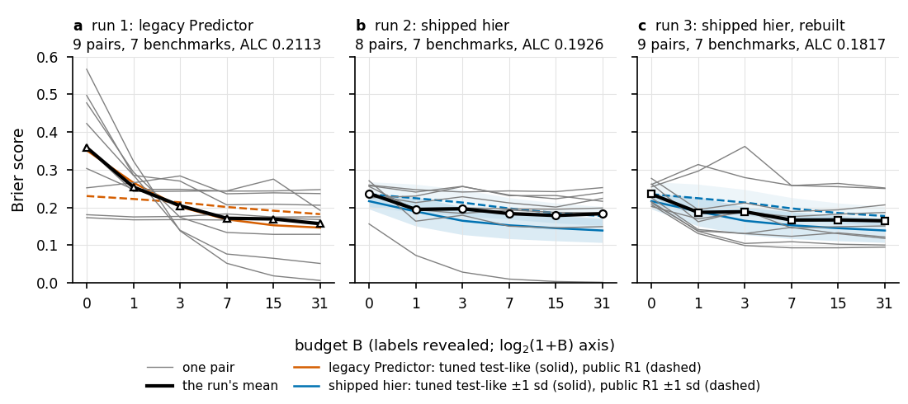

*Figure D1.* Each formative run's pairs (grey) and their mean (black), by budget, against the replica's mean for the run's model on tuned test-like runs (solid) and public R1 runs (dashed). Run 1's B0 spans 0.17 to 0.57 over its 9 pairs; runs 2 and 3 span 0.16 to 0.27 and 0.20 to 0.28.

### D.3 What hier-ship was expected to score

Before run 2, the audit's per-pair matched estimate on run 1 was about 0.178 (0.169 to 0.183) for hier-rec; it replaced that configuration's average-shift estimate of 0.167. hier-ship's own estimate, by the same estimator, is 0.1812 (K = 15 neighbours) and 0.1830 (K = 40) on the audit's pool, where hier-rec scores 0.1824 and 0.1839, and 0.1774 and 0.1779 on hier-ship's own replica rows. Across robustness variants on pools that hold test-like runs it ranges from 0.1766 to 0.1824; pools of public runs alone give 0.205, on matches about five times further away (F§ "Formative feedback, runs 1 and 2"; `experiments/level_audit.py` agrees, 0.1765 and 0.1789). Run 2 is a different draw, so these are predictions for a like-sized run, not for its pairs. Its 0.1926 lies 0.015 above the shipped rows' estimate (z +0.48 of a test-like single-run sd). It did better than predicted at B0 (by 0.008) and worse from B3 on (by 0.017 to 0.022 at B3 to B15 and 0.034 at B31). Run 2's pairs sit nearer a rate of 0.5 than run 1's (mean B31 0.183 against 0.157).

### D.4 The pooled reading of runs 1 and 2

**After run 2.** The audit asked for the next feedback to be read per pair, pooled with run 1, before refitting the level distribution once. Its decision rule, which could change mu0 and sigma_mu only, was written and hash-locked before the reading was computed, but after both runs' feedback tables had been seen, so the reading is not blind. It found the pooled level 1.0 to 1.2 SEs more central than the tuned regime's, below the rule's bar of 2 SEs, and proposed nothing. LEVEL is unchanged since run 2.

**The pooled reading of runs 1 and 2, under a rule fixed in advance.** Before any matching of run 2's pairs or any pooled reading was computed, we wrote into the results file what the reading could change and when (F§ "Formative feedback, runs 1 and 2"; written 2026-09-28 05:06:59 UTC, sha256 `0de18448…`; the first reading ran at 05:13:48). This fixes the rule, not what had been seen: both runs' feedback tables, run 2's per-pair Brier included, and the audit's scratch outputs for run 1 were known when it was written. It may change one global hyperparameter only, the level distribution of a new benchmark (mu0 and sigma_mu of LEVEL). A candidate is proposed only if, for both K = 15 and K = 40, the 17 pairs' mean (or sd) level differs from the tuned regime's realised -1.29 (sd 1.70) by more than 2 SEs that resample the 7 benchmarks, and only if a guard finds no bias from the reading itself. Even then it would have to pass the level calibration's gate on fresh test-like runs set to the reading before shipping.

| reading (continuity-corrected pair logit) | mean (SE) | sd (SE) |
|---|---|---|
| runs 1 and 2, 17 pairs, K = 15 | -0.65 (0.51) | 1.80 (0.36) |
| runs 1 and 2, 17 pairs, K = 40 | -0.78 (0.51) | 1.75 (0.34) |
| tuned test-like regime, realised | -1.29 (0.16) | 1.70 |
| public R1, realised | -0.71 (0.12) | 1.42 |

The pooled mean is 1.24 (K = 15) and 1.00 (K = 40) SEs above the regime's, and the sd 0.29 and 0.14 SEs above. The bias guard did not trip. **No candidate; LEVEL stays.** The shipped LEVEL implies, on this scale, a mean of -1.15, a between-benchmark sd of 1.15 and a within sd of 1.10; the 17 pairs give a between sd of 1.20 to 1.49 (90% interval from 0 to about 1.7) and a within sd of 1.01 to 1.40, which is consistent. Two components are not supported (BIC by 0.68 and 0.38, bar 2): the only structure is two pairs near a zero rate. Descriptively, run 2's B0 excess over B31 does not sit mainly on low-rate pairs (0.047 on the 4 pairs read below a rate of 0.5, 0.078 on the 3 above, at K = 15), and by the rule fixed in advance that changes nothing.

**Run 3 is not added to the reading.** The rule covered runs 1 and 2 only, and no level reading, matching or tuning is done on run 3 (`results/formative_run3.json`, `no_reading_or_tuning`).

What the pooled reading of runs 1 and 2 supports is modest. The pooled level is near the public centre, and more central than the regime in which the headline gain was measured, but within the noise of 7 benchmarks. The audit's two regimes nearer that reading give hier-ship 0.022 to 0.029 over LegacyP, not 0.042. Regimes set to this reading and to the audit's, scored later under a rule fixed in advance, give it 0.025 to 0.031. No scored alternative beats it there (§5.4).

On the plain logit of the pair's rate the lower roots of run 1 average -1.6 (sd 1.5) and the public R1 appearances -0.74 (sd 1.50) (`experiments/hier_design/levels.json`, `r1`; F§ "Against the first real formative feedback"). On the continuity-corrected scale of the pooled reading the two are -1.51 and -0.71 (`results/formative_feedback.json`). Read per pair against replica pairs, run 1 is spread both ways, and the pooled reading of runs 1 and 2 puts the hidden level near the public centre, with an SE of about 0.5 logit.

---

## Appendix E: calibration details

### E.1 hier-fit against LegacyP on public runs

**hier-fit against LegacyP**, before the level calibration (300 runs per setting; F§ "Hierarchical model", `experiments/hier_eval.py`, `results/hier_eval.json`):

| weighting, split scope | hier-fit − LegacyP (run / cluster / stratified SE) | 95%, pair-cluster | 95%, stratified |
|---|---|---|---|
| benchmark-first, pair (primary) | -0.0024 ± 0.0004 / 0.0013 / 0.0008 | [-0.0047, +0.0002] | [-0.0040, -0.0008] |
| benchmark-first, benchmark | -0.0010 ± 0.0003 / 0.0014 / 0.0009 | [-0.0035, +0.0017] | [-0.0027, +0.0007] |
| pair-uniform, pair | -0.0017 ± 0.0004 / 0.0008 / 0.0007 | [-0.0033, -0.0002] | [-0.0031, -0.0003] |
| pair-uniform, benchmark | -0.0015 ± 0.0003 / 0.0008 / 0.0007 | [-0.0030, +0.0000] | [-0.0029, +0.0000] |

The gain comes from pooling a benchmark's level across the subjects a run holds on it. On multi-subject benchmarks it is worth 0.0015 to 0.0033 to a target that shares its benchmark with one other pair, 0.0019 to 0.0044 with two or more, and nothing measurable to a target alone on its benchmark (at most 0.0016 ± 0.0014). On the single-subject swe_rebench pair hier-fit is worse, by 0.006 to 0.009 against LegacyP, mostly through the widened level prior. Weighted like the real run (5 targets alone, 4 in pairs), hier's expected gain on public data would be 0.0006 to 0.0024. On that evidence the first verdict was to keep LegacyP (F§ "Verdict: keep the Predictor"). §5.3 reversed it.

**By company.** hier-fit − LegacyP by how many pairs of the target's benchmark a run holds; multi-subject benchmarks, pair-cluster SEs (F§ "Hierarchical model"):

| weighting, split scope | alone | 2 pairs | 3 or more |
|---|---|---|---|
| benchmark-first, pair | -0.0016 ± 0.0014 | -0.0033 ± 0.0011 | -0.0044 ± 0.0010 |
| benchmark-first, benchmark | -0.0009 ± 0.0014 | -0.0020 ± 0.0011 | -0.0029 ± 0.0011 |
| pair-uniform, pair | +0.0003 ± 0.0014 | -0.0017 ± 0.0011 | -0.0024 ± 0.0008 |
| pair-uniform, benchmark | -0.0001 ± 0.0012 | -0.0015 ± 0.0011 | -0.0019 ± 0.0008 |

**Strict run-LOBO.**

With everything fitted without every benchmark of the run, over runs 0 to 149: LegacyP 0.2111 ± 0.0019, hier-fit 0.2089 ± 0.0020. hier-fit − LegacyP is -0.0022 ± 0.0004 / 0.0010 / 0.0006 (95% [-0.0039, -0.0001], stratified [-0.0033, -0.0010]). Both models lose about 0.004 against their LOPO lines (F§ "Strict run-LOBO").

### E.2 Sensitivity to the regime, and the RS study in full

**Against hier-rec** (mu0 -3.0, attr_scale 0.25; F§ "The public guard decides", F§ "What actually shipped, after the audit"). hier-rec was confirmed on runs 100 to 199 at -0.0418 ± 0.0024 / 0.0047 / 0.0042 against LegacyP, and cost +0.0008 and +0.0007 on the two public weightings. Against it, hier-ship gives up 0.0030 ± 0.0005 / 0.0009 / 0.0007 on the selection half and 0.0022 ± 0.0005 / 0.0011 / 0.0009 on the confirmation half. It gains 0.0023 ± 0.0002 / 0.0005 / 0.0004 (benchmark-first) and 0.0024 ± 0.0002 / 0.0004 / 0.0004 (pair-uniform) on public runs 0 to 99 (`results/level_audit.json`, `mild`).

**Sensitivity to the regime.** Configuration − LegacyP, ± run / cluster / stratified SE. TL-1.2 and TL-2.0 were scored for hier-rec only.

| configuration | TL-1.2 (100 runs) | TL-2.0 (100) | TL-mix (100) | TL-noshift (100) | LA-0.8 (40; realised -0.77) | LA-flat (40; realised -0.59) |
|---|---|---|---|---|---|---|
| hier-ship | not scored | not scored | -0.0436 ± 0.0014 / 0.0039 / 0.0031 | -0.0144 ± 0.0012 / 0.0024 / 0.0022 | -0.0286 ± 0.0026 / 0.0039 / 0.0035 | -0.0222 ± 0.0025 / 0.0049 / 0.0043 |
| hier-rec | -0.0388 ± 0.0021 / 0.0044 / 0.0039 | -0.0524 ± 0.0022 / 0.0044 / 0.0039 | -0.0467 ± 0.0017 / 0.0049 / 0.0038 | -0.0139 ± 0.0014 / 0.0028 / 0.0026 | -0.0283 ± 0.0033 / 0.0049 / 0.0044 | -0.0196 ± 0.0033 / 0.0063 / 0.0055 |
| Smooth | -0.0228 | -0.0281 | -0.0260 | +0.0077 | -0.0183 | -0.0119 |
| LegacyP+fix, off -1.5 | -0.0353 | -0.0446 | -0.0398 | -0.0137 | -0.0275 | -0.0232 |

Sources: hier-ship's TL-mix and TL-noshift cells from `results/ship_confirm.json`; the first four columns of the other rows from F§ "Sensitivity to the regime" (`results/level_calibration.json`); the last two columns from `results/level_audit.json` (`extra`: seed 5, the date shift kept, the library at `4d2cc4f`). The TL-mix and no-shift runs are the same 100 runs for every row.

The gain shrinks as the hidden level rises toward the public centre: 0.042 at the tuned regime's realised -1.29, 0.029 at -0.77 and 0.022 at -0.59. The RS regimes below show the same pattern on fresh seeds and the current library: 0.043 at -1.28, 0.031 at -0.93, 0.025 and 0.026 at -0.63 and -0.64, and 0.020 at -0.28. Without the synthetic date shift, which is what inflates the attribute prior in this regime, the gain against LegacyP shrinks to 0.014; against Smooth it does not shrink.

**The RS study in full.**

**At the feedback's reading.** The audit moved the level because the hidden levels "look spread both ways" (§5.4), and the pooled reading of runs 1 and 2 put them near the public centre (§5.4). No regime at that reading had been scored. The RS study scores ten alternatives against hier-ship on identical runs of seven regimes (F§ "Regime sensitivity at the feedback's reading"; `experiments/regime_sensitivity.py`, `results/regime_sensitivity.json`).

- **The test-like regimes** share the catalogue and the date shift of §4.1 and differ only in their level target (§4.1, RS regimes).
- **Fresh seeds, same data.** Scoring seed 11 had not been used before. But its runs redraw the same catalogue and the same public pairs that chose the level, so TUNED and the public guard are not an independent replication.
- **Priors and code.** Every prior is fitted with the target's parent left out. Every hier row runs on the library of the current archive (`4d2cc4f`).

What the rows show:

- **Nothing scored is a better bet at the feedback's reading.** Three configurations sit within 0.0006 of hier-ship in READING and AUDIT: hier-ship σ3.5 and both hier-EB. Their cluster SEs are 0.0003 to 0.0007. hier-ship is first, or tied with the first (within 1.96 cluster SEs), in READING, AUDIT, MIXTURE and on both public weightings. Configurations ahead of it by more than that margin appear only in TUNED (hier-rec, hier-nosubj and both hier-EB) and in FLAT (hier-ship σ3.5, by 0.0010 ± 0.0005).
- **hier-rec wins only where it was chosen.** It beats hier-ship in TUNED, the regime and catalogue it was selected on, by 0.0034 (cluster SE 0.0010). It loses in every other regime, by +0.0005 to +0.0033, and the higher the level, the more it loses. Its losses sit on matharena, the highest-level parent. That is the audit's argument (§5.4).
- **A wider level prior does not do better.** hier-ship σ3.5 stays within 0.001 of hier-ship everywhere (-0.0010 to +0.0009). hier-ship σ5 is worse by 0.0022 to 0.0031 in five of the seven regimes.
- **The adaptive empirical-Bayes level does not beat the fixed one where levels spread both ways.** hier-EB on hier-ship gains only in TUNED (-0.0014). It is level in the four other test-like regimes, and costs +0.0006 and +0.0014 on public runs, which fails the guard. The review expected it to win where levels spread both ways, and it does not.
- **Against LegacyP,** hier-ship gains 0.043 in TUNED, 0.031 in AUDIT, 0.026 in MIXTURE, 0.025 in READING and 0.020 in FLAT, with parent-level SEs of 0.008 to 0.015. On public runs it is level or slightly ahead (-0.0002 and -0.0039).

Four parents carry these numbers. Every alternative with a lower centre than hier-ship trades the same two: it gains on multi_swebench, the lowest-level parent, and loses on matharena, the highest. The parent-level SE is two to four times the cluster SE. The rule detects gains of about 0.003 or more, and is a coin flip at 0.002.

### E.3 The empirical-Bayes level

**The empirical-Bayes level adapts in the right direction.** At budget 1 it moves most of the way from the public centre toward each regime's level, and among the date-shifted test-like regimes it orders them by their levels; the date shift itself moves it further down (F§ "The empirical-Bayes level adapts the right way"). It ties the fixed configuration because the level fixed at B0 decides most of the gain. It was not shipped: it is about 70 lines of experiment code outside the library, with a slower worst call. At the feedback's reading it also gains nothing over the fixed level (below), so the decision now rests on measurement as well.

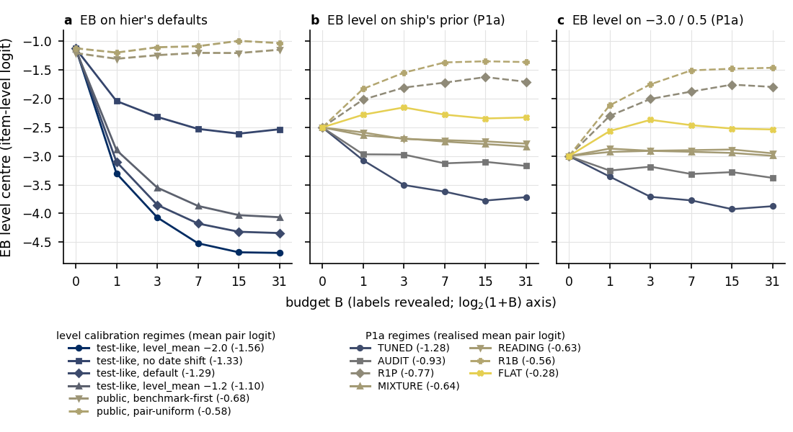

*Figure E1.* The EB estimate of a new benchmark's level centre by budget, coloured by each regime's mean pair logit; dashed lines are public regimes. (a) EB on hier-fit's level prior in the level calibration's regimes. (b, c) hier-EB on hier-ship and on mu0 -3.0 / attr_scale 0.5 in the RS regimes (fresh seeds, library of `4d2cc4f`). The centre is on the item-level scale and the regimes' levels on the pair-accuracy scale. They are ordered alike within regimes that share the date shift; the date shift moves the centre further down, because the inflated attribute standings are taken back (F§ "The empirical-Bayes level adapts the right way"), so a date-shifted regime ends below an unshifted one of the same or a lower level.

### E.4 The baseline study: provenance and details

**Smooth-cal in §5.3.** Its row of §5.3's table was added by the RS study (`results/regime_sensitivity.json`, `smcal`), scored on the same runs as the rest of the table. Its difference is derived from the two ALCs (0.1588 and 0.2039). Its public cost is against LegacyP's stored rows, which predate the corrected multiple-choice floor; against the current LegacyP it is larger (F§ "Regime sensitivity at the feedback's reading").

**Row provenance of §5.5.** On the RS study's TUNED and public runs the baseline study scored a plain 1PL and EmpMean (F§ "Baselines: a plain 1PL, the organisers' empirical mean and BLE"; `experiments/baselines_p1.py`, `results/baselines_p1.json`). The 1PL is hier with the attributes, the identity link, the groups, the multiple-choice floor and slip off: one pooled level per benchmark, one ability per (subject, benchmark) pair and one difficulty per item, refitted from `labeled` at every checkpoint. It was scored at the shipped level and at its own leave-one-parent-out public level. Every other row is the RS study's: Smooth and Smooth-cal were re-scored on every run, hier-ship, hier-nosubj and LegacyP on the first and last run of each regime, all bit for bit, and hier-fit is read from the RS study's rows as stored.

- **A calibrated level alone recovers the tuned-regime gain.** Smooth-cal takes the prior that LEVEL's own selection rule picks on the tuned regime: mean 0.25, strength 2. No grid point passed the public guard, so this is the best point regardless of the guard.
  - In TUNED it is level with hier-ship (+0.0015 ± 0.0019 cluster SE, in its favour). It beats LegacyP by 0.045 there, with no item model and no subject prior.
  - In the four other test-like regimes it trails hier-ship by 0.004 to 0.010 (hier-ship − Smooth-cal is -0.0043 to -0.0103), and on public runs by 0.010 to 0.011, where it also fails the guard.
  - So the tuned-regime headline measures a moved level. What hier adds over a calibrated level is the gain it keeps when the hidden level is not the one it was tuned for, and parity with LegacyP on public runs.
- **The subject prior.** hier-nosubj is hier-ship without its attribute prior, keeping the pooled level, item difficulty, groups and floor. It is ahead of hier-ship in TUNED by 0.0030 and behind it elsewhere by 0.0016 to 0.0049. Turning the prior off also lowers the B0 centre: the mean B0 prediction is 0.31, against 0.42. So this measures the prior and hier-ship's centre together. It is not the plain 1PL; that is 1PL-ship (§5.5).
- **Most of LegacyP's tuned-regime deficit is its own prior.** 1PL-fit, with no calibration at all, beats it there by 0.038 (cluster SE 0.004); hier-fit beats it by 0.012. LegacyP's mean B0 prediction in TUNED is 0.68, against 0.42 for hier-ship: its attribute prior turns the synthetic date shift into optimism. Even EmpMean is ahead of it in that regime, by 0.0095 (-0.0095 ± 0.0025 / 0.0049 / 0.0043, 1.9 cluster SEs; parent-level -0.003 ± 0.012). The tuned regime's headline is therefore set largely by the date shift (§7).
- **On public runs, where the calibration costs, the model pays for it.** hier-ship minus LegacyP is within noise there (-0.0002 and -0.0039), so no share is given. At the same level, hier adds 0.010 over Smooth-cal and 0.005 over 1PL-ship (-0.0048 ± 0.0005 / 0.0007 / 0.0006 and -0.0050 ± 0.0004 / 0.0007 / 0.0006), about half of it the subject prior (hier-ship − hier-nosubj) and half the groups, the floor, slip and ability keyed on the model's name (hier-nosubj − 1PL-ship).
- **At B0 the attribute prior pays once the centre is held level.** Where the mean B0 predictions match, hier-ship beats 1PL-ship by 0.010 to 0.015 of Brier at B0 and 0.004 to 0.009 at B1 (cluster SEs 0.0009 to 0.0026). About 0.0015 of the B0 gap separates hier-nosubj from 1PL-ship; the rest is mostly the attribute prior.
- **EmpMean** trails hier-ship by 0.0339 ± 0.0016 / 0.0030 / 0.0028 in TUNED and by 0.045 to 0.046 on public runs (cluster SEs 0.003).

1PL-ship borrows hier's calibrated mu0, chosen with the attribute prior on, and TUNED redraws the catalogue that chose LEVEL and Smooth-cal, so it favours those configurations.

### E.5 BLE

**BLE could not be run.** Each BLE prediction is a language-model agent run against a paid API (by default openai/gpt-5.6-luna, up to 10 turns and 240 s a prediction), with a payload prepared over the network; its only offline mode replaces the model with scripted replies. These runs alone would need 569,838 agent runs. The empirical mean with BLE acquisition chooses its labels from BLE's predictions, so it cannot run either; under random acquisition it is the empirical mean above. The best leaderboard entry (0.1172) stays unexplained.

BLE and the empirical mean with BLE acquisition are deferred: they need network access, an `OPENAI_API_KEY` for a paid model, a payload prepared over the network and filtered per held-out parent, and about 570,000 agent runs on these runs alone; the baseline's only offline mode is scripted. Amortized calibration [Truong et al. 2025] was not run either. Its core is a difficulty map from embedded item content, trained across datasets; App F.2 measures such a map leave one benchmark out, and it does not transfer here.

### E.6 The single-subject benchmark

swe_rebench has one subject. Its numbers carry an SE over its appearances, each of which sees a different subset of its 6,306 items through the run's item cap (mean pairwise overlap 0.026); that is not a cluster SE, and nothing measures variation between subjects or between single-subject benchmarks (F§ "A single-subject benchmark"; `experiments/gate_and_ci.py --stage single`, `results/gate_and_ci.json`, `single`).

- **hier-ship loses there.** Against LegacyP it loses +0.0101 ± 0.0012 over 130 R1-bf appearances (run-2 library, seed 0) and +0.0094 ± 0.0016 over 51 (current library, the RS study's seed 11); against Smooth, +0.0130 ± 0.0014 and +0.0117 ± 0.0018. Pair-uniform runs hold 7 and 9 appearances (+0.0121 ± 0.0065 and +0.0024 ± 0.0042 against LegacyP).
- **The loss sits at B0 to B3:** +0.024, +0.018 and +0.013 against LegacyP, and under 0.006 from B7 on. It carries +0.0010 of R1-bf's -0.0017.
- **Among the RS study's alternatives hier-ship is near the best there.** It does better than both wider level priors, hier-rec, Smooth-cal, hier-EB on mu0 -3.0 and hier-nosubj, by 0.0009 to 0.0073; the wider priors gain at B0 and lose from B1 on. Only hier-fit does better (by 0.0022 ± 0.0010), besides LegacyP and Smooth.

Test-like runs exclude single-subject benchmarks, so the tuned-regime gains say nothing about them, and swe_rebench's rate (about 0.49) sits near the public centre.

### E.7 hier-ship across regimes by budget

| regime | runs (seed) | B0 | B1 | B3 | B7 | B15 | B31 | ALC ± run SE | single-run sd of ALC |
|---|---|---|---|---|---|---|---|---|---|
| TL | 300 (2) | 0.2165 | 0.1892 | 0.1645 | 0.1525 | 0.1450 | 0.1386 | 0.1658 ± 0.0018 | 0.0318 |
| TL-mix | 200 (3) | 0.2178 | 0.1931 | 0.1692 | 0.1590 | 0.1524 | 0.1454 | 0.1711 ± 0.0023 | 0.0329 |
| TL-noshift | 100 (3) | 0.1948 | 0.1763 | 0.1620 | 0.1479 | 0.1413 | 0.1353 | 0.1585 ± 0.0033 | 0.0335 |
| R1-bf | 150 (0) | 0.2350 | 0.2243 | 0.2128 | 0.1973 | 0.1852 | 0.1771 | 0.2051 ± 0.0023 | 0.0285 |
| R1-pu | 100 (0) | 0.2442 | 0.2215 | 0.2069 | 0.1929 | 0.1813 | 0.1708 | 0.2020 ± 0.0026 | 0.0261 |
| platform, formative run 2 | 1 | 0.2368 | 0.1947 | 0.1963 | 0.1836 | 0.1785 | 0.1833 | 0.1926 | |
| platform, formative run 3 (archive `4a882cc7…`) | 1 | 0.2351 | 0.1868 | 0.1885 | 0.1664 | 0.1667 | 0.1644 | 0.1817 (recomputed) | |

Source: `results/subject_side.json` (`summary.regimes.*.ship`), `experiments/subject_side.py`; single-run sds from `results/ship_confirm.json` (`single_run_sd`); run 2 from `results/formative_feedback.json`, run 3 from `results/formative_run3.json`. The 'ship' arm reproduces `experiments/itemsig_eval.py`'s base exactly.

Per budget, against LegacyP and Smooth (`results/ship_confirm.json`):

- **Most of it is at B0 and B1.** By budget on runs 0 to 299, hier-ship gains 0.135 (cluster SE 0.011) at B0, 0.076 at B1, 0.037 at B3, 0.016 at B7 and 0.008 at B15 and B31: B0 and B1 carry 0.029 of the 0.042.
- **Against Smooth, which has no level to tune, the gain is 0.016 to 0.018 in the tuned regime and 0.009 on public runs.** It is larger without the date shift (0.022) and positive on every test-like parent.
- **On public runs hier-ship is level with LegacyP.** Its point estimates are 0.0015 to 0.0018 better, within about one cluster SE (0.81 cluster SEs on R1-bf, 1.02 on R1-pu). It loses at B0 (+0.0049 ± 0.0065 on R1-bf, +0.0140 ± 0.0072 on R1-pu, cluster SEs) and gains from B7 on (0.004 to 0.008 a budget). It loses on public matharena (+0.010, +0.009) and on the single-subject swe_rebench pair (+0.010; App E.6).

---

## Appendix F: the studies of §6

### F.1 Summary table and the within-pair scale

Each idea below is recorded as negative with its script. The label-conditional layer, the meta-learned heads, the known-sign cues and the subject-side priors were scored against hier-ship leave-one-parent-out, and so were the language-model probes that produce an item covariate. The TF-IDF map is a data-level correlation with a naive solve-rate target; the embeddings and the blind ratings are data-level correlations with Rasch difficulty, as are the probes' own correlation prongs. The transfer correlations of every text map, judge, probe head and encoder and of the 14B now carry 95% intervals (F§ "Intervals for every transfer correlation"; the probe heads' and the encoder's from their own results files), and the table below restates them on the gate's within-pair scale. App F.8's results come from the legacy replica. They share one reason for failing. The hidden test's headroom lies at budgets 0 and 1 and in per-item structure of benchmarks nobody has seen, and none of these signals reaches either.

| idea | best honest estimate | verdict | script, results |
|---|---|---|---|
| item difficulty from TF-IDF text, across benchmarks | LOBO Pearson with Rasch difficulty on text-bearing items 0.10, 0.14, -0.02, -0.16, 0.11, every 95% interval below 0.3 (0.14, 0.23, 0.09, -0.22, 0.16 with the naive solve-rate target); within a test-like pair 0.07 | does not transfer | `experiments/transfer.py` (data-level); intervals `results/gate_and_ci.json` |
| item difficulty from Qwen3-Embedding-0.6B | LOBO ridge -0.16 / -0.03 / -0.23 / -0.02 (upper 95% limits 0.26 at most); within benchmark 0.66 / 0.27 / 0.38 / 0.51 | does not transfer | `experiments/emb_transfer.py`, `results/emb_transfer.json` |
| blind LLM difficulty rating (rater undocumented, App F.3) | 0.482 [0.25, 0.64] on matharena; -0.13 to 0.21 elsewhere | mathematics only; inconclusive on multi_swebench and real_webagents, interval below 0.3 on swe_rebench | `experiments/llm_rating/analysis.py`; group intervals `results/gate_and_ci.json` |
| Qwen3-4B zero-shot judge (rating, digit, entropy, nll) | no benchmark-equal test-like difference (the mean of the parents' means) ≤ -0.001 | closed | `experiments/llm4b_close.py`, `results/llm4b_close.json` |
| a 4B model's own attempts | graded accuracy 2.3% and 7.8%, below the 10% floor | cannot be read | `experiments/attempt_probe.py`, `results/attempt_probe.json` |
| entropy and hidden-state heads | LOBO r, random-effects mean over the four parents, -0.05 [-0.24, 0.14] (entropy) and +0.12 [-0.004, 0.24] (hidden state) | replicated null | `experiments/hidden_state_probe.py`, `results/hidden_state_probe.json` |
| in-context learning over the pair's labels | r 0.206 ± 0.040, below 0.3 | closed | `experiments/icl_probe.py`, `results/icl_probe.json` |
| pairwise (anchored) comparisons | pooled q 0.540, below 0.60 | dropped | `experiments/pairwise_probe.py`, `results/pairwise_probe.json` |
| text-similarity residual layer (itemsig) | nested -0.00002 ± 0.00002 / 0.00008 / 0.00008 | no gain | `experiments/itemsig_eval.py`, `results/itemsig_eval.json` |
| meta-learned heads on frozen embeddings | nested 0 (every head off in every fold); forced +0.0002 to +0.0006 | no gain | `experiments/heads_eval.py`, `results/heads_eval.json` |
| fine-tuned encoder | 0 of 4 parents at held-out r ≥ 0.3, best +0.05 [-0.01, 0.10] (multi_swebench, group interval), random effects -0.05 [-0.14, 0.05]; transferred line +0.00048 | closed | `experiments/finetune_encoder.py`, `results/finetune_encoder.json` |
| Qwen3-14B demand rubric and direct ratings (Kaggle, two T4s) | LOBO head r +0.19 (random effects), per parent +0.23 [0.04, 0.40], +0.01 [-0.08, 0.11], +0.19 [0.11, 0.28], +0.33 [0.12, 0.51] (-0.04 within competition on matharena); within-pair r 0.11; best nested line -0.00084 ± 0.00043 | null for ALC | `experiments/strong_llm_eval.py`, `results/strong_llm_eval.json` |
| Qwen3-14B reasoning attempts (matharena only) | within-competition rho 0.372 [0.209, 0.516] on the 147 probe texts, 0.352 [0.25, 0.45] on all 270 attempted; forced per-pair line -0.00011 ± 0.00005 | GO for correlation; NULL for ALC (one parent) | same |
| Qwen3-14B reasoning entropy, all four parents (Kaggle, the entropy job) | within-group Spearman +0.29 [0.16, 0.40] / +0.12 [0.06, 0.16] / -0.03 [-0.19, 0.15] / +0.33 [0.17, 0.45] (matharena, multi_swebench, real_webagents, researchcodebench), random effects +0.18; within-pair r 0.12 [0.09, 0.15]; transferred nested +0.00110 ± 0.00045 (on in 1 of 4 folds), per-pair nested +0.00001 ± 0.00006 | NULL, under a rule fixed before the data | same (`entropy`) |
| known-sign item cues (ordinal fields, position, format, length, stated size, image refs) | nested test-like 0 to +0.00003 | none passes the sign rule or the gate | `experiments/itemcov_eval.py`, `results/itemcov_eval.json` |
| subject side: harness identity, ordered effort, date forms, Student-t level | best nested -0.00097 ± 0.00033 (ordered effort) | none passes | `experiments/subject_side.py`, `results/subject_side.json` |
| acquisition policies (legacy replica) | coverage-first -0.0000 ± 0.0013 | none beats random | `experiments/acquisition.py` |
| post-hoc temperature and slip (legacy replica) | loses 0.0007 ± 0.0011 | does not transfer | `experiments/acquisition.py` |
| offline bank of per-item results | 1 of 161 inventory benchmarks judged usable (the judgement is unrecorded, App F.8) | closed | `experiments/inventory_scan.py` |

**One correlation scale.** The gate's r is a correlation with an *honest* difficulty, fitted on other subject folds. That difficulty is reliable (0.84 to 0.95 by split-half and fold-overlap estimates), so a correlation against full-sample difficulty is only 0.5% to 1.6% higher than against the honest one. What differs is the unit. The gate reads a covariate within a test-like pair, where its bar is r = 0.25 (0.33 at an honest r of 0.4), while most correlations in §6.3 are taken over a benchmark's whole range, within groups, or over text-bearing subsets. A degraded oracle keeps 0.82 of its r within a pair; the 14B's primary head, judged solve share, rubric sum and expert-time estimate and its reasoning entropy keep 0.57 to 0.65, and every covariate whose parent-scale correlation is clear of zero keeps 0.30 to 1.02 (for TF-IDF, the 4B judge and the embedding kNN that correlation is near zero and the share means nothing; `results/gate_and_ci.json`, `ci.unit_ratio`). On the gate's within-pair scale (`results/gate_and_ci.json`, `scale`):

| covariate | within-pair r [95% cluster interval] |
|---|---|
| TF-IDF, leave one benchmark out | 0.07 [0.03, 0.10] |
| embedding ridge; kNN, leave one benchmark out | -0.11 [-0.13, -0.08]; -0.04 [-0.06, -0.02] |
| embedding ridge fitted within the same benchmark (cannot transfer) | 0.25 [0.23, 0.27] |
| 4B judge, four features (absolute value; the harness fits the sign) | 0.04 to 0.09 |
| 14B rubric: primary head; judged solve share; the two highest scales | 0.11 [0.08, 0.14]; 0.13 [0.10, 0.16]; 0.15 [0.12, 0.17] |
| 14B reasoning entropy, all four parents | 0.12 [0.09, 0.15] |
| 14B attempts' entropy (matharena only; it varies on 20% of appearances) | 0.32 [0.27, 0.35] |

No covariate that can be carried to a new benchmark reaches 0.25 within a pair. The attempts' entropy does on one parent, where no slope can be transferred leave one parent out.

A slope transferred from other benchmarks acts at B1 about as much as at later budgets: the honest oracle's transferred line gains 0.036 at B1 (cluster SE 0.004; `results/gate_and_ci.json`, `gate.b1`). The target does not flatter the correlations of §6.3: the honest difficulty is reliable (0.84 to 0.95), and a correlation against full-sample difficulty is at most 1.6% higher than against the honest one.

### F.2 Item difficulty from text: TF-IDF and neural embeddings

Leave one benchmark out, a TF-IDF map from item text correlates with the naive difficulty target (the solve-rate logit over all items) at 0.14 [0.06, 0.23] on matharena, 0.23 [0.16, 0.27] on multi_swebench, 0.09 [-0.13, 0.31] on real_webagents, -0.22 [-0.47, 0.07] on researchcodebench and 0.16 [0.13, 0.18] on swe_rebench (95% group-bootstrap intervals; item interval on swe_rebench, which has no groups). Against Rasch difficulty on the items that carry text, the target the rest of this section uses, it is 0.10 [0.01, 0.20], 0.14 [0.09, 0.23], -0.02 [-0.40, 0.28], -0.16 [-0.44, 0.10] and 0.11 [0.09, 0.14] (F§ "Intervals for every transfer correlation"; `results/gate_and_ci.json`, `ci.rows`). Within a test-like pair, where the gate reads it, it is 0.07 [0.03, 0.10]. Within matharena (5-fold, text-bearing items) the same model reaches 0.80 [0.70, 0.86], but much of that is identifying which competition an item comes from: removing the competition mean drops it to 0.58 [0.48, 0.66]. (Findings first recorded 0.73 and 0.49 here; they do not reproduce at HEAD, and the refitted values are quoted.) Competition alone explains 40% of the variance of this difficulty target (F§ "What transfers between benchmarks"); the Rasch variance component in §2.2 puts the competition's share at 0.50.

Qwen3-Embedding-0.6B embeddings do no better across benchmarks (F§ "Neural embeddings do not carry difficulty to an unseen benchmark"; 95% group-bootstrap intervals from `results/emb_transfer.json` and `results/gate_and_ci.json`):

- LOBO ridge correlations are -0.16 [-0.29, -0.03], -0.03 [-0.16, 0.04], -0.23 [-0.43, -0.01] and -0.02 [-0.31, 0.26] (matharena, multi_swebench, real_webagents, researchcodebench), and kNN -0.08 [-0.21, 0.06] to +0.16 [-0.11, 0.38].
- R² as predicted is at most 0 everywhere, and the carried slope has the wrong sign.
- Within a benchmark (5-fold) they reach 0.66 [0.56, 0.73], 0.27 [0.20, 0.34], 0.38 [0.19, 0.52] and 0.51 [0.30, 0.66]. But the item_features group mean alone reaches 0.57 [0.39, 0.69], 0.12 [-0.06, 0.23], 0.41 [0.19, 0.55] and 0.52 [0.30, 0.67], and with whole groups held out the embeddings fall to 0.40 [0.29, 0.51], 0.16 [0.09, 0.25], -0.02 [-0.19, 0.15] and -0.09 [-0.30, 0.11]. So within a benchmark the embedding mostly identifies the group, which hier already learns from labels.

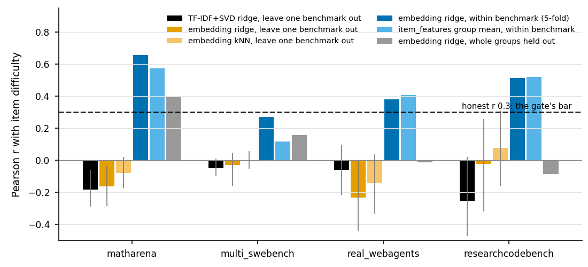

*Figure F1.* Pearson r between predicted and full-sample Rasch item difficulty, per benchmark, with 95% group-bootstrap intervals: leave-one-benchmark-out maps (TF-IDF+SVD ridge, embedding ridge, embedding kNN) against within-benchmark fits (embedding ridge, the item_features group mean, embeddings with whole groups held out). The TF-IDF bars are `experiments/emb_transfer.py`'s TF-IDF+SVD ridge, not the `transfer.py` map quoted above. The dashed rule is the gate's honest r of 0.3; within a test-like pair the bar is 0.25 (§6.1).

*Literature.* Amortized calibration fits one map from embedded question content to difficulty across 22 datasets and matches per-question calibration on held-out questions [Truong et al. 2025]; it does not test a held-out dataset. ADeLe reports that black-box predictors built on embeddings or fine-tuning are weaker than rubric-based demand levels, especially out of distribution [Zhou et al. 2026]. Our result is the out-of-distribution end of that picture on agentic and code benchmarks: the direction of difficulty in embedding space is not shared between benchmarks. For agentic coding tasks, Agent Psychometrics predicts task-level success on unseen benchmarks from issue statements *together with* repository context, solutions and test cases [Ge et al. 2026]. The competition's items carry the issue text and grouping metadata only.

### F.3 Language-model difficulty judgements

180 items across four benchmarks were rated blind to their difficulty on a 0-100 scale and compared with Rasch difficulty (F§ "Language-model difficulty judgement").

| benchmark | n | Pearson | 95% CI (Fisher) | 95% CI (group bootstrap) |
|---|---|---|---|---|
| matharena | 45 | 0.482 | [+0.22, +0.68] | [+0.25, +0.64] |
| multi_swebench | 45 | 0.133 | [-0.17, +0.41] | [-0.17, +0.48] |
| real_webagents | 45 | 0.210 | [-0.09, +0.47] | [+0.12, +0.41] |
| swe_rebench | 45 | -0.128 | [-0.41, +0.17] | (no groups) |
| pooled within benchmark | 180 | 0.174 | [+0.03, +0.31] | [+0.03, +0.33] |

Group intervals resample item_features groups (`experiments/gate_and_ci.py --stage ci`, `results/gate_and_ci.json`); the Fisher intervals reproduce. A control on 60 fresh multi_swebench items with the full issue text (capped at 4,000 characters) gives Pearson +0.252 (interval touching zero) and Spearman +0.109, so truncation was not the explanation.

**The rater's prompt and protocol are undocumented.** The ratings are hard-coded in `experiments/llm_rating/ratings_main.py` and `ratings_control.py`, which entered the repository in its first commit (2026-09-23), co-authored by Claude Opus 5 in a Claude Code session. The team confirms that the rater was the Claude model of that coding session (the commit's trailer names Claude Opus 5). Its prompt, the date and the sampling settings are recorded nowhere. The rater was blind to difficulty only: item ids carry the benchmark, and the texts name their domain. Whether it saw measurement-db (which that session held) or the benchmarks' public leaderboards cannot be excluded. The correlations re-derive from the stored ratings; the ratings do not (App G.6).

*Literature.* Human-labelled difficulty of math and coding problems is linearly decodable from model activations [Lugoloobi and Russell 2025], and rubric-based LLM annotation of task demands predicts instance-level performance [Zhou et al. 2026]. We see the judge track difficulty where it is visible in the statement (competition mathematics) and not where it lies in the environment (repository size, files to touch, test harness). The gate table (§6.1) needs an honest r of 0.3 to 0.35 across benchmarks, 0.25 within a test-like pair. The judge reaches 0.3 against full-sample difficulty on one benchmark of four. With 45 items per benchmark the intervals on multi_swebench and real_webagents include 0.3, so on those two the result is inconclusive rather than negative; on swe_rebench the interval, [-0.41, +0.17], excludes 0.3.

**A larger 4B run is not needed to settle the question.** The review asked for the local 4B judge on several hundred items a benchmark. The 14B of App F.9 has since rated every item of the four parents, with the same judged solve share, so the item count no longer limits the answer (F§ "Intervals for every transfer correlation"; `results/gate_and_ci.json`, `ci.power_4b`). Excluding r = 0.3 at 80% power would take 258 items on multi_swebench, but 847 on real_webagents, which has 233 items in all. Where items are plentiful, both local judges sit below the bar with intervals that exclude it: on multi_swebench the 14B's solve share reaches 0.07 [-0.04, 0.19] (Pearson with fold-averaged difficulty) and the 4B's rating 0.11 [0.06, 0.21] (Spearman within language, sign as declared; the stored raw rating's is -0.11 [-0.21, -0.06]). Figure 5 (c) draws the 4B rating's Pearson over all rated items in the same orientation, 0.11 [0.06, 0.18]: a different statistic from the same file (`results/llm4b_close.json`, `signs.features.rating.units.multi_swebench`). Where items are few, the 14B's solve share is 0.34 [0.13, 0.52] on researchcodebench and 0.18 [-0.03, 0.39] on real_webagents against fold-averaged difficulty, and it still fails the gate: within a test-like pair it reaches 0.13, and its best nested line is -0.00084. More 4B items could narrow an interval, but not move a covariate that the stronger judge, at full coverage, does not carry through the gate.

A fully specified local judge, Qwen3-4B-Instruct-2507, read each item once and rated it as a digit (`experiments/llm_features.py`). It was closed (F§ "The 4B judge, closed out"): no benchmark-equal test-like difference reached -0.001 through the harness, and on text-bearing matharena items every feature's partial correlation was below 0.2 with the declared sign. Its extraction covers matharena and 1,941 of 2,078 multi_swebench items only.

### F.4 A label-conditional text-similarity layer

`paiec/itemsig.py` carries hier's residuals on a pair's labeled items to unlabeled items with similar text. It was run over a 480-configuration grid, with nested leave-one-parent-out selection redone in every bootstrap resample (F§ "Item signal from the pair's own labels"):

Base ALCs in brackets. R1-bf here is runs 0-199 (0.2057), not the 0-149 of App E.7 (0.2051).

| regime (base ALC) | nested, selected within the regime | in-sample best of 480 |
|---|---|---|
| TL, runs 0-299 (0.1658) | -0.00002 ± 0.00002 / 0.00008 / 0.00008 | -0.00006 |
| TL-mix, runs 0-199 (0.1711) | -0.00028 ± 0.00005 / 0.00021 / 0.00019 | -0.00037 |
| R1-bf, runs 0-199 (0.2057) | -0.00003 ± 0.00012 / 0.00049 / 0.00046 | -0.00071 |
| R1-pu, runs 0-99 (0.2020) | -0.00076 ± 0.00018 / 0.00031 / 0.00029 | -0.00112 |

The layer cannot act at B0 or B1 by construction: there are no labels at B0, and at B1 centring within the pair zeroes the single residual. At B31 it takes 0.5% of the gap between the pair-rate oracle and the item oracle. That gap is 0.063 of Brier on test-like runs, and the base already matches the pair-rate oracle there. Selected on the public runs of the other parents, the layer picks aggressive settings that lose +0.0019 ± 0.0007 on held-out researchcodebench. Not shipped.

*Literature.* Generic assessors that transfer instance-level performance from reference instances do well in distribution, but out of distribution "no clear winner emerges and the overall performance is worse" [Pacchiardi et al. 2024].

### F.5 Meta-learned heads on frozen embeddings

An episode-trained study put linear and low-rank heads on frozen Qwen3-Embedding-0.6B features on top of hier-ship: a meta-learned difficulty direction, a learned-metric few-shot kernel, and an assessor-style subject × item term (F§ "Meta-learned heads on frozen embeddings"; `experiments/heads_eval.py`, `results/heads_eval.json`). Its strength was chosen by nested leave-one-parent-out, and a head was used on the held-out parent only if its inner mean was below 0.

- **Nested, every head is off in every fold**, on the rows it ran on and on the rows of the current library, so the nested difference is exactly 0. The smallest inner mean over folds and strengths is +0.000007.
- **Forced on**, the combined head costs +0.0002 to +0.0006 test-like.
- **It learns something where the benchmark has been seen**, with subject folds inside the training benchmarks: the best two of five configurations (the difficulty head at λ 0.001, and all heads at PCA 256) gain 0.0005 and 0.0017 test-like and 0.0024 and 0.0046 TL-mix. Across all five the range is +0.0005 to -0.0017 test-like, where both λ 0.01 variants lose to hier, and -0.0008 to -0.0046 TL-mix. None of it reaches a held-out parent.
- **The same head on in-sample Rasch difficulty** gains -0.0437 test-like (cluster SE 0.0037) and -0.0557 TL-mix. That is the acceptance target the harness reproduces (App C.4).

The study ran in session scratch; the script reproduces all 21 of its result files bit for bit.

### F.6 Item covariates with a known sign

`paiec/itemcov.py` reads benchmark-agnostic cues off the item dict, each with its sign declared in advance: ordinal difficulty fields, problem position, answer format, text length, stated amount of work and image references. The plan allowed a transferred slope only if a cue had the declared sign *and* agreed with the other benchmarks' mean on 4 of 5 units (F§ "Item covariates with a known sign"; computed on the legacy harness rows, before the corrected floor and the floored-fit fix). Three facts decide the result:

- **Most cues cannot be tested across benchmarks.** No public item carries a difficulty-named field, and position, format and stated size each vary on one benchmark only.
- **The one universal cue is unstable.** Text length is present everywhere but changes sign: +0.28 on matharena, +0.36 on real_webagents, -0.43 within paper on researchcodebench.
- **Nothing passes the gate.** Through the harness, nested test-like differences are between 0 and +0.00003.

The one cue with real item signal is researchcodebench's stated size ("Approximately 7 line(s) of code"). It has a within-pair r of +0.41, and a forced per-pair slope from B7 gains -0.0022 ± 0.0005 on its pairs, against a placebo of +0.0008. That sits where the gate table says an r of 0.3 to 0.5 covariate should. But it exists on one public benchmark, so it cannot be selected leave-one-parent-out. If one hidden benchmark in seven carried such a cue, the run-level value would be about 0.0003.

*Literature.* Task length in human time predicts agent success on software tasks [Kwa et al. 2025], and stated lines of code is a crude, benchmark-specific proxy for it. Agent Psychometrics finds that repository state, tests and the solution patch add predictive power beyond the issue text [Ge et al. 2026], but none of these is visible in the competition's item input.

**Sign check.** Spearman correlation with honest difficulty; within item_features groups in brackets (F§ "Item covariates with a known sign"):

| covariate | matharena | multi_swebench | real_webagents | researchcodebench | swe_rebench |
|---|---|---|---|---|---|
| position_within | +0.12 ± 0.05 (+0.15) | absent | absent | absent | absent |
| format_score | +0.19 ± 0.13 (+0.07) | constant | constant | 3 items off | 3 items off |
| log_length | +0.28 ± 0.08 (+0.06) | -0.02 ± 0.05 (+0.00) | +0.36 ± 0.08 (+0.29) | -0.10 ± 0.17 (-0.43) | +0.04 ± 0.01 |
| stated_size | absent | absent | absent | +0.50 ± 0.06 (+0.43) | absent |
| image_ref | -0.04 ± 0.09 | +0.05 ± 0.03 (+0.05) | absent | -0.08 ± 0.15 | +0.05 ± 0.01 |

### F.7 The subject side at budgets 0 and 1

Four changes to the priors that act at B0 and B1 were measured against hier-ship (F§ "Subject side at budgets 0 and 1"): harness identity (H), ordered reasoning effort (E), the form of the release-date trend (D: clip, hinge, both, log) and a Student-t level (T).

| selection | folds on | TL | R1-bf / R1-pu | TL-noshift | worst held-out parent |
|---|---|---|---|---|---|
| E vs hier-ship | 4 | -0.00097 ± 0.00033 | -0.00002 / +0.00001 | -0.00005 | 0 |
| H vs hier-ship | 1 | +0.00008 | +0.00005 / +0.00008 | +0.00005 | +0.0004 |
| Dlog vs hier-ship | 3 | +0.00033 | +0.00048 / +0.00056 | +0.00050 | +0.0044 |
| all ten, selected on test-like alone | E 4, Dlog 3 | -0.00052 ± 0.00118 | +0.00047 / +0.00058 | +0.00043 | +0.0044 |

None passes the gates:

- **H cannot be measured leave-one-parent-out.** Harness strings exist on one multi-subject benchmark. Within multi_swebench the harness is the largest attribute (+0.75 for Agentless, -0.75 for MSWE-agent); Ge et al. likewise find a sizeable additive scaffold component, with Agentless above SWE-agent [Ge et al. 2026]. That is within-benchmark transfer, not what the hidden test asks for.
- **E is switched on in every fold but gains half the bar,** and all of that gain comes through a lower date slope under the synthetic date shift.
- **The date form is decided by the shift, not by data.** On real dates the hinge fits held-out standings best and gains 0.0004 to 0.0007. Under the shift it loses.
- **The Student-t level ties or loses,** at five to nine times the cost.

*Literature.* Observational scaling laws predict benchmark performance from a few capability dimensions shared across model families [Ruan et al. 2024], which supports putting subject attributes in the prior. What no public run can check is how far hidden subjects lie past the public release dates. That, not the attribute model, sets the B0 error.

### F.8 Acquisition, calibration and the offline bank (legacy replica)

These were measured on the legacy replica and have not been re-measured under the official protocol.

- **Acquisition.** A-optimal acquisition targeting the evaluation pool was worse than random, because it starved the shared difficulty estimate of distinct items. Coverage-first selection moved ALC by -0.0000 ± 0.0013 (F§ "Acquisition and calibration"). The submission ships no `labeling.py`.
- **Calibration.** Post-hoc temperature and slip fitted on four benchmarks and applied to the fifth lose 0.0007 ± 0.0011. The fitted temperatures range from 0.8 to 1.6, so the constant is itself a property of the benchmark.
- **The offline bank.** Of the organisers' 161 inventory benchmarks, 5 publish per-item outputs for at least nine models, and only one (capability) was judged to publish them graded (F§ "The offline bank"). How that judgement was made for the five (phyblock, mmdocrag, atmossci_bench, capability, engdesign) is not recorded: `results/strong_repos.csv` has no producing script, and the step may have inspected their files (App G.6). The rules also restrict competition-specific training to the public pool. What the scan read, and that nothing from it entered any model or selection, is stated in App G.6.

*Literature.* Active and anchor-point selection choose informative items for a population of models [Li et al. 2025; Vivek et al. 2024; Maia Polo et al. 2024]. Here the evaluation items are a fixed half, the first label is worth 0.9 of a budget, and the level of a new benchmark, not the ranking of items, dominates the error.

### F.9 Closed probes, and a 14B on a free GPU

Six language-model and encoder studies that an earlier version of this report listed as in progress are closed, each by the rule its plan fixed (the rows of App F.1's table; F§ "The 4B judge, closed out", "Attempting instead of judging", "Entropy profiles and hidden-state probes", "Few-shot prompting", "Fine-tuning an encoder"):

- **The 4B zero-shot judge** (rating, digit, entropy, nll): closed; no benchmark-equal test-like difference ≤ -0.001 (App F.3).
- **A 4B model's own attempts**: below the plan's floor. Graded accuracy was 2.3% answering at once and 7.8% with a short chain of thought, so the attempts are mostly forced guesses and the design cannot show whether they carry difficulty. A post-hoc feature met the plan's GO numbers on 32 extreme items and is discounted.
- **Entropy and hidden-state heads**: a replicated null. Leave-one-benchmark-out r is -0.05 [-0.24, 0.14] for the entropy head (random-effects mean over the parents; positive on 2 of 4) and +0.12 [-0.004, 0.24] for the hidden-state head (none at 0.2; `results/hidden_state_probe.json`, `heads.<head>.random_effects`); the nested harness lines are +0.00098 and +0.00003, and 0 and -0.000001.
- **In-context learning over the pair's labels**: closed. It learns from the labels (+0.158 ± 0.059 in r over zero-shot) but reaches r 0.206 ± 0.040, below 0.3 on every parent, and mostly duplicates what hier learns from the same labels.
- **Pairwise (anchored) comparisons**: dropped at pooled q 0.540, against a bar of 0.60.
- **A fine-tuned encoder**: closed. 0 of 4 parents reach a held-out r of 0.3: -0.08 [-0.22, 0.06], +0.05 [-0.01, 0.10], -0.09 [-0.32, 0.15] and -0.11 [-0.41, 0.10] (matharena, multi_swebench, real_webagents, researchcodebench; group intervals), random effects -0.05 [-0.14, 0.05] (`results/finetune_encoder.json`, `eval.per_cov.finetuned`). The transferred harness line is +0.00048.

The plan's escalation after the 4B's floor ran as well: a stronger model on a free GPU (F§ "Strong model on Kaggle: Qwen3-14B rubric and attempts"; `experiments/strong_llm_eval.py`, `results/strong_llm_eval.json`). Qwen3-14B, 4-bit AWQ under vLLM on two Kaggle T4s, ran in two sessions. In the first, whose script ran 10.7 hours, it rated all 4,326 items of the four parents on a ten-scale demand rubric (eight ADeLe-style demands, a judged solve share and an expert's time), and made four reasoning attempts of up to 4,096 tokens on 270 of the 819 checkable matharena texts, the 147 probe texts first. In the second (the entropy job, whose script ran 4.9 hours by the same measure), it reasoned once over every item of the four parents, to record its token entropy.

- **The attempts pass their correlation rule.** The rule and the primary feature were fixed for the probe texts before any output existed. The primary, the mean token entropy of the raw distribution, reaches a within-competition Spearman of 0.372 [0.209, 0.516] against difficulty, with graded accuracy at 20.5%: GO. On the 2026 contests, which post-date the model and so cannot have been memorised, it is 0.585; on the other contests 0.29, so the pooled value leans on the 2026 ones. On all 270 texts it is 0.352 [0.251, 0.448]. It is the first item-side signal to pass its correlation bar. 97% of the attempts were truncated at 4,096 tokens, so it reads how the model starts to reason, not whether it finishes.
- **Neither use passes the gate.** The rubric's primary head reaches a leave-one-parent-out r of 0.19 (0.11 within a pair), and the best nested harness line of any rubric covariate is -0.00084. The attempts cover one parent, so no transferred slope can be fitted leave one parent out; their forced per-pair lines give -0.0001. A covariate with an honest r ≈ 0.3 on all four parents' items would sit just past the gate at this coverage (-0.0025, passing on 6 of 8 noise draws). That left one question: whether the entropy reaches that on the three parents that are not mathematics.
- **The entropy on all four parents: NULL.** The entropy-only job was the variant with upside, because a slope transferred leave one parent out needs the feature on every parent. It was held while it was unclear whether a model may run at predict time, then run as a measurement for this report (F§ "Commit D: reasoning entropy on all four parents"). Its reading rule and primary feature, the mean raw entropy over the first 1,024 reasoning tokens after a generic prompt, were committed (`78e303e`) before any output existed. The job covered all 4,078 units (4,326 items) in 4.8 hours of generation, at 1.28 times the planned throughput, with the recorder check passing on all 89 shards. The entropy orders difficulty within group on mathematics (+0.29; +0.40 on the 2026 contests' text-bearing items) and on research code (+0.33), weakly on multi_swebench (+0.12) and not on real_webagents (-0.03). On mathematics it reads nearly what the attempts read (Spearman 0.87 with the attempts' same window), and one sample is stable (test-retest ICC 0.81). Within a test-like pair it reaches r 0.12, half of the 0.25 at which the reference reaches the gate. Nested, the transferred slope is switched on only in the fold that holds out real_webagents, where it costs (+0.00110 overall), and the per-pair slope is level (+0.00001). Forced on, the transferred slope gains on the other three parents and on public runs but loses 0.0058 on real_webagents.
- **The line is closed.** The other 549 attempt texts are matharena too, so they cannot change any call, and no further commit is planned. Nothing from the Kaggle study enters the submission.

*Literature.* Token-entropy profiles carry some difficulty signal within benchmarks but little across them. On 17 agentic benchmarks their Spearman correlation falls from 0.19 under K-fold to 0.14 leave-one-benchmark-out [Krsteski and Meyer 2026]. Pre-generation activations predict a model's *own* success better than length or TF-IDF [Lugoloobi et al. 2026] and better than embedding assessors and verbalised confidence, though not on mathematical reasoning [Moreno Cencerrado et al. 2026]. Our subjects are other systems. A 4B proxy's signal did not transfer to them; a 14B's reasoning entropy tracks their difficulty on mathematics and research code, and hardly on the two agentic benchmarks, in line with the weak cross-benchmark transfer Krsteski and Meyer report for agentic tasks. Rubric-based demand levels predict instance-level performance [Zhou et al. 2026]. Here nine of the ten scales carry the declared sign on at least three of the four benchmarks, but weakly: within a test-like pair they correlate 0.03 to 0.15 with difficulty.

---

## Appendix G: reproducibility

### G.1 Environment

Development ran on an Apple M1 Pro (8 cores, 16 GB; macOS 26.5.1, Darwin 25.5.0) shared with other jobs, under Anaconda's Python 3.10.8 with numpy 1.26.4 (OpenBLAS 0.3.23.dev), scipy 1.10.1, scikit-learn 1.7.2, pandas 2.2.2, pyarrow 23.0.1, huggingface_hub 0.36.2 and pytest 9.0.3. torch 2.6.0 (CPU), transformers 4.57.6, tokenizers 0.22.2 and safetensors 0.8.0 were used only for the offline language-model features and, torch alone, for the meta-learned heads of App F.5 (`experiments/heads_eval.py`). None of them is in `pyproject.toml`: re-running those studies needs them installed separately. The Kaggle study of App F.9 ran `kaggle/strong_probe/strong_probe.py` on Kaggle's two T4 GPUs in two sessions, with vLLM 0.9.2, torch 2.7.0 and transformers 4.53.2 installed by the notebook (`results/strong_llm_eval.json`, `run.notebook` and `entropy.run.notebook`); reading its outputs locally needs nothing beyond this environment. The figures are drawn with matplotlib 3.9.2 (`tools/report_figures.py`), pinned by the `report` extra of `pyproject.toml`; their committed bytes are tied to that version. Every command means the `python` of that environment (`docs/report/provenance_facts.md` §1.3).

    pip install -e ".[dev]"            # add ",report" to redraw the figures

The submission needs numpy alone (`requirements.txt`).

### G.2 Data and pinned inputs

measurement-db is gated. Accept the terms on the dataset page, then:

    export HF_TOKEN=...          # or huggingface-cli login
    python -m paiec.fetch        # the core tables of six benchmarks into data/, at the pinned revision

Every result in this report used measurement-db at revision `bc8204d811823da849c6686bf124d4ca9f82e4de`, downloaded on 2026-09-24. For all 24 parquet files the local sha256 equals the etag recorded at that revision, so `data/` is byte for byte the dataset there. `paiec/fetch.py` now downloads that revision by default (`REVISION`); `PAIEC_DATA_REVISION` or `--revision` overrides it, and `tests/test_fetch.py` checks the pin without network. Whether the dataset's main branch has moved since cannot be checked offline.

The organisers' baseline repository (validator and streaming client) has no license and is not redistributed. Clone it at the commit the replica mirrors:

    git clone https://github.com/aims-foundations/paiec_baseline third_party/paiec_baseline
    git -C third_party/paiec_baseline checkout 82d330ddcdb16016a3ae9e048db7e588ba2c6a39

At that commit `tools/streaming_ingestion.py` has sha256 `c6f2610f…` and `check_submission_zip.py` `abe3cae0…`.

`pytest` needs neither: it runs on synthetic data (501 test functions over 23 files, 699 collected tests in this revision's working tree; to be recounted at the tagged commit).

### G.3 Rebuilding the submission

    python tools/build_submission.py        # fit prior.json, bake LEVEL, zip dist/paiec.zip, run every check
    python third_party/paiec_baseline/check_submission_zip.py dist/paiec.zip

`dist/paiec.zip` exists only if every check passed (§3.5). The rollback to LegacyP is `--legacy`. The archive writer is deterministic: rebuilding commit ee5085a from `git archive` with that tree's own build script reproduces run 2's archive byte for byte. The fit of `prior.json` is not bit-stable across BLAS threading: with OpenBLAS, OMP and vecLib held to one thread it differs in its last bits (at most 2.1e-11 relative) and so does the archive hash. A byte-identical rebuild needs the same BLAS and thread count as the build machine (App G.1); it was shown there, with the default thread settings, and not on other hardware (F§ "Formative feedback, runs 1 and 2", Archives).

| archive (sha256) | code | used for |
|---|---|---|
| `8e28d930d45b16aee351bfbbc75531a6d12079667793232d4bd74a17f9d47b9f` | b68492c, LegacyP | formative run 1 (the file downloaded back from the platform has these bytes) |
| `2c64eaada491cbf85bd54ae190cdbb28f9d0a13870df0dc77a3a850f90cf661f` | ee5085a, hier, old floor, solver before the floored-fit fix | formative run 2 (the file downloaded back from the platform has these bytes) |
| `4a882cc7d410e6a9085e4b1044b3e45aa50c370b74901bb55fa30cb1054a5090` | 4d2cc4f, hier, corrected floor and floored-fit fix | archive-3; formative run 3, a regression and latency check only (the file in `dist/` has these bytes and every tracked member matches 4d2cc4f; it was not downloaded back from the platform, `results/formative_run3.json`, `archive`) |

### G.4 Re-running the experiments

Wall times are as recorded, on the shared machine above. Every results file records its commands and code digests under `passes`, and `--summarise` rebuilds its summary from stored rows.

| result | command | wall time | output |
|---|---|---|---|
| official baselines (§2.4, §5.2) | `python experiments/official_baselines.py --runs 600 --jobs 6` | 12 min, 6 processes | `results/official_baselines.json` |
| hier-fit vs LegacyP, ablations (App E.1, App B.3) | `python experiments/hier_eval.py --jobs 8 --skip 'r2\|researchcodebench\|pair\|hier t3 level'`, then `--summarise` | 2 h 16 min, 8 processes, 4 resumed invocations | `results/hier_eval.json` |
| test-like regime check (§4.1) | `python experiments/testlike_check.py --phase tune --jobs 5`, then `--phase check --resume --validate --jobs 5` | about 6 CPU hours | `results/testlike_check.json` |
| level calibration (§5.3, §5.4) | `python experiments/level_calibration.py --stage S --resume --jobs 6` for S = grid, grid2, r1base, eb, t3, prob, eb, screen, confirm, final; then `--summarise` | 3 h 11 min, 6 processes | `results/level_calibration.json` (19 MB) |
| level audit (§5.4, App E.2) | `python experiments/level_audit.py`, then `--stage extra --jobs 1` | 5 s; 1,414 s, 1 process, 1.9 GB | `results/level_audit.json` |
| regime sensitivity, the RS study (§5.4, App C.3, App E.2, §7) | `python experiments/regime_sensitivity.py lock`, `smcal`, `regimes --grid`, `reproduce`, then `score --shard 0/2` and `score --shard 1/2` side by side, then `summarise`; `review` after scoring (commands in the script's header) | scoring 31 to 40 s a run (all eleven configs), 520 runs on two processes, rows written over 2 h 31 min; at most 1.0 GB a process | `results/regime_sensitivity.json`; rows in `data/regime_sensitivity_rows` |
| script versions behind stored results (App C.3, App D.4) | `python experiments/script_revisions.py --stage replay`, then `--stage reread` | instant; 40 s, 0.3 GB | `results/script_revisions.json` |
| hier-ship, confirmed (§1.5, §5.1, §5.4) | `python experiments/ship_confirm.py` | about 5 s, 0.56 GB; reads `data/subject_side_rows` | `results/ship_confirm.json` |
| formative feedback (§5.1, App D) | `python experiments/formative_feedback.py --stage record`, `--stage prereg`, `--stage read` | seconds, 0.3 GB | `results/formative_feedback.json` |
| formative run 3 (§5.1, App D.1, App E.7) | `python experiments/formative_run3.py` (`--archive PATH --archive-how TEXT` to record a copy downloaded back from the platform) | 0.3 s, 1 process; reads no data; needs `dist/` to hold the `4a882cc7…` archive unless given `--archive` | `results/formative_run3.json` |
| itemsig layer (App F.4) | `python experiments/itemsig_eval.py --stage run --jobs 4 --rows DIR`, then `--stage oracle`, `--summarise`, `--stage verify`, `--summarise` | 38 min, 4 processes | `results/itemsig_eval.json` |
| acceptance harness (§6.1, App C.4) | `python experiments/harness.py --stage collect --jobs 1`, `--stage verify --legacy data/harness_rows_legacy`, `--stage table --resume`, `--stage show` | 39 min collection, 1 min verification, 44 min table | `results/harness_thresholds.json` |
| meta-learned heads (App F.5) | `python experiments/heads_eval.py --rows legacy`, then `--rows current` | 54 and 52 min, 1 process, 1.07 GB | `results/heads_eval.json` |
| known-sign cues (App F.6) | `python experiments/itemcov_eval.py --stage signs`, `--stage harness --rows data/harness_rows_legacy`, `HARNESS_SCALE=pooled ... --stage harness --scale train --rows data/harness_rows_legacy`, `--stage inventory`, `--stage show` | 11 min, 1 process | `results/itemcov_eval.json` |
| subject side (App F.7) | `python experiments/subject_side.py --stage verify`, `--stage diag`, `--stage run --jobs 2` (plus `--configs` passes), `--summarise` | about 4 h 25 min over four invocations, 2 processes | `results/subject_side.json` |
| multiple-choice floor (App B.4) | `python experiments/mcq_floor.py --stage items`, `--stage run --harness-rows data/harness_rows_legacy`, `--stage summary` | about 50 min, 2 processes | `results/mcq_floor.json` |
| floored fits (§3.2, §7) | `python experiments/hier_floor_replay.py --stage compare --both`, `--stage timing`, `--stage synthetic`, `--stage modes`, `--stage hidden`, `--stage summary` | about 1 hour over the stages (34 min for the replay, on two shards) | `results/hier_floor.json` |
| embedding transfer (App F.2) | `python experiments/llm_features.py --download` then `--resume`; `python experiments/emb_transfer.py` | extraction `TODO(record)`; probe 232 s, 480 MB | `results/emb_transfer.json` |
| LLM rating study (App F.3) | `python experiments/llm_rating/analysis.py` | seconds | printed |
| closed language-model and encoder studies (App F.9) | `experiments/llm4b_close.py`, `attempt_probe.py`, `hidden_state_probe.py`, `icl_probe.py`, `pairwise_probe.py`, `finetune_encoder.py`, each with the stages in its F§ section | see F§ | `results/<script>.json` |
| a 14B on Kaggle: rubric and attempts (App F.9) | on Kaggle, `kaggle/strong_probe/strong_probe.py` (its README); then `python experiments/strong_llm_eval.py --stage S` for S = check-schema, ingest, signs, harness, reference, attempts (by default both readings: every attempted text and the probe texts), verdict, run, show | one Kaggle session on two T4s (the script ran 10.7 h); locally about 1.5 hours, 1 process (signs 14 min, harness 68 min, reference 8 min) | `results/strong_llm_eval.json` |
| a 14B on Kaggle: the entropy job (App F.9) | on Kaggle, the same notebook with `ARGS = ["--jobs", "entropy", "--no-prefix-caching"]` (README, "Коммит D", that is "Commit D", the entropy job); then `python experiments/strong_llm_eval.py` with `--stage check-schema` and `--stage ingest` on `--kaggle data/features/kaggle_d`, `--stage signs`, `harness`, `reference` with `--job entropy`, `--stage consistency`, `--stage verdict --job entropy`, `--stage run` | one Kaggle session on two T4s (the script ran 4.9 h, 4.84 h of it generation, about 5.0 h from the first cell to the export; planned 7.1 h, 9.3 h slow); locally about 1.2 hours, 1 process (signs 12 min, harness 40 min, reference 23 min) | `results/strong_llm_eval.json` (`entropy`) |
| inventory classes (§2.2) | `python experiments/inventory_classes.py` (`--out`, `--out-csv` to write elsewhere) | seconds, no network | `results/inventory_classes.json`, `.csv` |
| data counts (§2.2) | `python experiments/data_counts.py` | 2 s, 0.2 GB | `results/data_counts.json` |
| baselines: plain 1PL, empirical mean, BLE (§5.5, App B.5, App E.4) | `python experiments/baselines_p1.py ble`, then `score` (repeat while it exits with 75), then `summarise` | final pass 21 min, 1 process, at most 0.67 GB; reads the RS study's rows | `results/baselines_p1.json`; rows in `data/baselines_p1_rows` |
| pooling decomposition (§2.4, §5.6, App A.2, App A.3, App B.5) | `python experiments/pooling_decomposition.py score`, `recheck`, `summarise` | 208 tasks in 84 min, 1 process, under 1 GB | `results/pooling_decomposition.json`; rows in `data/pooling_decomposition_rows` |
| gate, intervals, single-subject breakout (§5.6, §6.1, App C.3, App C.4, App E.6, App F) | `python experiments/gate_and_ci.py --stage S` for S = gate, evidence, scale (by `--families`), ci, single | under 4 min a stage, 1 process, under 0.7 GB; reads stored results, rows and features | `results/gate_and_ci.json` |
| row export (App G.4) | `python tools/export_rows.py`, then `verify`; `restore` to unpack | minutes | `data/release_rows` (gitignored): six tar.xz archives, `MANIFEST.json`, `SHA256SUMS` |
| figures (Figures 1 to 7, A1, B1, D1, E1, F1) | `python tools/report_figures.py`, `--check` to rebuild and compare | about 5 s, under 300 MB; reads `results/*.json` only | `docs/report/fig/*.svg`, `*.png`, `manifest.json` |
| legacy-replica results (App F.8) | `python experiments/ceilings.py`, `ladder.py --seeds 4`, `transfer.py`, `order_sensitivity.py`, `pool_robustness.py`, `acquisition.py --seeds 4` | minutes each | printed |
| offline bank (App F.8) | `python experiments/inventory_scan.py` (needs network: clones repositories; App G.6) | not recorded; it ran before 2026-09-23 19:14 UTC | `results/inventory.csv`, `results/clone_scan.csv` |

Large per-row files (`data/harness_rows`, `data/harness_rows_legacy`, `data/itemsig_eval_rows`, `data/subject_side_rows`, `data/hier_floor`, `data/regime_sensitivity_rows`, `data/baselines_p1_rows`, `data/pooling_decomposition_rows`) are gitignored and regenerated by the scripts above, with one exception: `data/harness_rows_legacy` comes from `experiments/harness.py --stage collect` run at a checkout of `bd0be67` (library `0c05d35e…`). At the current commit the collection writes `data/harness_rows`, which differs on 157 of 300 test-like runs (F§ "Acceptance harness", Provenance), and the numbers of `heads_eval.py --rows legacy`, `itemcov_eval.py` and `mcq_floor.py` depend on the legacy rows. `experiments/ship_confirm.py`, `formative_feedback.py`, `level_audit.py` and `script_revisions.py --stage reread` read `data/subject_side_rows`, so they need `experiments/subject_side.py`'s rows first.

**Released rows.** `tools/export_rows.py` packs eight of these row sets (subject side, the RS study, the current and legacy harness rows, the floored-fit replay, the 14B's derived tables, and the rows of the baseline study and the pooling decomposition) into deterministic tar.xz archives with a manifest of member sha256s, and `restore` unpacks and checks them. Re-run on restored rows, `experiments/ship_confirm.py` passes every check with identical numbers, and the summaries of `baselines_p1.py` and `pooling_decomposition.py` are identical except for their timestamps (F§ "Row files for release"). The export never copies measurement-db, item features or `third_party/`, and the manifest carries measurement-db's terms. The archives are not yet hosted (App I), and the itemsig rows cannot be: they were written to a scratch `--rows` directory, not to `data/itemsig_eval_rows`.

`formative_feedback.py --stage record` verifies the two formative archives only when given them (`--archive1`, `--rebuild1`, `--archive2`, `--rebuild2`; the paths used are in `passes` and point into session scratch, which is not durable). Without them it keeps the `archives` already stored, so the hashes in `results/formative_feedback.json` are the durable record, and re-verifying needs the archives themselves. `formative_run3.py` checks run 3's archive in `dist/` unless given a downloaded copy (`--archive`), and records which it read (`results/formative_run3.json`, `archive`). `dist/` is gitignored and rebuilt by `tools/build_submission.py`, so re-verifying needs it to hold the `4a882cc7…` file: read from `dist/`, the archive checks are required and nothing is written without it, and a stored record whose archive matched is replaced by one whose archive does not only with `--replace-archive-record`.

### G.5 Seeds and determinism

- Public formative-like runs use `official.sample_run` with seed 0. Test-like runs use seed 2 (primary), seed 3 (sensitivities), seed 1 (tuning) and seed 5 (the audit's two extra regimes).
- The RS study uses two seeds that nothing used before. Seed 10 set its regime knobs from run composition alone, with no predictor. Seed 11 drew every scored run, test-like and public. The baseline study rescored the RS study's seed-11 runs, and the pooling decomposition drew its formative-size runs at seed 11 too, so its runs 0 to 59 are the RS study's R1-bf runs.
- `official`'s seed 0 is the persistent 50/50 split, and other seeds stand in for other hidden splits.
- Bootstraps use 2,000 resamples.
- The replica's acquisition is the platform's sha256 rule, and every hash is a digest, never Python's salted `hash()`.
- LLM features use no sampling, fixed batches and pinned model revisions.
- Every task in the long experiments is a pure function of its key, which makes interrupted runs resumable bit for bit.

### G.6 Conduct and disclosure

- **Training data.** measurement-db only, the public training pool, at the revision of App G.2. No external per-item data was used.
- **Formative feedback, every use.** Three formative submissions have been scored (F§ "Formative feedback, runs 1 and 2", Uses, and "Formative run 3"; `results/formative_feedback.json`, `submissions`; `results/formative_run3.json`).
  - *Run 1* (LegacyP) set the test-like regime's defaults: its lower-root B31 reading gave the level target, the date shift is the grid point whose LegacyP B0 and B1 are closest to it, and its shape motivated two run-shape settings. Its composition (5 pairs alone, 4 sharing a benchmark) weighted the first verdict of §5.2. The level calibration chose three global hyperparameters on runs of that regime, and estimated each candidate's score on run 1 by adding its paired difference to run 1's budgets, as a sanity check, not a selection criterion. The audit then read run 1 per pair and moved the shipped level between two guarded configurations (§5.4). So run 1 was read per pair twice, not only through aggregate statistics; every use set global quantities only.
  - *Run 2* (hier-ship) motivated the subject-side study, which shipped nothing, and the pooled reading of runs 1 and 2, which changed nothing (§5.4, App D.4). That reading's decision rule was fixed and hash-locked before it was computed, but both runs' tables had been seen, and the reading code was revised twice afterwards in its descriptive outputs; the earlier versions give the same decision (App C.3). That reading and the audit's reading of run 1 then set the level targets of three RS regimes, READING, AUDIT and MIXTURE (§5.4). The RS study also changed nothing. No hyperparameter has changed since run 2: `LEVEL` and `submission/prior.json` are byte-identical to run 2's archive. The two library changes after it (the multiple-choice floor and the floored-fit fix) came from public-data findings.
  - *Run 3* (archive-3, built at `4d2cc4f`) was uploaded as a regression and latency check only, a purpose stated in `results/formative_feedback.json` (`submissions`, first committed in `00bdf04`) three days before it was scored. Its table is recorded (`experiments/formative_run3.py`), and no level reading, matching or tuning is done on it; nothing has changed because of it. The RS study does not use it either. One descriptive use came later: the pooling study (§2.4) counts, in runs 1 to 3, how many pairs of a run share a benchmark (16 of 26 alone, 10 with one companion) and reweights its replica differences to those shares. It reads no Brier, level or label, and sets nothing.
  - The live leaderboard (read once, 2026-09-24) is used for placement only.
  - The organisers' tables are stored verbatim as a record (`results/formative/`), with their anonymous subject and benchmark ids. The docs, the figures and the research code (`paiec/testlike.py`'s `FEEDBACK`) use relabelled letters, and the ids are used only to check the runs' overlap, to give the same letter to the same benchmark, to group pairs by benchmark in the pooled reading (App D.4; its bootstrap resamples the 7 benchmark ids), and to count how many pairs of a run share a benchmark (§2.4). No model input, prior, hyperparameter or selection is keyed on an id, nothing in `paiec/`, `submission/` or `tools/` reads `results/formative/`, and `prior.json` holds no item- or benchmark-keyed table. No prediction was shaped to probe hidden labels.
- **The inventory scan.** `experiments/inventory_scan.py` (first commit, 2026-09-23) cloned each GitHub repository of the organisers' 161-benchmark inventory with `--filter=blob:none --depth 1`, listed its tracked files, matched regular expressions against the file *paths* (results-like directories, data extensions, model names), stored counts and up to three example paths, and deleted the clone. The script opened no file's contents, but a blobless clone checks out the default branch, so each repository's files were downloaded to a temporary directory and deleted with the clone. The inventory holds candidates for both pools, so these may include hidden-test benchmarks. One step is not recorded: the judgement that of the five repositories with outputs for nine or more models (phyblock, mmdocrag, atmossci_bench, capability, engdesign) only capability publishes graded outcomes. `results/strong_repos.csv`, which lists them, has no producing script, and the judgement needs file names or contents beyond the scan's counts, so an inspection of those repositories' files cannot be excluded. mmdocrag is a public benchmark; the other four may be hidden-test benchmarks. Nothing from the scan, its outputs, that step or the inventory enters `paiec/`, `submission/` or `tools/`, and no per-item data from any inventory repository was kept or used. `TODO(team)`: confirm how the raw-versus-graded judgement was made. The offline bank it assessed was closed on feasibility and because the rules restrict competition-specific training and curation to the public pool (App F.8). The inventory's titles, not the scan, feed two descriptive analyses: the task-type shares of §2.2 and a keyword scan for difficulty cues (App F.6). Neither sets a model, prior or hyperparameter.
- **Blind LLM difficulty ratings (App F.3).** The rater was the Claude model of the Claude Code session that made the repository's first commit (the commit's trailer names Claude Opus 5; confirmed by the team). Its prompt, the date and the protocol are undocumented. The rater was blind to difficulty, not to benchmark identity, and its exposure to measurement-db or public leaderboards cannot be excluded. The fully specified replacement is the local Qwen3-4B judge (App F.3).
- **Inventory validation labels (App A.1).** The 80 labels in `results/inventory_hand_labels.csv` were assigned by an AI agent reading each title, not by a person; we report them as such (confirmed by the team, 2026-09-28), and the agreement figures of App A.1 are agreement with that agent.
- **LLM coding assistant.** The code, the experiments, `docs/` and this draft were developed with Claude Code (Anthropic). Commit trailers record Claude Opus 5 and Claude Opus 5.5 as co-authors.
- **Pretrained models.** Qwen3-Embedding-0.6B (revision `97b0c614be4d77ee51c0cef4e5f07c00f9eb65b3`) and Qwen3-4B-Instruct-2507 (revision `cdbee75f17c01a7cc42f958dc650907174af0554`), for offline research features only, and Qwen/Qwen3-14B-AWQ (revision `31c69efc29464b6bb0aee1398b5a7b50a99340c3`), run on Kaggle for the research features of App F.9. None is part of the submission, which uses no pretrained model. The Kaggle notebook downloaded measurement-db itself with the team's Hugging Face token, into a directory outside its Output. The kit asks for the notebook and its versions to stay private, and its Output holds no reference answer and no correctness flag, which the kit's tests check (`kaggle/strong_probe/README.md`).
- **Community code.** The organisers' baseline repository at commit `82d330dd` (validator, streaming client and reference predictors), read and run locally, not redistributed.

---

## Appendix H: provenance

### H.1 Convention and internal labels

**Provenance convention.** Every number in this report is taken from `docs/findings.md` (cited as F§ plus the section title), from `docs/protocol.md` (P§), or from a file in `results/`, and each table names the script that produces it, its results file, or the appendix table that names them; App G.4 and App H.2 map the results files to their scripts. The few numbers that are derived here are marked "derived", with their inputs. Numbers that exist only in session scratch are not quoted. App H.2 maps each number of §1.5, §2.4, §5 and their appendices to the script, results file and code that produced it, and to the submission archives. Figures are drawn by `tools/report_figures.py` from `results/` only (App G.4); `docs/report/figures.md` maps Figures 1 to 7, A1, B1, D1, E1 and F1 to the drawn figures D1 to D12, with their full captions and the results keys each panel reads, and `docs/report/fig/` holds the SVG and PNG files.

**Provenance records.** Results files record each invocation's command, wall time and digests of the code it ran (`passes`), and `--summarise` rebuilds every summary from stored rows. Where a script changed after one of its stages had written results (`formative_feedback.py`, `level_audit.py`), `experiments/script_revisions.py` rebuilds each earlier version from a log of the edits and checks it against the recorded digest.

**Internal labels.** Seeds: R1 0; TL 2 (primary), 3 (sensitivities), 1 (tuning), 5 (the level audit's two extra regimes); RS 10 (knobs) and 11 (scored runs). Archives: archive-1 `8e28d930…` (LegacyP, run 1), archive-2 `2c64eaad…` (hier-ship, run 2), archive-3 `4a882cc7…` (hier-ship, run 3; the archive now selected, which may not be the final selection). Libraries: the "run-2 library" is hier 70a3a81a with the old multiple-choice floor and the solver before the floored-fit fix; the "current library" is that of `4d2cc4f`. The harness's "legacy rows" were collected at `bd0be67` (library `0c05d35e…`), its "current rows" at the current commit. F§ and P§ cite `docs/findings.md` and `docs/protocol.md` sections. "The precision deviation" is the RS study's reproduction check compared at stored precision (App C.3; the review's D1). "The entropy job" is the 14B's second Kaggle session ("commit D" in its README). "The 4B", "the 14B" and "the blind rater" are the judges of §6.3. The review items (`docs/report/review_v0.md`) are mapped to sections in App I.

### H.2 Which code produced each number

"Old floor" is the multiple-choice floor before `f7e7d87`; "pre-fix solver" is `paiec/hier.py` before the floored-fit fix of `4d2cc4f`. Where Newton converges the fix changes nothing, bit for bit; its measured effect on ALC is 0 (test-like), -0.0000002 (public benchmark-first) and -0.000008 (public pair-uniform) on runs 0 to 199 (`results/hier_floor.json`). The corrected floor moves ALC by -0.00026, -0.00027 and -0.00045 (`results/mcq_floor.json`).

| number (section) | script | results file | code it ran | relation to the archives |
|---|---|---|---|---|
| formative run 1, all budgets and pairs (§1.5, §5.1, App D.1) | platform; recorded by `experiments/formative_feedback.py --stage record` | `results/formative/run1.txt`, `results/formative_feedback.json` (`record.run1`) | b68492c, LegacyP | archive `8e28d930…`, verified byte for byte against the file downloaded from the platform and against b68492c |
| formative run 2, all budgets and pairs (§1.5, §5.1, App D.1, App E.7) | platform; same | `results/formative/run2.txt`, `record.run2` | ee5085a: hier 70a3a81a, old floor, pre-fix solver | archive `2c64eaad…`, verified byte for byte against ee5085a |
| formative run 3, all budgets and pairs (§1.5, §5.1, App D.1, App E.7) | platform; recorded by `experiments/formative_run3.py` | `results/formative/run3.txt`, `results/formative_run3.json` (`run3`, `three_runs`, `overlap`) | 4d2cc4f: hier with the corrected floor and the floored-fit fix | archive `4a882cc7…`, checked member by member against 4d2cc4f in `dist/`; not downloaded back from the platform |
| run 2's placement, single-run sds (§5.1, App D.2, App E.7) | `experiments/ship_confirm.py` | `results/ship_confirm.json` (`run2_placement`, `single_run_sd`) | rows of `experiments/subject_side.py` at bd0be67: hier 70a3a81a, old floor, pre-fix solver | the run-2 archive's library; not re-run for `4a882cc7…` |
| run 3's placement (§5.1, App D.2) | `experiments/formative_run3.py` | `results/formative_run3.json` (`placement`) | the regime means and sds of the row above | the run-2 archive's library; run 3's archive differs by at most 0.00046, not added |
| matched estimates on run 1; the pooled reading (§5.4, App D.3, App D.4) | `experiments/formative_feedback.py --stage read` (script `93cb6a84…`; earlier versions give the same decision, `experiments/script_revisions.py`); `experiments/level_audit.py` | `results/formative_feedback.json` (`reading`); `results/level_audit.json` (`feedback`, `mild`); `results/script_revisions.json` | rows of `level_calibration.py` (head bba726c, hier 70a3a81a) and `subject_side.py` (same hier), old floor, pre-fix solver | the run-2 archive's library |
| baselines (§5.2) | `experiments/official_baselines.py` | `results/official_baselines.json` | b68492c, inferred: the results file records no commit, and it entered the repository in b68492c unchanged since; no hier | LegacyP is the run-1 archive's predictor |
| hier-fit vs LegacyP; ablations (§5.2, App B.3, App E.1) | `experiments/hier_eval.py` | `results/hier_eval.json` | bba726c library: hier f3f4e7da, old floor | neither archive's hier or LEVEL |
| unconstrained families, guarded configurations, hier-rec's sensitivities (§5.3, §5.4(a), App E.2) | `experiments/level_calibration.py` | `results/level_calibration.json` | head bba726c with hier 70a3a81a, old floor, pre-fix solver | the run-2 archive's hier.py; other LEVELs |
| hier-ship's own numbers (§1.5, §5.4) | `experiments/ship_confirm.py` | `results/ship_confirm.json` | rows of `subject_side.py` at bd0be67 (hier 70a3a81a, old floor, pre-fix solver; prior.py and subjects.py at f7e7d87) | the run-2 archive's library; `4a882cc7…` differs by the two changes above, not added |
| hier-ship − hier-rec (§5.4, App E.2) | `experiments/level_audit.py --stage mild` | `results/level_audit.json` (`mild`) | the same rows as above, and `level_calibration.py`'s | the run-2 archive's library |
| LA-0.8 and LA-flat (App E.2) | `experiments/level_audit.py --stage extra` (script `40ed9e5b…`; the file since differs in the `analyse` stage and the docstring only, `results/script_revisions.json`) | `results/level_audit.json` (`extra`) | the library at 4d2cc4f: corrected floor, floored-fit fix | the current archive's library |
| the RS study: hier-ship against ten alternatives in seven regimes; the Smooth-cal row of §5.3 (§1.5, §5.3, §5.4, §5.5, App E.2, App E.4, App B.5, §7) | `experiments/regime_sensitivity.py` (rows and summary under script `0bef6bf0…`; earlier stages under `dbbf63b6…` and `316f8e91…`, re-run identically under the final script, `review.rerun`) | `results/regime_sensitivity.json` | the library at 4d2cc4f (hier d9a95612, corrected floor, floored-fit fix), with `paiec/testlike.py`'s `level_mix` added | the current archive's library |
| hier-ship across regimes (App E.7) | `experiments/subject_side.py` | `results/subject_side.json` | bd0be67 working tree: hier 70a3a81a, old floor, pre-fix solver | the run-2 archive's library |
| the corrected floor (App B.4) | `experiments/mcq_floor.py` | `results/mcq_floor.json` | bd0be67 (library 2a58be15), legacy harness rows, pre-fix solver | the first change between the two archives |
| the floored-fit fix (§3.2, §7) | `experiments/hier_floor_replay.py` | `results/hier_floor.json` | hier at f7e7d87 against 4d2cc4f, corrected floor | the second change between the two archives |
| latencies (§5.6, App B.5) | `experiments/subject_side.py`; `experiments/level_calibration.py`; `experiments/hier_floor_replay.py --stage timing`; `experiments/pooling_decomposition.py` (dense); `experiments/baselines_p1.py` (the 1PL) | the five results files | as above, and the library at 4d2cc4f for the last two | hier-ship on the run-2 library; hier-rec; the fix; hier-ship and the 1PL on the current archive's library |
| plain 1PL, EmpMean, BLE; the decomposition of the tuned-regime gain (§1.5, §5.5, App E.4) | `experiments/baselines_p1.py` (script `9825bb14…`) | `results/baselines_p1.json` | the library at 4d2cc4f (hier d9a95612); the RS study's rows for the other configs (the two smoothed means re-scored bit for bit on every run, hier-ship, hier-nosubj and LegacyP on the first and last run of each regime, hier-fit as stored) | the current archive's library |
| pooling on and off; the platform-composition reweighting (§1.2, §2.4, §5.6, App A.2, App A.3, App B.5) | `experiments/pooling_decomposition.py` (rows scored under script `b4504d05…`, summary under `4143835a…`; the `recheck` stage re-scored five tasks with the current script, bit-identical) | `results/pooling_decomposition.json` | the library at 4d2cc4f (hier d9a95612), with a research-only wrapper for pooling off | the current archive's library |
| the single-subject benchmark (§1.5, §5.6, §7, App E.6) | `experiments/gate_and_ci.py --stage single` | `results/gate_and_ci.json` (`single`) | seed 0: the rows of `subject_side.py` and `ship_confirm.py`'s arms (hier 70a3a81a, old floor, pre-fix solver); seed 11: the RS study's rows (hier d9a95612) | the run-2 archive's library and the current archive's, labelled apart |

**The confirmation table of §5.4(c).** Its rows are hier with the old multiple-choice floor and the solver before the floored-fit fix, the code of run 2's archive. The selection-half row reproduces `results/level_calibration.json`'s `summary.selection` exactly.

**Which code App E.7's rows describe.** They were scored at commit `bd0be67` with `paiec/hier.py` 70a3a81a and the old multiple-choice floor: the library of run 2's archive, before the corrected floor (`f7e7d87`) and the floored-fit fix (`4d2cc4f`). (`paiec/prior.py` and `paiec/subjects.py` are at their `f7e7d87` versions, whose new terms are off by default and leave the prior and predictions unchanged; F§ "Subject side at budgets 0 and 1".) Archive-3, `4a882cc7…`, which formative run 3 used, adds both changes. The corrected floor moves ALC by -0.00026 (test-like), -0.00027 (benchmark-first) and -0.00045 (pair-uniform) (`results/mcq_floor.json`). The floored-fit fix changes nothing where Newton converges; on runs 0 to 199 it moves ALC by 0, -0.0000002 and -0.000008 (`results/hier_floor.json`). Neither is added to the table.

Base ALCs differ between tables because run sets differ: hier-ship scores 0.1658 on TL runs 0-299 (seed 2) and 0.1690 on TUNED (seed 11, current library); on R1-bf it scores 0.2051 on runs 0-149 and 0.2057 on runs 0-199 (seed 0, run-2 library), and 0.2114 on 60 runs at seed 11 (current library).

### H.3 Provenance gaps

A few design inputs are recorded only as outputs: `item_signal.py` and `predictor_check.py` were not rerun. Two checks in F§ "Acceptance harness", Caveats, exist only as scratch and are marked indicative there; this report does not quote them. The legacy-replica results in App F.8 were not re-measured under the official protocol. The blind rater's prompt and date are undocumented (App F.3), and the 80 inventory validation labels were assigned by an AI agent (App A.1). How five inventory repositories were judged to publish raw or graded outputs is unrecorded (App G.6). Run 3's headline score was not pasted, and its archive is recorded from the file in `dist/`, not from a copy downloaded back from the platform (§5.1, App D.1). The RS study has two gaps of its own (App C.3). Its lock is evidenced by local file times and copies, not by a commit made before scoring. And its outcome assumes the precision deviation, which the team accepted on 2026-10-02; read literally, without it, the rule was not applied, and neither reading has a candidate. The pooling study's rows were scored by an earlier version of its script, whose summary code changed afterwards; five tasks re-scored by the current script are bit-identical (F§ "Pooling under the verified protocol"). Two correlations first recorded in findings from `experiments/transfer.py`, which prints and writes no results file (TF-IDF within matharena, 0.73 and 0.49), do not reproduce at HEAD; the report quotes the refitted values from `results/gate_and_ci.json` (App F.2).

### H.4 Commits and revision history

**Revision history.** Draft v1, 2026-09-28; revised 2026-10-01 (the 14B's entropy job, formative run 3, and the regime-sensitivity study) and 2026-10-02 (the remaining P1 items of the internal review: the missing baselines, the pooling decomposition, the gate's tightening and intervals, the single-subject breakout, the row export, and the figures). Restructured on 2026-10-02 (the review's P2 items): the main text cut to sections 1 to 7 and detail moved to these appendices, with one name per model and one SE format; the pre-trim text is kept as `docs/report/draft_v1_long.md`. A verification pass the same day restored caveats lost in the trim, labelled the headline table in plain words, completed the references and recorded the submission requirements with their sources (App I); no reported result changed.

**Commits.** Report written against branch `official-protocol`; every script, results file and test it cites is committed there (the P0 revision in `00bdf04`, the Kaggle record in the commit after it, the entropy job's kit and rule in `78e303e`, the entropy job's output and formative run 3 in `380fecf`, the RS study in `7fb7450`, the P1 records in `dd3e372`), except this revision's records, which are to be committed with it (App I). The submission archive's code is that of `4d2cc4f`.

---

## Appendix I: open items before submission

- `TODO(team)` Confirm how the five inventory repositories were judged to publish raw or graded outputs, and whether any of their files was opened (App F.8, App G.6).
- `TODO(team)` Confirm the two conduct statements of "Code, data and conduct" as now worded (formative feedback set global quantities only; nothing from the inventory scan enters `paiec/`, `submission/` or `tools/`); both follow App G.6.
- `TODO(team)` Tag the commit the final archive is built from, and update the test counts of App A.4 and App G.2 there. Every script, results file and test this draft cites is committed (the P0 revision in `00bdf04`, the Kaggle record in the commit after it, the entropy job's kit and rule in `78e303e`, the entropy job's output and formative run 3 in `380fecf`, the RS study in `7fb7450`, and the P1 records in `dd3e372`: the baseline study, the pooling decomposition, the gate and intervals, the row export and the figures, with their tests, results files, `docs/report/fig/` and `docs/findings.md`), except this revision's records, which are to be committed with it: `docs/report/draft.md`, `docs/report/figures.md`, `docs/report/draft_v1_long.md` (the pre-trim text, App H.4) and `docs/report/references_check.md` (the references' verification record).
- `TODO(team)` Paste formative run 3's headline score, and check that it equals the recomputed 0.181653 (`results/formative_run3.json`, `run3.platform_alc`). Optionally download run 3's archive back from the platform and record it with `experiments/formative_run3.py --archive PATH --archive-how TEXT`, as for runs 1 and 2.
- `TODO(record)` Wall times for `experiments/llm_features.py` and `tools/build_submission.py` (the rebuild of ee5085a took 41 s, `results/formative_feedback.json`, `archives.run2.how`). `experiments/inventory_scan.py`'s is not recorded and cannot be recovered.
- App E.7 describes the run-2 archive's library, not `4a882cc7…`'s; the gap is measured (App E.7, App H.2) but the subject-side 'ship' arm was not re-scored at `4d2cc4f`. Formative run 3 shows that `4a882cc7…` runs end to end on the platform, not what it scores across the regimes.
- **The review's P1 items** (`docs/report/review_v0.md`, section 9):
  - P1.9, baselines: **done** (§5.5, App E.4; F§ "Baselines: a plain 1PL, the organisers' empirical mean and BLE"). Smooth-cal and hier-nosubj (the RS study), 1PL-ship and 1PL-fit, and EmpMean, all on the RS study's runs, with the calibration-versus-model decomposition. "Calibration is worth far more than the modelling" and the "twenty times" comparison are dropped. **BLE, the empirical mean with BLE acquisition and amortized calibration are deferred** (App E.5).
  - P1.10, the regime sensitivity at the audit's reading: **done** in the RS study (§5.4). No candidate.
  - P1.11, the decomposition of contribution 1: **done** (§2.4; F§ "Pooling under the verified protocol"). Contribution 1 is rephrased: run size, not the information set.
  - P1.12, the gate: **done, except the full gate under TL-mix** (§6.1, App C.3, App C.4; F§ "The gate, tightened"). "Pre-registered" is gone, with the commit evidence for when the gate was fixed; the pass probability at each r; the gate read on TL-mix (upper bounds); one correlation scale with the honest difficulty's reliability; and the corrected B1 statement (§6.4). The harness has had a findings section since v1 (F§ "Acceptance harness"). **Deferred:** the full TL-mix gate needs a change to `experiments/harness.py`'s `gate()` and `average_lines()` (selection on TL-mix, each draw's worst parent kept) and a 25-minute rerun of its table stage on one process. It was deferred because that code lies outside this revision's scripts and because it would move only the degraded oracles' pass counts: the stored TL-mix nested lines of all 44 measured covariates are above -0.002 (best -0.0014), so it could pass a covariate only where selection on TL-mix switched on one that test-like selection did not (App C.4; F§ "The gate, tightened").
  - P1.13, intervals: **done** for the transfer correlations of the text maps, the blind and 4B judges and the 14B (§6.2, App F; F§ "Intervals for every transfer correlation", `ci.rows`), and for the probe heads and the fine-tuned encoder from their own results files (App F.1, App F.9); the known-sign cues' sign checks carry SEs (App F.6). The larger 4B judge run is **not needed**, for the reasons in App F.3. No interval is computable for swe_rebench on the harness scales, the blind ratings within a pair or on researchcodebench, the 4B judge on two parents, and the 14B's attempts outside matharena.
  - P1.14, between-benchmark variation: **done** in v1 (the parent-level mean ± SE in §1.5 and §5.4).
  - P1.15, single-subject benchmarks: **done** (§5.6, §7, App E.6; F§ "A single-subject benchmark"), with an SE over appearances of one subject. Variation between single-subject benchmarks cannot be measured on public data.
  - P1.16, a wider level prior: **done** in the RS study (§5.4, App E.2). No.
  - P1.17, release the row files: **done locally**, all eight row sets including P1.9's and P1.11's (App G.4; F§ "Row files for release"). `TODO(team)` Host them (a Hugging Face dataset or Zenodo, under measurement-db's CC-BY-SA terms): it needs network access and the team's sign-off on publishing derived rows of a gated dataset, neither of which this revision has. The itemsig rows cannot be released (App G.4).
- P1-adjacent experiments not run: hier-ship at level_mean -2.0, and at the feedback's reading without the date shift; a 1PL-specific level calibration (P1.9 borrows hier's mu0).
- Not explained, from P1.11 (§7): hier's pooling cost at B1 on dense real_webagents (+0.015 ± 0.010), and LegacyP's at B1 on dense multi_swebench (+0.004 to +0.009). Check the second-order term first. hier-ship's cost against LegacyP at the platform's composition is mostly swe_rebench's (§5.6, App A.2): what remains for pairs alone on a multi-subject benchmark is within about one cluster SE, so the open question is the single-subject one (P1.15), not company.
- A later version of `experiments/regime_sensitivity.py` should iterate sorted parents in `Maker.__call__`. That makes the order of the EB traces inside its rows independent of `PYTHONHASHSEED`; no number depends on that order. The scored version is left as it is, because its digest is what the rows record.
- `experiments/llm_rating/analysis.py`'s pooled interval subtracts 3 from n twice (`ci(r, len(df) - 3)`); the difference does not show at two decimals (App F.3).
- Not drawn: plan Figs. 1 (a schematic), 2, 4, 7, A2 and A5 (`docs/report/figures.md`, "Open questions").
- `experiments/harness.py --stage verify --scratch` still expects the heads study's scratch row format (F§ "Meta-learned heads on frozen embeddings", Caveat).
- `TODO(team)` Authors, affiliations and the public code link. Include measurement-db terms in the release notes.

- **Submission requirements still open** (`docs/report/report_requirements.md`; read 2026-10-02 from the competition page, https://aimslab.stanford.edu/competition, and from the OpenReview submission form, invitation `NeurIPS.cc/2026/Workshop/PAIEC/-/Submission` of the venue https://openreview.net/group?id=NeurIPS.cc/2026/Workshop/PAIEC, read through https://api2.openreview.net/invitations?id=NeurIPS.cc/2026/Workshop/PAIEC/-/Submission): one PDF of at most 50 MB, built from this Markdown, with appendices in the same file; the OpenReview abstract field takes at most 5,000 characters (the abstract above is 1,544); a title and keywords, both required (keywords `TODO(team)`), and an optional TLDR of at most 250 characters; named authors, each with an OpenReview profile (the report is not anonymised); two required confirmations, that all author e-mails are shared with the Program Chairs and that an accepted submission is released publicly with its author names; a public code link, and links to any released derived data (`data/release_rows`, the LLM features); and a separate e-mail to the organisers naming the selected Codabench submission, all by 30 October 2026 23:59 AoE (the form's due time, 2026-10-31 11:59 UTC). The page also asks the report to describe data, approach, setup, results and limitations with rerun instructions, and to disclose training sources, pretrained models and coding assistants (Code, data and conduct; App G).
- `paiec/hier.py` still calls the target's line read "INLA's Gaussian strategy" (docstring, line 67; also a comment near line 1609) and a refit at each node "INLA's Laplace strategy" (line 99); §3.2 now uses the corrected term, and the code comments should match it.

**Map from the internal review (`docs/report/review_v0.md`) to this version.**

| review item | where it is answered |
|---|---|
| W1, the headline rests on a self-built regime | §5.4(c), §5.5, §7 |
| W2, hier-ship's own held-out and guard numbers | §5.4(a), (c) |
| W3, the level reading and the realised level | §4.1, §5.4(d), (e); App C.1, D.4 |
| W4, missing baselines | §5.5; App E.4, E.5 |
| W5, information set against run size | §2.4; App A.2 |
| W6, the harness's claims | §6.1; App C.3, C.4 |
| W7, underpowered negative results | §6.2, §6.3; App F.3 |
| W8, reproducibility gaps | App G, H |
| W9, conduct and disclosure | Code, data and conduct; App G.6 |
| Q3, Q5, Q12 | §5.4(e); §5.6 and App E.6; App B.5 |
| D1, the precision deviation | App C.3 |
| m1, names and notation; m7, one SE format | §2.1; §4.3 |
| m2, the shipped configuration told once; m9, length | §5.4; this version (App H.4) |
| m3, subject ids against canonical names | §2.2 |
| m4, split scope | §2.5 |
| m5, the caveats of §3.2 and §3.3 | §3.2, §3.3 |
| m6, mixed run sets | §4.1 and every table |
| m8, figures | Figures 1 to 7; Figures A1, B1, D1, E1, F1 |
| m10, literature | §1.4; References |
| P1.9 to P1.17 | the list above |
| P2.18 to P2.22 | §2.1, §4.3, §5.4, the figures, §1.4 and References, §2.2, §2.5, §3.2, §3.3 |
